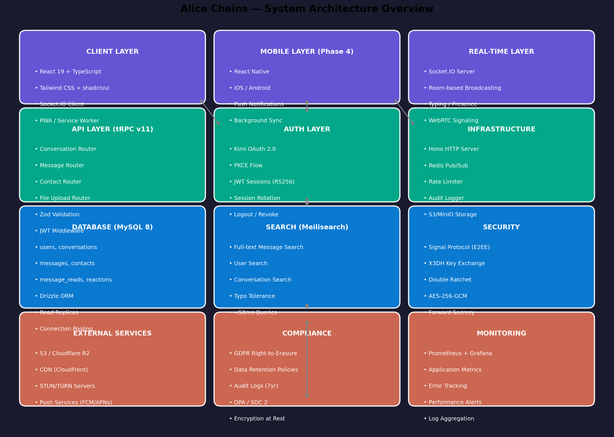

# Alice Chains — Architecture (current state)

*Describes what is implemented on `main` as of 2026-08-12. Forward-looking design lives in [PRD.md](PRD.md) (Phases 2–4) and the parked [MLS re-architecture program](ALICE_CHAINS_END_TO_END_PRODUCT_BUILDOUT.md).*



## 1. Overview

Alice Chains is a **monorepo fullstack TypeScript application**: a React 19 SPA (Vite) and a Hono + tRPC + Socket.IO backend share one `package.json`, one type system, and one deploy artifact. Type safety is end-to-end: Drizzle infers row types from `db/schema.ts`, tRPC routers consume them, and the React client imports `AppRouter` directly (`src/providers/trpc.tsx`), so an API change that breaks the client fails `tsc`.

| Concern | Choice | Where |
|---|---|---|
| HTTP server | Hono 4 (fetch-style handlers on Node `http`) | `api/boot.ts` |
| RPC | tRPC v11, superjson transformer | `api/router.ts`, `api/middleware.ts` |
| Real-time | Socket.IO 4, room-based broadcast | `api/socket.ts` |
| ORM / DB | Drizzle ORM → MySQL 8 (`mysql2` pool) | `db/schema.ts`, `api/queries/connection.ts` |
| Auth | OAuth 2.0 (Kimi platform) + HMAC-signed cookie | `api/kimi/*` |
| SPA | React 19, React Router 7, TanStack Query via tRPC | `src/` |
| UI | Tailwind 3 + shadcn/ui (Radix), dark glassmorphism theme | `src/components/ui/`, `src/index.css` |

## 2. Runtime topology

**Production (`npm run build && npm start`)** — single Node process, single port (`PORT`, default 3000):

```
Browser ──HTTP──▶ node dist/boot.js
   │                ├─ Hono: /api/oauth/callback, /api/logout, /api/trpc/*
   │                ├─ Static: dist/public (SPA assets + index.html fallback)
   └──WebSocket──▶  └─ Socket.IO at /socket.io (same http.Server)
                          │
                          ▼
                    MySQL 8 (DATABASE_URL, mysql2 pool)
```

The client build lands in `dist/public`; the server is bundled by esbuild to `dist/boot.js` (ESM, with a `createRequire` banner for CJS deps).

**Development (`npm run dev`)** — two processes via `concurrently`:

```
Vite dev server :3000  ──proxy /api, /socket.io──▶  API on :3001
tsx watch api/boot.ts  (binds API_PORT=3001 in dev — fixed by S-2)
```

> ⚠️ **Known defect:** `api/boot.ts` only creates the HTTP server + Socket.IO inside `if (NODE_ENV === "production")`, so in dev the proxy target is dead. Fixing this (listen on 3001 in dev, same `initSocket` path) is stabilization task **S-2**.

## 3. Authentication flow

1. `src/pages/Login.tsx` sends the browser to the Kimi authorize endpoint with `client_id` (`VITE_APP_ID`) and `redirect_uri = {origin}/api/oauth/callback`.
2. `api/kimi/auth.ts` (`createOAuthCallbackHandler`) exchanges the `code` at the token endpoint using `APP_SECRET`, fetches userinfo with the access token, and **upserts** the user by `unionId` (`api/queries/users.ts`).
3. A session token is minted by `api/kimi/session.ts`: `base64url(JSON{userId, unionId, name, email, iat}) + "." + HMAC-SHA256(payload, JWT_SECRET)` and set as the `alice_session` cookie (HttpOnly, SameSite=Lax, 7-day max age).
4. Every subsequent request — tRPC (`api/context.ts`) **and** the Socket.IO handshake (`api/socket.ts` middleware) — re-verifies the signature (timing-safe compare) and expiry, then loads the user by `unionId`. `authedQuery` middleware rejects requests with no user (`UNAUTHORIZED`).
5. `/api/logout` clears the cookie and redirects to `/login`.

Security properties as implemented: tamper-evident sessions, no client-supplied identity anywhere (socket `userId` comes from `socket.data` set at handshake), membership checked server-side before any room join or message write. Known gaps tracked in BACKLOG **S-4**: no `state`/PKCE on the OAuth dance, endpoint-path incoherence between login and callback, terminology ("JWT") vs implementation (signed cookie).

## 4. Real-time design

Rooms: every socket joins `user_{userId}` at connect; opening a conversation joins `conv_{conversationId}` (membership-checked). Presence is an in-process `Map<userId, Set<socketId>>` — multiple tabs/devices per user are supported; `userOnline`/`userOffline` broadcast on first-connect/last-disconnect. This is deliberately single-instance; the Redis pub/sub adapter is the Phase 4 scaling path (PRD).

Message send path (socket variant): membership check → `INSERT` message → re-select full row → `newMessage` to `conv_{id}` (with client `tempId` echo for optimistic UI) → `conversationUpdated` to each participant's `user_{id}` room. A parallel tRPC mutation (`message.send`) exists for HTTP-initiated sends; both persist identically.

Event contract (authoritative list also in [API.md](API.md)):

| Direction | Events |
|---|---|
| client → server | `joinConversation`, `leaveConversation`, `sendMessage`, `markAsRead`, `typing` |
| server → client | `newMessage`, `conversationUpdated`, `messagesRead`, `userTyping`, `userOnline`, `userOffline`, `onlineUsers`, `messageError` |

## 5. Data model

Six tables (`db/schema.ts`), Drizzle relations in `db/relations.ts`:

```
users 1──∞ conversation_participants ∞──1 conversations
users 1──∞ messages ∞──1 conversations          messages.replyToId ─▶ messages.id (threading, Phase 2 UI)
users 1──∞ message_reads ∞──1 messages          (read receipts)
users 1──∞ contacts ∞──1 users                  (status: pending | accepted | blocked)
```

| Table | Purpose | Notable columns |
|---|---|---|
| `users` | Identity (created on first OAuth sign-in) | `unionId` (unique, external id), `role` user/admin, `status` line, `lastSignInAt` |
| `conversations` | Direct + group containers | `type` direct/group, `name`/`avatar` (groups), `createdBy` |
| `conversation_participants` | Membership + read cursor | `lastReadAt` (powers unread counts — F-1), `joinedAt` |
| `messages` | Message content | `type` text/image/file, `fileUrl`, `replyToId`, `isEdited` (Phase 2 groundwork) |
| `message_reads` | Per-user read receipts | `(messageId, userId)` should be unique — S-3 |
| `contacts` | Friendship graph | three-state machine, `nickname` |

Schema evolution (reactions, push subscriptions, audit logs, devices, encryption keys) is mapped per phase in [PRD.md](PRD.md) §Database Design. **No migrations are committed yet — S-3.** Integrity constraints (FKs, uniques, indexes) are also S-3.

## 6. Frontend structure

- `App.tsx`: `/login`, then `AuthLayout` gates `/` (Chat) and `/contacts`; 404 fallback.
- `AuthLayout` uses `useAuth()` (`trpc.auth.me`) — unauthenticated users are pushed to login; a skeleton renders while loading.
- `Chat.tsx` (563 LOC): two-panel layout — 320px conversation sidebar (overlay < 768px via `use-mobile`) + message pane with header (call/video buttons are **stubs by design**, Phase 3), bubbles, typing dots, read ticks, auto-resize composer. Paperclip button is a stub until F-4.
- `useSocket.ts`: owns the socket lifecycle and exposes typed emit/subscribe helpers; event interfaces mirror the server contract.
- Design tokens (HSL variables) match PRD §UI/UX; dark-first, violet primary `250 85% 65%`.

## 7. Build & CI

`npm run build` = `tsc` (typecheck) → `vite build` (SPA → `dist/public`) → `esbuild api/boot.ts` (server → `dist/boot.js`). CI (`.github/workflows/ci.yml`) runs install → typecheck → test → lint → build on every push/PR with Node 22. CI is green as of the S-0 build-restoration commit (`npm ci && npm run validate` passes from a clean clone). There is no deploy pipeline yet; the Docker stack is S-6.

## 8. Scaling posture (summary)

Current: one process, in-memory presence, MySQL pool — appropriate for the prototype stage. The PRD's Phase 4 plan (Redis adapter for multi-instance Socket.IO, sticky sessions, read replicas via Drizzle `withReplicas`, token-bucket rate limiting) is documented with benchmarks in [PRD.md](PRD.md) and should not be built before Phase 2 features exist.
