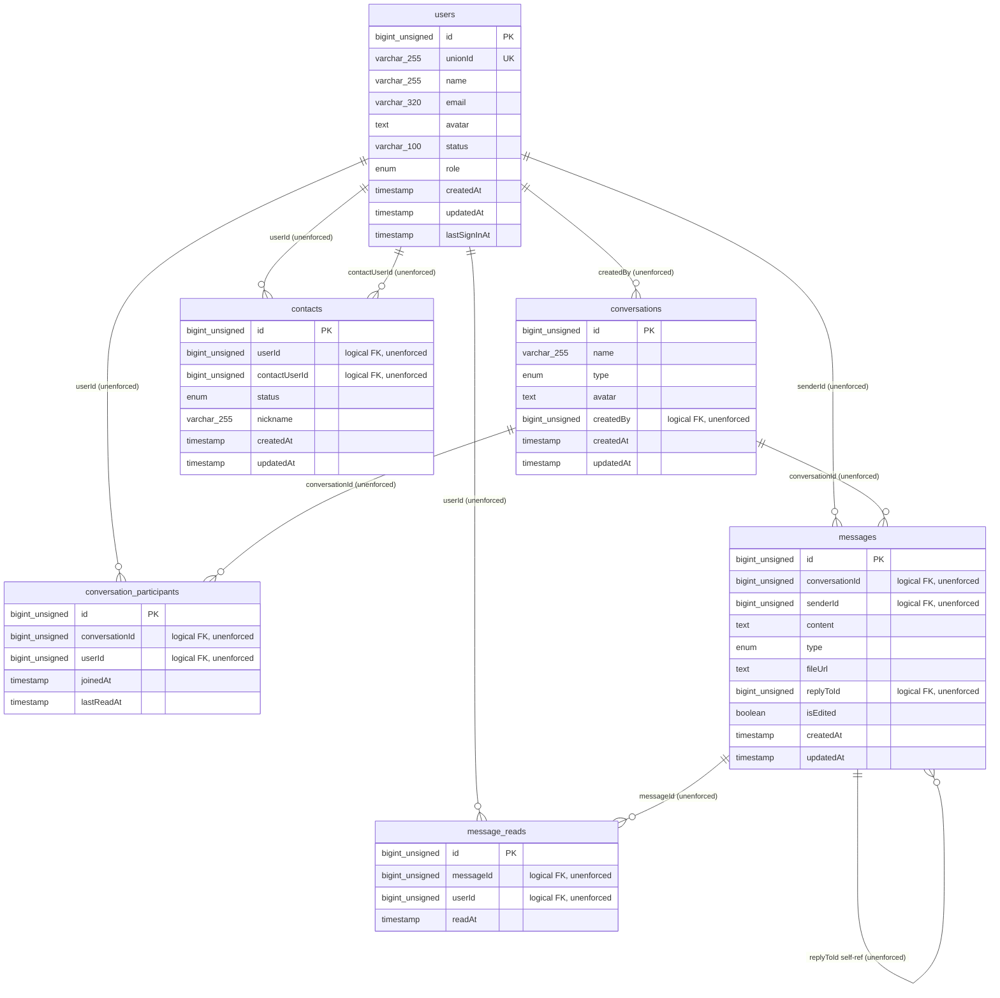

# Alice Chains — Data Model Specification

**Repo:** `Mangu-Platforms/alice_chains` · **Engine:** MySQL 8.4 (`docker-compose.yml:4`) via `mysql2` pool (`api/queries/connection.ts:6`) · **ORM:** Drizzle `0.40.1`, drizzle-kit `0.30.6`
**Schema source of truth:** `db/schema.ts` · **Relations (ORM-only):** `db/relations.ts` · **Baseline DDL:** `db/migrations/0000_lumpy_marten_broadcloak.sql`

**Database decision of record: stay on MySQL.** Supabase/Postgres is a future, gated migration and is out of scope for every task in this document. The only Postgres reference in the repo is an aspirational target-architecture line (`docs/ALICE_CHAINS_END_TO_END_PRODUCT_BUILDOUT.md:113`) and it is **not** the current direction.

---

## 1. Entity-relationship overview

### 1.1 Diagram

All relationships below are **logical only**. Zero foreign keys exist in the database (`db/migrations/meta/0000_snapshot.json` — `foreignKeys: {}` on all six tables). Cardinality is enforced, where at all, by application code.



### 1.2 Entity purpose and lifecycle

| Entity | Purpose | Created by | Mutated by | Deleted by |
|---|---|---|---|---|
| `users` | Identity projection of the Kimi OAuth subject. `unionId` is the external principal; `id` is the internal surrogate used by every other table. | `upsertUser()` on OAuth callback (`api/queries/users.ts:10`, called `api/kimi/auth.ts:75`) | Same upsert (name/email/avatar/`lastSignInAt` refreshed on every sign-in, `api/queries/users.ts:12`) | **Nothing.** No delete path exists anywhere in `api/`. |
| `conversations` | Container for a message stream. `type` discriminates `direct` (exactly 2 participants by convention) from `group` (N participants). | `conversation.createDirect` (`api/conversation-router.ts:200`), `conversation.createGroup` (`api/conversation-router.ts:226`) | **Nothing.** No `db.update(conversations)` call exists — see §6.5. | **Nothing.** |
| `conversation_participants` | Membership join table **and** per-user read cursor (`lastReadAt`). This is the sole authorisation record: every read/write path resolves permission by querying this table. | `createDirect` (`api/conversation-router.ts:207`), `createGroup` (`api/conversation-router.ts:235`) | `conversation.markAsRead` sets `lastReadAt` (`api/conversation-router.ts:249`) | **Nothing.** No leave-conversation path. |
| `messages` | Immutable-in-practice message log. `type` ∈ text/image/file; `fileUrl` is an opaque string (no upload pipeline exists). `isEdited`/`updatedAt` are written but never updated — no edit procedure exists. | `message.send` (`api/message-router.ts:115`) and socket `sendMessage` (`api/socket.ts:107`) | **Nothing.** | **Nothing.** |
| `message_reads` | Per-(message, user) read receipt, append-only. | `message.markAsRead` (`api/message-router.ts:146`), socket `markAsRead` (`api/socket.ts:167`) | **Nothing.** | **Nothing.** |
| `contacts` | Directed friendship edge. The application writes **two rows per relationship** (A→B and B→A) and keeps both in lockstep (`api/contact-router.ts:89-105`, `:117-136`). `blocked` is in the enum but no code path ever writes it. | `contact.add` (`api/contact-router.ts:89`, `:96`) | `contact.accept` — updates both directions to `accepted` (`api/contact-router.ts:117`, `:128`) | `contact.remove` — hard-deletes both directions (`api/contact-router.ts:148`) |

**Lifecycle gap (NFR-OPS, FR-AUTH):** five of six tables have no delete path. Account closure, conversation deletion, and message deletion are unimplemented. See §7.

---

## 2. Per-table column reference

Types shown are exactly what drizzle-kit emitted into `db/migrations/0000_lumpy_marten_broadcloak.sql`. `serial` in MySQL is an alias for `BIGINT UNSIGNED NOT NULL AUTO_INCREMENT UNIQUE`; every FK-shaped column is declared `bigint unsigned` and is therefore type-compatible with the referenced PKs (a hard prerequisite for §3).

### 2.1 `users` — `db/schema.ts:13-27` · DDL `db/migrations/0000_lumpy_marten_broadcloak.sql:54-67`

| Column | MySQL type (as generated) | Null | Default | Semantics |
|---|---|---|---|---|
| `id` | `serial AUTO_INCREMENT` (→ `bigint unsigned`) | NO | auto | Surrogate PK. Referenced (unenforced) by 6 columns across 4 tables. |
| `unionId` | `varchar(255)` | NO | — | Kimi OAuth subject identifier. Sole natural key; `UNIQUE` (`users_unionId_unique`). Populated from `userData.unionId \|\| userData.id` (`api/kimi/auth.ts:76`). Carried inside the session cookie payload (`api/kimi/session.ts:24`). |
| `name` | `varchar(255)` | YES | `NULL` | Display name from the OAuth provider; falls back to `"User"` (`api/kimi/auth.ts:77`). Searched by `contact.searchUsers` (`api/contact-router.ts:181`). |
| `email` | `varchar(320)` | YES | `NULL` | RFC-max-length address. Searched by `contact.searchUsers` (`api/contact-router.ts:182`). PII. |
| `avatar` | `text` | YES | `NULL` | Absolute URL to the provider avatar. `text` (not `varchar`) so it can never be indexed without a prefix length. |
| `status` | `varchar(100)` | YES | `'Hey there! I''m using Alice Chains.'` | **Free-text status message, not a state machine.** Naming trap: `contacts.status` and `conversations.type` are enums; this is prose. Never read or written by any procedure. |
| `role` | `enum('user','admin')` | NO | `'user'` | Authorisation role. **Never read anywhere** — no admin gate exists (`OWNER_UNION_ID` in `api/lib/env.ts:11` is likewise unused). |
| `createdAt` | `timestamp` | NO | `(now())` | Row creation. |
| `updatedAt` | `timestamp` | NO | `(now())` | Bumped by Drizzle `$onUpdate` (`db/schema.ts:25`) — **application-side only**. The DDL has no `ON UPDATE CURRENT_TIMESTAMP`, so any raw-SQL write leaves it stale. |
| `lastSignInAt` | `timestamp` | NO | `(now())` | Set on every returning sign-in via the upsert branch (`api/queries/users.ts:12`). Behavioural PII. |

### 2.2 `conversations` — `db/schema.ts:33-44` · DDL `:21-30`

| Column | MySQL type | Null | Default | Semantics |
|---|---|---|---|---|
| `id` | `serial AUTO_INCREMENT` | NO | auto | PK. |
| `name` | `varchar(255)` | YES | `NULL` | Group title. `NULL` for direct conversations; the API substitutes the counterparty name (`api/conversation-router.ts:86-89`). |
| `type` | `enum('direct','group')` | NO | `'direct'` | Discriminator. Direct = 2 participants **by convention only** — nothing enforces the count. |
| `avatar` | `text` | YES | `NULL` | Group avatar; for direct conversations the counterparty avatar is substituted (`api/conversation-router.ts:90-93`). |
| `createdBy` | `bigint unsigned` | NO | — | Creator `users.id`. Logical FK. Never used for authorisation — group ownership/admin is unimplemented. |
| `createdAt` | `timestamp` | NO | `(now())` | Creation. |
| `updatedAt` | `timestamp` | NO | `(now())` | **Dead column.** The conversation list orders by it (`api/conversation-router.ts:38`) but no code ever updates a `conversations` row, so it permanently equals `createdAt`. See §6.5. |

### 2.3 `conversation_participants` — `db/schema.ts:50-56` · DDL `:12-19`

| Column | MySQL type | Null | Default | Semantics |
|---|---|---|---|---|
| `id` | `serial AUTO_INCREMENT` | NO | auto | PK. Surrogate over what should be a natural composite key. |
| `conversationId` | `bigint unsigned` | NO | — | Logical FK → `conversations.id`. |
| `userId` | `bigint unsigned` | NO | — | Logical FK → `users.id`. Filtered on every conversation-list query (`api/conversation-router.ts:21`) — unindexed. |
| `joinedAt` | `timestamp` | NO | `(now())` | Membership start. Not used for history windowing (a joiner sees all prior messages). |
| `lastReadAt` | `timestamp` | **YES** | `NULL` | Read cursor. Written by `conversation.markAsRead` (`api/conversation-router.ts:251`); **never read by anything**. The unread-count feature it exists to serve is unimplemented (§6.1). |

### 2.4 `messages` — `db/schema.ts:62-76` · DDL `:40-52`

| Column | MySQL type | Null | Default | Semantics |
|---|---|---|---|---|
| `id` | `serial AUTO_INCREMENT` | NO | auto | PK; monotonic, therefore usable as a keyset pagination cursor (§6.2). |
| `conversationId` | `bigint unsigned` | NO | — | Logical FK → `conversations.id`. The hottest predicate in the system; unindexed. |
| `senderId` | `bigint unsigned` | NO | — | Logical FK → `users.id`. |
| `content` | `text` | NO | — | Message body. Capped at 4000 chars by the tRPC input schema (`api/message-router.ts:89`); **uncapped on the socket path** (`api/socket.ts:78-85`) — MySQL `TEXT` (64 KiB) is the only limit there. |
| `type` | `enum('text','image','file')` | NO | `'text'` | Payload kind. Socket path casts an arbitrary string into this enum without validation (`api/socket.ts:111`). |
| `fileUrl` | `text` | YES | `NULL` | Opaque URL for image/file messages. No upload endpoint exists; always `NULL` in practice. |
| `replyToId` | `bigint unsigned` | **YES** | `NULL` | Self-referencing logical FK → `messages.id`. Nullable, so `ON DELETE SET NULL` is legal (§3.1). |
| `isEdited` | `boolean` (`tinyint(1)`) | NO | `false` | Edit marker. No edit procedure exists; always `0`. |
| `createdAt` | `timestamp` | NO | `(now())` | Sort key for history and for last-message resolution. |
| `updatedAt` | `timestamp` | NO | `(now())` | ORM-side `$onUpdate` only; never fires. |

> **2038 problem (NFR-REL):** MySQL `TIMESTAMP` is a 32-bit epoch (max `2038-01-19 03:14:07 UTC`). Every temporal column in this schema is `timestamp`. Migrating to `DATETIME(3)` is a breaking change and must be scheduled deliberately; it is out of scope for the constraint migration in §4 but must be tracked as **H-DT-2038**.

### 2.5 `message_reads` — `db/schema.ts:82-87` · DDL `:32-38`

| Column | MySQL type | Null | Default | Semantics |
|---|---|---|---|---|
| `id` | `serial AUTO_INCREMENT` | NO | auto | PK. |
| `messageId` | `bigint unsigned` | NO | — | Logical FK → `messages.id`. |
| `userId` | `bigint unsigned` | NO | — | Logical FK → `users.id`. |
| `readAt` | `timestamp` | NO | `(now())` | Receipt time. |

Both writers wrap the insert in `try {} catch {}` with the comment "Ignore duplicate errors" (`api/message-router.ts:144-153`, `api/socket.ts:165-174`). **There is no unique key, so no duplicate error can ever be raised** — the table accumulates one row per re-read, unbounded.

### 2.6 `contacts` — `db/schema.ts:92-103` · DDL `:1-10`

| Column | MySQL type | Null | Default | Semantics |
|---|---|---|---|---|
| `id` | `serial AUTO_INCREMENT` | NO | auto | PK. |
| `userId` | `bigint unsigned` | NO | — | Edge owner. Logical FK → `users.id`. |
| `contactUserId` | `bigint unsigned` | NO | — | Edge target. Logical FK → `users.id`. |
| `status` | `enum('pending','accepted','blocked')` | NO | `'pending'` | Edge state. `blocked` is never written by any code path — block is unimplemented (FR-CONT gap). |
| `nickname` | `varchar(255)` | YES | `NULL` | Per-owner alias. Selected by `contact.list` (`api/contact-router.ts:21`) but never written. |
| `createdAt` | `timestamp` | NO | `(now())` | Request time. |
| `updatedAt` | `timestamp` | NO | `(now())` | ORM-side `$onUpdate` — fires on `accept` (`api/contact-router.ts:119`). |

> **UNVERIFIED:** MySQL's `SERIAL` alias implies `UNIQUE`, and the generated DDL also declares an explicit `PRIMARY KEY` on the same column (e.g. `db/migrations/0000_lumpy_marten_broadcloak.sql:2` + `:9`). Whether MySQL 8.4 materialises one index or two for that pair could not be confirmed — no MySQL instance was reachable from the analysis sandbox. Verify with `SHOW INDEX FROM messages;` against a migrated database; if a redundant `id` unique index exists on all six tables, drop it under **H-IDX-REDUNDANT** (it doubles insert-time index maintenance on the hottest table).

---

## 3. The integrity gap

**Verified fact:** across all six tables the generated baseline declares **0 foreign keys, 0 secondary indexes**, and exactly **1 unique constraint** (`users_unionId_unique`). Source: `db/migrations/meta/0000_snapshot.json` — every table's `foreignKeys`, `indexes`, and (except `users`) `uniqueConstraints` maps are empty; corroborated by `db/migrations/0000_lumpy_marten_broadcloak.sql` containing no `FOREIGN KEY`, `KEY`, or `INDEX` token.

Consequence: referential integrity, idempotency, and every hot-path lookup are unprotected. `contacts.add`'s `onDuplicateKeyUpdate` (`api/contact-router.ts:103`) compiles to real `ON DUPLICATE KEY UPDATE` SQL but **can never fire**, because no unique key exists for it to conflict on (verified by compiling the statement with drizzle's MySQL dialect).

### 3.1 Missing foreign keys

| # | Child column | Parent | `ON DELETE` | `ON UPDATE` | Justification |
|---|---|---|---|---|---|
| FK-1 | `conversation_participants.conversationId` | `conversations.id` | `CASCADE` | `NO ACTION` | Membership has no meaning without its conversation. Deleting a conversation must remove memberships atomically. |
| FK-2 | `conversation_participants.userId` | `users.id` | `CASCADE` | `NO ACTION` | Account erasure must remove the user from every conversation; a dangling membership would grant permission to a non-existent principal (the membership row *is* the ACL — `api/socket.ts:56-63`). |
| FK-3 | `messages.conversationId` | `conversations.id` | `CASCADE` | `NO ACTION` | Orphan messages are unreachable and unauditable; they would also survive as undeletable PII. |
| FK-4 | `messages.senderId` | `users.id` | `RESTRICT` | `NO ACTION` | **Not** cascade: deleting a user must not silently erase a conversation's history for everyone else. `RESTRICT` forces account deletion to go through an explicit anonymise-or-purge routine (§7.3), making the policy decision visible in code rather than implicit in DDL. |
| FK-5 | `messages.replyToId` | `messages.id` (self) | `SET NULL` | `NO ACTION` | Column is nullable (`db/schema.ts:69`), so `SET NULL` is legal. A deleted parent must degrade the reply to a normal message, never cascade-delete an unrelated author's reply. |
| FK-6 | `message_reads.messageId` | `messages.id` | `CASCADE` | `NO ACTION` | A receipt for a deleted message is meaningless. |
| FK-7 | `message_reads.userId` | `users.id` | `CASCADE` | `NO ACTION` | Receipts are low-value personal data; erase with the account. |
| FK-8 | `contacts.userId` | `users.id` | `CASCADE` | `NO ACTION` | Edge is owned by the user; erase with the account. |
| FK-9 | `contacts.contactUserId` | `users.id` | `CASCADE` | `NO ACTION` | Symmetric to FK-8; both directions of the pair must vanish together. |
| FK-10 | `conversations.createdBy` | `users.id` | `RESTRICT` | `NO ACTION` | Same reasoning as FK-4: a group must not evaporate when its creator closes their account. Forces an explicit ownership-transfer step. |

> MySQL/InnoDB rejects `SET NULL` on `NOT NULL` columns and requires an index on the referencing column (InnoDB creates one implicitly if absent). Because §3.3 adds explicit indexes first, no implicit single-column indexes are created and index naming stays deterministic.

### 3.2 Missing unique constraints

| # | Table | Columns | Rationale |
|---|---|---|---|
| UQ-1 | `conversation_participants` | (`conversationId`, `userId`) | Double-join is currently possible. `createGroup` de-dupes in JS (`api/conversation-router.ts:234`) but `createDirect` does not; duplicate membership inflates participant lists (`api/conversation-router.ts:94`) and duplicates `conversationUpdated` fan-out (`api/socket.ts:140-145`). |
| UQ-2 | `message_reads` | (`messageId`, `userId`) | Makes the existing "ignore duplicates" `try/catch` (`api/message-router.ts:150`, `api/socket.ts:171`) actually mean something, and bounds table growth to O(messages × participants). |
| UQ-3 | `contacts` | (`userId`, `contactUserId`) | Makes `onDuplicateKeyUpdate` (`api/contact-router.ts:103`) functional. Today, if B→A already exists and A then adds B, the reverse insert creates a **second** B→A row; `contact.list` then renders the contact twice. |

### 3.3 Missing indexes

| # | Table | Definition | Serves | Current cost |
|---|---|---|---|---|
| IX-1 | `messages` | (`conversationId`, `createdAt`) | History pagination (`api/message-router.ts:55-58`), last-message scan (`api/conversation-router.ts:61-62`) | Full table scan + filesort per conversation open. |
| IX-2 | `conversation_participants` | (`userId`) | "my conversations" (`api/conversation-router.ts:21`), membership check on every send/join/typing (`api/socket.ts:56-63`) | Full scan per keystroke on the typing path. |
| IX-3 | `contacts` | (`contactUserId`, `status`) | `contact.pending` (`api/contact-router.ts:53-58`) | Full scan. |
| IX-4 | `contacts` | (`userId`, `status`) | `contact.list` (`api/contact-router.ts:26-31`) | Full scan. Not in the original brief; symmetric to IX-3 and equally hot. |
| IX-5 | `message_reads` | (`messageId`) | Receipt fetch (`api/message-router.ts:65-68`) | Full scan. Partially covered by UQ-2's leading column — see note below. |
| IX-6 | `messages` | (`senderId`) | Required by FK-4 and by "messages by author" export (§7.3) | n/a |

> UQ-2 `(messageId, userId)` already provides a usable leftmost prefix on `messageId`, so **IX-5 is redundant if UQ-2 is applied** and must be omitted. Listed for completeness only.

### 3.4 Drizzle schema — exact replacement for `db/schema.ts`

Drizzle `0.40.x` uses the array-returning extra-config callback. Apply verbatim; names are explicit so generated SQL is deterministic.

```ts
import {
  mysqlTable,
  mysqlEnum,
  serial,
  varchar,
  text,
  timestamp,
  bigint,
  boolean,
  index,
  uniqueIndex,
  foreignKey,
  type AnyMySqlColumn,
} from "drizzle-orm/mysql-core";

// ─── Conversations ────────────────────────────────────────────────
export const conversations = mysqlTable(
  "conversations",
  {
    id: serial("id").primaryKey(),
    name: varchar("name", { length: 255 }),
    type: mysqlEnum("type", ["direct", "group"]).default("direct").notNull(),
    avatar: text("avatar"),
    createdBy: bigint("createdBy", { mode: "number", unsigned: true }).notNull(),
    createdAt: timestamp("createdAt").defaultNow().notNull(),
    updatedAt: timestamp("updatedAt").defaultNow().notNull().$onUpdate(() => new Date()),
  },
  (t) => [
    index("conversations_createdBy_idx").on(t.createdBy),
    foreignKey({
      name: "conversations_createdBy_users_id_fk",
      columns: [t.createdBy],
      foreignColumns: [users.id],
    }).onDelete("restrict"),
  ],
);

// ─── Conversation Participants ────────────────────────────────────
export const conversationParticipants = mysqlTable(
  "conversation_participants",
  {
    id: serial("id").primaryKey(),
    conversationId: bigint("conversationId", { mode: "number", unsigned: true }).notNull(),
    userId: bigint("userId", { mode: "number", unsigned: true }).notNull(),
    joinedAt: timestamp("joinedAt").defaultNow().notNull(),
    lastReadAt: timestamp("lastReadAt"),
  },
  (t) => [
    uniqueIndex("cp_conversation_user_uq").on(t.conversationId, t.userId), // UQ-1
    index("cp_user_idx").on(t.userId),                                     // IX-2
    foreignKey({
      name: "cp_conversationId_conversations_id_fk",
      columns: [t.conversationId],
      foreignColumns: [conversations.id],
    }).onDelete("cascade"),                                                // FK-1
    foreignKey({
      name: "cp_userId_users_id_fk",
      columns: [t.userId],
      foreignColumns: [users.id],
    }).onDelete("cascade"),                                                // FK-2
  ],
);

// ─── Messages ─────────────────────────────────────────────────────
export const messages = mysqlTable(
  "messages",
  {
    id: serial("id").primaryKey(),
    conversationId: bigint("conversationId", { mode: "number", unsigned: true }).notNull(),
    senderId: bigint("senderId", { mode: "number", unsigned: true }).notNull(),
    content: text("content").notNull(),
    type: mysqlEnum("type", ["text", "image", "file"]).default("text").notNull(),
    fileUrl: text("fileUrl"),
    replyToId: bigint("replyToId", { mode: "number", unsigned: true }),
    isEdited: boolean("isEdited").default(false).notNull(),
    createdAt: timestamp("createdAt").defaultNow().notNull(),
    updatedAt: timestamp("updatedAt").defaultNow().notNull().$onUpdate(() => new Date()),
  },
  (t) => [
    index("messages_conversation_created_idx").on(t.conversationId, t.createdAt), // IX-1
    index("messages_sender_idx").on(t.senderId),                                  // IX-6
    index("messages_replyTo_idx").on(t.replyToId),
    foreignKey({
      name: "messages_conversationId_conversations_id_fk",
      columns: [t.conversationId],
      foreignColumns: [conversations.id],
    }).onDelete("cascade"),                                                       // FK-3
    foreignKey({
      name: "messages_senderId_users_id_fk",
      columns: [t.senderId],
      foreignColumns: [users.id],
    }).onDelete("restrict"),                                                      // FK-4
    foreignKey({
      name: "messages_replyToId_messages_id_fk",
      columns: [t.replyToId],
      foreignColumns: [t.id as AnyMySqlColumn],
    }).onDelete("set null"),                                                      // FK-5
  ],
);

// ─── Message Read Receipts ────────────────────────────────────────
export const messageReads = mysqlTable(
  "message_reads",
  {
    id: serial("id").primaryKey(),
    messageId: bigint("messageId", { mode: "number", unsigned: true }).notNull(),
    userId: bigint("userId", { mode: "number", unsigned: true }).notNull(),
    readAt: timestamp("readAt").defaultNow().notNull(),
  },
  (t) => [
    uniqueIndex("message_reads_message_user_uq").on(t.messageId, t.userId), // UQ-2 (also serves IX-5)
    index("message_reads_user_idx").on(t.userId),
    foreignKey({
      name: "message_reads_messageId_messages_id_fk",
      columns: [t.messageId],
      foreignColumns: [messages.id],
    }).onDelete("cascade"),                                                 // FK-6
    foreignKey({
      name: "message_reads_userId_users_id_fk",
      columns: [t.userId],
      foreignColumns: [users.id],
    }).onDelete("cascade"),                                                 // FK-7
  ],
);

// ─── Contacts ─────────────────────────────────────────────────────
export const contacts = mysqlTable(
  "contacts",
  {
    id: serial("id").primaryKey(),
    userId: bigint("userId", { mode: "number", unsigned: true }).notNull(),
    contactUserId: bigint("contactUserId", { mode: "number", unsigned: true }).notNull(),
    status: mysqlEnum("status", ["pending", "accepted", "blocked"]).default("pending").notNull(),
    nickname: varchar("nickname", { length: 255 }),
    createdAt: timestamp("createdAt").defaultNow().notNull(),
    updatedAt: timestamp("updatedAt").defaultNow().notNull().$onUpdate(() => new Date()),
  },
  (t) => [
    uniqueIndex("contacts_user_contact_uq").on(t.userId, t.contactUserId), // UQ-3
    index("contacts_contactUser_status_idx").on(t.contactUserId, t.status), // IX-3
    index("contacts_user_status_idx").on(t.userId, t.status),               // IX-4
    foreignKey({
      name: "contacts_userId_users_id_fk",
      columns: [t.userId],
      foreignColumns: [users.id],
    }).onDelete("cascade"),                                                 // FK-8
    foreignKey({
      name: "contacts_contactUserId_users_id_fk",
      columns: [t.contactUserId],
      foreignColumns: [users.id],
    }).onDelete("cascade"),                                                 // FK-9
  ],
);
```

`users` is unchanged except that it must be declared **before** `conversations` (already true at `db/schema.ts:13`) so the `foreignColumns` references resolve at module-eval time.

### 3.5 Resulting SQL (migration `0001_constraints`)

```sql
-- Unique constraints (apply AFTER the dedupe in §4.3)
CREATE UNIQUE INDEX `cp_conversation_user_uq` ON `conversation_participants` (`conversationId`,`userId`);--> statement-breakpoint
CREATE UNIQUE INDEX `message_reads_message_user_uq` ON `message_reads` (`messageId`,`userId`);--> statement-breakpoint
CREATE UNIQUE INDEX `contacts_user_contact_uq` ON `contacts` (`userId`,`contactUserId`);--> statement-breakpoint

-- Secondary indexes
CREATE INDEX `messages_conversation_created_idx` ON `messages` (`conversationId`,`createdAt`);--> statement-breakpoint
CREATE INDEX `messages_sender_idx` ON `messages` (`senderId`);--> statement-breakpoint
CREATE INDEX `messages_replyTo_idx` ON `messages` (`replyToId`);--> statement-breakpoint
CREATE INDEX `cp_user_idx` ON `conversation_participants` (`userId`);--> statement-breakpoint
CREATE INDEX `message_reads_user_idx` ON `message_reads` (`userId`);--> statement-breakpoint
CREATE INDEX `contacts_contactUser_status_idx` ON `contacts` (`contactUserId`,`status`);--> statement-breakpoint
CREATE INDEX `contacts_user_status_idx` ON `contacts` (`userId`,`status`);--> statement-breakpoint
CREATE INDEX `conversations_createdBy_idx` ON `conversations` (`createdBy`);--> statement-breakpoint

-- Foreign keys (apply AFTER the orphan cleanup in §4.3)
ALTER TABLE `conversation_participants` ADD CONSTRAINT `cp_conversationId_conversations_id_fk`
  FOREIGN KEY (`conversationId`) REFERENCES `conversations`(`id`) ON DELETE cascade ON UPDATE no action;--> statement-breakpoint
ALTER TABLE `conversation_participants` ADD CONSTRAINT `cp_userId_users_id_fk`
  FOREIGN KEY (`userId`) REFERENCES `users`(`id`) ON DELETE cascade ON UPDATE no action;--> statement-breakpoint
ALTER TABLE `messages` ADD CONSTRAINT `messages_conversationId_conversations_id_fk`
  FOREIGN KEY (`conversationId`) REFERENCES `conversations`(`id`) ON DELETE cascade ON UPDATE no action;--> statement-breakpoint
ALTER TABLE `messages` ADD CONSTRAINT `messages_senderId_users_id_fk`
  FOREIGN KEY (`senderId`) REFERENCES `users`(`id`) ON DELETE restrict ON UPDATE no action;--> statement-breakpoint
ALTER TABLE `messages` ADD CONSTRAINT `messages_replyToId_messages_id_fk`
  FOREIGN KEY (`replyToId`) REFERENCES `messages`(`id`) ON DELETE set null ON UPDATE no action;--> statement-breakpoint
ALTER TABLE `message_reads` ADD CONSTRAINT `message_reads_messageId_messages_id_fk`
  FOREIGN KEY (`messageId`) REFERENCES `messages`(`id`) ON DELETE cascade ON UPDATE no action;--> statement-breakpoint
ALTER TABLE `message_reads` ADD CONSTRAINT `message_reads_userId_users_id_fk`
  FOREIGN KEY (`userId`) REFERENCES `users`(`id`) ON DELETE cascade ON UPDATE no action;--> statement-breakpoint
ALTER TABLE `contacts` ADD CONSTRAINT `contacts_userId_users_id_fk`
  FOREIGN KEY (`userId`) REFERENCES `users`(`id`) ON DELETE cascade ON UPDATE no action;--> statement-breakpoint
ALTER TABLE `contacts` ADD CONSTRAINT `contacts_contactUserId_users_id_fk`
  FOREIGN KEY (`contactUserId`) REFERENCES `users`(`id`) ON DELETE cascade ON UPDATE no action;--> statement-breakpoint
ALTER TABLE `conversations` ADD CONSTRAINT `conversations_createdBy_users_id_fk`
  FOREIGN KEY (`createdBy`) REFERENCES `users`(`id`) ON DELETE restrict ON UPDATE no action;
```

> Drizzle-kit generates a `uniqueIndex` as `CREATE UNIQUE INDEX`. In MySQL a `UNIQUE` table constraint and a unique index are the same physical object, so either emitted form satisfies UQ-1…UQ-3 and `ON DUPLICATE KEY UPDATE`.

---

## 4. Migration strategy

### 4.1 Current state

| Fact | Evidence |
|---|---|
| Exactly one migration exists: `0000_lumpy_marten_broadcloak` | `db/migrations/meta/_journal.json` (single entry, `idx: 0`) |
| It is a full-create baseline with no constraints | `db/migrations/0000_lumpy_marten_broadcloak.sql:1-67` |
| Migration output dir and dialect | `drizzle.config.ts:12-17` (`out: "./db/migrations"`, `dialect: "mysql"`, `strict: true`) |
| Migrations run as a one-shot container before the app starts | `docker-compose.yml` `migrate` service: `command: ["npx","drizzle-kit","migrate"]`, app `depends_on: migrate: service_completed_successfully` |
| The baseline SQL and `drizzle.config.ts` are **untracked in git** in the working clone | `git status --porcelain` → `?? db/migrations/0000_lumpy_marten_broadcloak.sql`, `?? db/migrations/meta/`, `?? drizzle.config.ts` |

**S-DB-000 (blocking):** commit `drizzle.config.ts`, `db/migrations/0000_lumpy_marten_broadcloak.sql`, and `db/migrations/meta/**`. Until they are tracked, CI (`.github/workflows/ci.yml`) and the Docker `migrate` service have no baseline to apply, and every environment silently diverges.

### 4.2 Policy

| Rule | Statement |
|---|---|
| **Forward-only** | Migrations are never edited after merge and never rolled back. A mistake is corrected by a new numbered migration. `db/migrations/meta/_journal.json` is append-only and merge conflicts in it are resolved by renumbering the incoming migration, never by editing history. |
| **`db:generate` → review → commit** | `npm run db:generate` (`package.json:14`) emits SQL; the diff is reviewed as code. Hand-written SQL is permitted **only** for data operations drizzle-kit cannot express (the dedupe in §4.3), appended to the generated file above the DDL. |
| **`db:migrate` is the only deployment path** | `npm run db:migrate` (`package.json:15`) in CI, staging and production, executed by the `migrate` service before the app boots. |
| **`db:push` is scratch-only** | `npm run db:push` (`package.json:13`) mutates a database with no journal entry and no artefact. Permitted **only** against a disposable local database. `README.md:42` currently instructs new developers to run `db:push` as the setup step — **H-DOC-PUSH:** change it to `db:migrate`, otherwise developer databases drift from the migration chain and later `db:migrate` runs fail on already-existing objects. |
| **Every migration must be idempotent-safe under retry** | The `migrate` container may be restarted by the orchestrator; drizzle-kit's journal makes DDL replay safe, but hand-written data statements must be written so a second run is a no-op (the dedupe in §4.3 is). |
| **Constraint migrations are gated on a dry run** | Before merging `0001_constraints`, the duplicate/orphan probes in §4.3 must return zero rows against a production snapshot. |

### 4.3 Pre-flight for `0001_constraints`

Adding UNIQUE to a table containing duplicates aborts with `ERROR 1062`. Adding a FK to a table containing orphans aborts with `ERROR 1452`. Run the probes, then the remediation, then the DDL — in one migration file, in this order.

**Step 1 — probe (must return 0 rows before proceeding to DDL):**

```sql
SELECT conversationId, userId, COUNT(*) c FROM conversation_participants
  GROUP BY conversationId, userId HAVING c > 1;
SELECT messageId, userId, COUNT(*) c FROM message_reads
  GROUP BY messageId, userId HAVING c > 1;
SELECT userId, contactUserId, COUNT(*) c FROM contacts
  GROUP BY userId, contactUserId HAVING c > 1;

SELECT COUNT(*) FROM conversation_participants cp
  LEFT JOIN conversations c ON c.id = cp.conversationId WHERE c.id IS NULL;
SELECT COUNT(*) FROM conversation_participants cp
  LEFT JOIN users u ON u.id = cp.userId WHERE u.id IS NULL;
SELECT COUNT(*) FROM messages m
  LEFT JOIN conversations c ON c.id = m.conversationId WHERE c.id IS NULL;
SELECT COUNT(*) FROM messages m
  LEFT JOIN users u ON u.id = m.senderId WHERE u.id IS NULL;
SELECT COUNT(*) FROM messages m
  LEFT JOIN messages p ON p.id = m.replyToId WHERE m.replyToId IS NOT NULL AND p.id IS NULL;
SELECT COUNT(*) FROM message_reads r
  LEFT JOIN messages m ON m.id = r.messageId WHERE m.id IS NULL;
SELECT COUNT(*) FROM message_reads r
  LEFT JOIN users u ON u.id = r.userId WHERE u.id IS NULL;
SELECT COUNT(*) FROM contacts k LEFT JOIN users u ON u.id = k.userId WHERE u.id IS NULL;
SELECT COUNT(*) FROM contacts k LEFT JOIN users u ON u.id = k.contactUserId WHERE u.id IS NULL;
SELECT COUNT(*) FROM conversations c LEFT JOIN users u ON u.id = c.createdBy WHERE u.id IS NULL;
```

**Step 2 — dedupe (keep the lowest `id`, i.e. the earliest row; MySQL 8 window functions in a derived table, safe to re-run):**

```sql
-- conversation_participants: keep earliest membership row (preserves joinedAt)
DELETE cp FROM conversation_participants cp
JOIN (
  SELECT id, ROW_NUMBER() OVER (PARTITION BY conversationId, userId ORDER BY id) AS rn
  FROM conversation_participants
) d ON d.id = cp.id
WHERE d.rn > 1;--> statement-breakpoint

-- message_reads: keep earliest receipt (readAt semantics = first read)
DELETE r FROM message_reads r
JOIN (
  SELECT id, ROW_NUMBER() OVER (PARTITION BY messageId, userId ORDER BY id) AS rn
  FROM message_reads
) d ON d.id = r.id
WHERE d.rn > 1;--> statement-breakpoint

-- contacts: collapse to the most-advanced status per directed pair.
-- Precedence: blocked > accepted > pending. Keeps the lowest id and rewrites its status.
UPDATE contacts c
JOIN (
  SELECT userId, contactUserId,
         MIN(id) AS keep_id,
         MAX(FIELD(status,'pending','accepted','blocked')) AS rank_status
  FROM contacts GROUP BY userId, contactUserId
) d ON d.keep_id = c.id
SET c.status = ELT(d.rank_status,'pending','accepted','blocked');--> statement-breakpoint

DELETE k FROM contacts k
JOIN (
  SELECT id, ROW_NUMBER() OVER (PARTITION BY userId, contactUserId ORDER BY id) AS rn
  FROM contacts
) d ON d.id = k.id
WHERE d.rn > 1;--> statement-breakpoint
```

**Step 3 — orphan remediation (only if Step 1 found any):**

```sql
DELETE cp FROM conversation_participants cp
  LEFT JOIN conversations c ON c.id = cp.conversationId WHERE c.id IS NULL;--> statement-breakpoint
DELETE cp FROM conversation_participants cp
  LEFT JOIN users u ON u.id = cp.userId WHERE u.id IS NULL;--> statement-breakpoint
DELETE m FROM messages m
  LEFT JOIN conversations c ON c.id = m.conversationId WHERE c.id IS NULL;--> statement-breakpoint
UPDATE messages m LEFT JOIN messages p ON p.id = m.replyToId
  SET m.replyToId = NULL WHERE m.replyToId IS NOT NULL AND p.id IS NULL;--> statement-breakpoint
DELETE r FROM message_reads r
  LEFT JOIN messages m ON m.id = r.messageId WHERE m.id IS NULL;--> statement-breakpoint
DELETE r FROM message_reads r
  LEFT JOIN users u ON u.id = r.userId WHERE u.id IS NULL;--> statement-breakpoint
DELETE k FROM contacts k LEFT JOIN users u ON u.id = k.userId WHERE u.id IS NULL;--> statement-breakpoint
DELETE k FROM contacts k LEFT JOIN users u ON u.id = k.contactUserId WHERE u.id IS NULL;--> statement-breakpoint
-- messages orphaned by senderId and conversations orphaned by createdBy block a RESTRICT FK.
-- Neither can be auto-deleted safely: escalate to a human decision (anonymise vs purge) before merge.
```

**Step 4 —** the DDL from §3.5.

### 4.4 Migration sequence of record

| Migration | Contents | Gate |
|---|---|---|
| `0000_lumpy_marten_broadcloak` | Baseline six tables (exists, untracked) | **S-DB-000:** commit it |
| `0001_constraints` | §4.3 Steps 2–4 (dedupe + orphan cleanup + all FK/UQ/IX from §3) | Step 1 probes return zero on a production snapshot |
| `0002_soft_delete` | §5.1 | Requires `0001` (index interplay with IX-1) |
| `0003_message_reactions` | §5.2 | Requires `0001` (FK to `messages`) |
| `0004_push_subscriptions` | §5.3 | Requires `0001` (FK to `users`) |
| `0005_attachments` | §5.4 | Requires `0001` and `0003` ordering only for review sanity |

---

## 5. Phase 2 schema additions

Each is a separate forward-only migration. All FKs follow the §3.1 policy.

### 5.1 `0002_soft_delete` — `messages.deletedAt` (F-MSG-DELETE)

```ts
// db/schema.ts — add to the messages column map
deletedAt: timestamp("deletedAt"),
deletedBy: bigint("deletedBy", { mode: "number", unsigned: true }),

// extra config additions
index("messages_conversation_active_idx").on(t.conversationId, t.deletedAt, t.createdAt),
foreignKey({
  name: "messages_deletedBy_users_id_fk",
  columns: [t.deletedBy],
  foreignColumns: [users.id],
}).onDelete("set null"),
```

```sql
ALTER TABLE `messages` ADD `deletedAt` timestamp;--> statement-breakpoint
ALTER TABLE `messages` ADD `deletedBy` bigint unsigned;--> statement-breakpoint
CREATE INDEX `messages_conversation_active_idx` ON `messages` (`conversationId`,`deletedAt`,`createdAt`);--> statement-breakpoint
ALTER TABLE `messages` ADD CONSTRAINT `messages_deletedBy_users_id_fk`
  FOREIGN KEY (`deletedBy`) REFERENCES `users`(`id`) ON DELETE set null ON UPDATE no action;
```

Semantics: `deletedAt IS NULL` = visible. Every read path must add the predicate — `api/message-router.ts:55`, `api/conversation-router.ts:61`, and the socket re-fetch `api/socket.ts:119-123`. Tombstones are retained so clients can render "message deleted" without a full refetch; `content` is overwritten with `''` at delete time so the body is not retrievable.

### 5.2 `0003_message_reactions` (F-MSG-REACT)

```ts
export const messageReactions = mysqlTable(
  "message_reactions",
  {
    id: serial("id").primaryKey(),
    messageId: bigint("messageId", { mode: "number", unsigned: true }).notNull(),
    userId: bigint("userId", { mode: "number", unsigned: true }).notNull(),
    emoji: varchar("emoji", { length: 32 }).notNull(),
    createdAt: timestamp("createdAt").defaultNow().notNull(),
  },
  (t) => [
    uniqueIndex("message_reactions_msg_user_emoji_uq").on(t.messageId, t.userId, t.emoji),
    index("message_reactions_message_idx").on(t.messageId),
    foreignKey({
      name: "message_reactions_messageId_messages_id_fk",
      columns: [t.messageId],
      foreignColumns: [messages.id],
    }).onDelete("cascade"),
    foreignKey({
      name: "message_reactions_userId_users_id_fk",
      columns: [t.userId],
      foreignColumns: [users.id],
    }).onDelete("cascade"),
  ],
);
```

`varchar(32)` holds a grapheme cluster with ZWJ sequences and skin-tone modifiers. Table collation must be `utf8mb4_0900_ai_ci` (MySQL 8 default) — `utf8mb3` would truncate.

### 5.3 `0004_push_subscriptions` (F-NOTIF-PUSH)

```ts
export const pushSubscriptions = mysqlTable(
  "push_subscriptions",
  {
    id: serial("id").primaryKey(),
    userId: bigint("userId", { mode: "number", unsigned: true }).notNull(),
    endpoint: varchar("endpoint", { length: 512 }).notNull(),
    p256dh: varchar("p256dh", { length: 255 }).notNull(),
    auth: varchar("auth", { length: 255 }).notNull(),
    userAgent: varchar("userAgent", { length: 255 }),
    createdAt: timestamp("createdAt").defaultNow().notNull(),
    lastUsedAt: timestamp("lastUsedAt"),
    failureCount: bigint("failureCount", { mode: "number", unsigned: true }).default(0).notNull(),
  },
  (t) => [
    uniqueIndex("push_subscriptions_endpoint_uq").on(t.endpoint),
    index("push_subscriptions_user_idx").on(t.userId),
    foreignKey({
      name: "push_subscriptions_userId_users_id_fk",
      columns: [t.userId],
      foreignColumns: [users.id],
    }).onDelete("cascade"),
  ],
);
```

`endpoint` is `varchar(512)` so it can carry a unique index (MySQL 8 InnoDB `utf8mb4` index limit is 3072 bytes; 512 × 4 = 2048 — fits). `p256dh`/`auth` are Web Push VAPID keying material — **secrets**; see §7.2. `failureCount` drives pruning after consecutive 410/404 responses from the push service.

### 5.4 `0005_attachments` (F-FILE-UPLOAD)

```ts
export const attachments = mysqlTable(
  "attachments",
  {
    id: serial("id").primaryKey(),
    messageId: bigint("messageId", { mode: "number", unsigned: true }),
    uploaderId: bigint("uploaderId", { mode: "number", unsigned: true }).notNull(),
    storageKey: varchar("storageKey", { length: 512 }).notNull(),
    fileName: varchar("fileName", { length: 255 }).notNull(),
    mimeType: varchar("mimeType", { length: 127 }).notNull(),
    byteSize: bigint("byteSize", { mode: "number", unsigned: true }).notNull(),
    width: bigint("width", { mode: "number", unsigned: true }),
    height: bigint("height", { mode: "number", unsigned: true }),
    checksumSha256: varchar("checksumSha256", { length: 64 }).notNull(),
    status: mysqlEnum("status", ["pending", "ready", "failed", "quarantined"])
      .default("pending").notNull(),
    createdAt: timestamp("createdAt").defaultNow().notNull(),
  },
  (t) => [
    uniqueIndex("attachments_storageKey_uq").on(t.storageKey),
    index("attachments_message_idx").on(t.messageId),
    index("attachments_uploader_created_idx").on(t.uploaderId, t.createdAt),
    foreignKey({
      name: "attachments_messageId_messages_id_fk",
      columns: [t.messageId],
      foreignColumns: [messages.id],
    }).onDelete("cascade"),
    foreignKey({
      name: "attachments_uploaderId_users_id_fk",
      columns: [t.uploaderId],
      foreignColumns: [users.id],
    }).onDelete("restrict"),
  ],
);
```

`messageId` is nullable so an upload can be created **before** the message that references it (two-phase: `pending` upload → message send → `ready`). `mimeType` at 127 chars matches the RFC 6838 practical maximum. Orphaned `pending` rows older than 24 h are reaped by a job (NFR-OPS). Once this lands, `messages.fileUrl` (`db/schema.ts:68`) is deprecated: keep the column, stop writing it, drop it in a later migration only after a backfill.

---

## 6. Query patterns and performance

### 6.1 Conversation list with last message + unread count — FR-CONV-LIST

**Current implementation** (`api/conversation-router.ts:13-104`) issues **four** round trips and reduces in JavaScript:

| Step | Line | Statement | Index used |
|---|---|---|---|
| 1 | `:18-21` | `SELECT conversationId FROM conversation_participants WHERE userId = ?` | none → full scan |
| 2 | `:27-38` | `SELECT ... FROM conversations WHERE id IN (…) ORDER BY updatedAt DESC` | PK for the `IN`, filesort for the `ORDER BY` |
| 3 | `:41-50` | `SELECT … FROM conversation_participants LEFT JOIN users … WHERE conversationId IN (…)` | none → full scan |
| 4 | `:53-62` | `SELECT … FROM messages WHERE conversationId IN (…) ORDER BY createdAt DESC` | none → **full scan of the entire messages table, unbounded, no LIMIT** |

Step 4 is the dominant defect: it loads **every message of every conversation the user belongs to** into Node just to pick the newest per conversation (`:65-70`). At 10 conversations × 5 000 messages that is 50 000 rows per sidebar render, and `Chat.tsx:88` refetches this on every inbound message.

**Unread count does not exist.** `conversation.list` returns no unread field (`:84-102`) and `conversation_participants.lastReadAt` is never read.

**Target shape** (single statement, MySQL 8 window function):

```sql
WITH my AS (
  SELECT conversationId, lastReadAt
  FROM conversation_participants
  WHERE userId = ?                                  -- IX-2
),
last_msg AS (
  SELECT m.*, ROW_NUMBER() OVER (PARTITION BY m.conversationId ORDER BY m.id DESC) rn
  FROM messages m
  JOIN my ON my.conversationId = m.conversationId
  WHERE m.deletedAt IS NULL                          -- after 0002
)
SELECT c.id, c.name, c.type, c.avatar, c.updatedAt,
       lm.id AS lastMessageId, lm.content, lm.createdAt AS lastMessageAt, lm.senderId,
       (SELECT COUNT(*) FROM messages um
          WHERE um.conversationId = c.id
            AND um.senderId <> ?
            AND um.createdAt > COALESCE(my.lastReadAt, '1970-01-02')) AS unreadCount
FROM conversations c
JOIN my            ON my.conversationId = c.id
LEFT JOIN last_msg lm ON lm.conversationId = c.id AND lm.rn = 1
ORDER BY COALESCE(lm.createdAt, c.createdAt) DESC
LIMIT 50;
```

| Access path | Index |
|---|---|
| `my` CTE | **IX-2** `conversation_participants(userId)` |
| `last_msg` partition scan | **IX-1** `messages(conversationId, createdAt)` — range per conversation, ordered read, no filesort |
| `unreadCount` subquery | **IX-1** — range scan on `(conversationId, createdAt > cursor)` |
| Participant hydration | second query on **IX-2**, or a `GROUP_CONCAT` if the participant list stays small |

`COALESCE(my.lastReadAt, '1970-01-02')` avoids the `TIMESTAMP` zero-value trap (MySQL `TIMESTAMP` cannot represent `1970-01-01 00:00:00 UTC`).

### 6.2 Message history pagination — FR-MSG-HISTORY

**Current** (`api/message-router.ts:39-58`): `WHERE conversationId = ? ORDER BY createdAt DESC LIMIT ? OFFSET ?` with `limit ≤ 100`, `offset ≥ 0` (`:17-18`). Two problems: (a) no index → full scan + filesort on every page; (b) `OFFSET` is O(offset) and produces duplicate/missing rows when new messages arrive mid-scroll — the exact scenario this app creates.

**Target — keyset pagination:**

```sql
SELECT m.id, m.conversationId, m.senderId, m.content, m.type, m.fileUrl,
       m.replyToId, m.isEdited, m.createdAt, u.name AS senderName, u.avatar AS senderAvatar
FROM messages m
LEFT JOIN users u ON u.id = m.senderId
WHERE m.conversationId = ?
  AND m.deletedAt IS NULL          -- after 0002
  AND (? IS NULL OR m.id < ?)      -- cursor = oldest id already held
ORDER BY m.id DESC
LIMIT ?;
```

Served by **IX-1** for the range and by the PK for the `users` join. `id DESC` is equivalent to `createdAt DESC` because `id` is monotonic, and it is a total order — `createdAt` is not (same-second collisions reorder non-deterministically today). Input schema changes from `{ offset }` to `{ cursor?: number }`: a **breaking API change** (see `API_CONTRACT.md` §6).

### 6.3 Read receipts — FR-MSG-READ

**Bug — `api/message-router.ts:68`:**

```ts
.where(sql`${messageReads.messageId} IN (${messageIds.join(",")})`)
```

Compiled with the project's own Drizzle MySQL dialect, this produces:

```json
{"sql":"select `id`, `messageId`, `userId`, `readAt` from `message_reads` where `message_reads`.`messageId` IN (?)",
 "params":["11,12,13"],"typings":["none"]}
```

Two distinct findings:

1. **Not an injection.** Drizzle's `sql` tag parameterises the interpolated value, so the joined string is bound, not spliced. The brief's "raw-SQL-interpolation" concern is **disproved for injection purposes**.
2. **It is a silent correctness bug.** The predicate becomes `messageId IN ('11,12,13')`. MySQL coerces the string to the number `11` in a numeric comparison, so **only receipts for the first message id in the page are ever returned**. `readBy` is empty for the other 49 messages, and the double-tick indicator (`src/pages/Chat.tsx:471`) is wrong for essentially every message.

**Fix:**

```ts
import { inArray } from "drizzle-orm";
reads = await db.select().from(messageReads).where(inArray(messageReads.messageId, messageIds));
```

Served by **UQ-2** `(messageId, userId)` leftmost prefix. Track as **S-MSG-READS**.

### 6.4 Contact search — FR-CONT-SEARCH

`api/contact-router.ts:171-185`:

```ts
or(
  sql`${users.name}  LIKE ${"%" + input.query + "%"}`,
  sql`${users.email} LIKE ${"%" + input.query + "%"}`,
)
```

Compiles to `where (\`users\`.\`name\` LIKE ? or \`users\`.\`email\` LIKE ?)` with params `["%bob%","%bob%"]` — **parameterised, injection-safe**. The defects are elsewhere:

| Defect | Detail |
|---|---|
| Leading wildcard | No index can serve `LIKE '%x%'`; full scan of `users` on every keystroke (`src/pages/Contacts.tsx:43-46` fires per character with no debounce). |
| Post-filter after LIMIT | `.limit(20)` then `rows.filter(u => u.id !== userId)` (`:185-187`) — the caller can receive 19 rows and never learn there were more. |
| Enumeration | Any authenticated user can page the entire user directory by name/email fragment. No rate limit exists anywhere in the codebase. **NFR-SEC-ENUM.** |

**Target:** trailing-wildcard prefix match served by `INDEX users(name)` + `INDEX users(email)`, or a `FULLTEXT(name, email)` index with `MATCH … AGAINST` for substring-quality results. Minimum viable fix: require `query.length >= 3`, apply the self-exclusion in SQL (`AND users.id <> ?`), and rate-limit to N searches/min/user.

### 6.5 Stale `conversations.updatedAt`

`conversation.list` orders by `conversations.updatedAt DESC` (`api/conversation-router.ts:38`), but no code path ever updates a `conversations` row — verified by grep: there is no `db.update(conversations)` anywhere in `api/`. Neither `message.send` (`api/message-router.ts:115-122`) nor the socket writer (`api/socket.ts:107-114`) touches it. **The sidebar is therefore sorted by conversation creation time, permanently.** Either bump `updatedAt` inside the send transaction, or (preferred, avoids write amplification on the hot path) sort by the last-message timestamp as in §6.1. Track as **S-CONV-ORDER**.

### 6.6 N+1 and loop-write inventory

| Location | Pattern | Impact | Fix |
|---|---|---|---|
| `api/message-router.ts:144-153` | `for (const messageId of input.messageIds) await db.insert(...)` | One round trip per message; a 50-message read burst is 50 sequential inserts | Single multi-row `insert().values(rows)` + `onDuplicateKeyUpdate` once UQ-2 exists |
| `api/socket.ts:165-174` | Identical loop on the socket path | Same, on the latency-critical path | Same |
| `api/socket.ts:140-145` | `for (const p of participants) io.to(...).emit(...)` | One emit per participant per message | Acceptable for small groups; use a shared room emit for large groups |
| `api/socket.ts:56-63` invoked from `:191` | Membership `SELECT` on **every** `typing` event | With IX-2 absent this is a full table scan per keystroke | Add IX-2 and cache membership in `socket.data` on `joinConversation` |
| `api/conversation-router.ts:53-62` | Unbounded message load to compute last-message | See §6.1 | Window function |
| `api/conversation-router.ts:167-197` | Membership pre-scan for `createDirect` | Loads every membership row for both users | Single `EXISTS` join over `conversation_participants` twice, filtered on `conversations.type='direct'` |

### 6.7 Transaction boundaries

No `db.transaction(...)` call exists in the codebase. Three multi-statement writes are non-atomic and can leave partial state:

| Operation | Statements | Failure mode |
|---|---|---|
| `conversation.createDirect` (`:200-210`) | insert conversation, then insert 2 participants | Conversation with 0 or 1 participants — invisible to everyone, undeletable |
| `conversation.createGroup` (`:226-240`) | insert conversation, then bulk insert participants | Same |
| `contact.add` (`:89-105`) | insert forward edge, then reverse edge | One-directional friendship; `accept` then updates only one row |
| `contact.accept` (`:117-136`) | two independent updates | Half-accepted relationship |

Wrap each in `db.transaction()`. Track as **S-TX-ATOMIC**.

---

## 7. Data retention, PII, and subject rights

### 7.1 Retention — current state

| Policy | Status |
|---|---|
| Message retention/TTL | **None.** Messages are never deleted; no reaper job exists. |
| Read-receipt retention | **None**, and unbounded growth (§2.5) — grows with re-reads, not with messages. |
| Conversation retention | **None.** |
| Session lifetime | 7 days, enforced only at verification time (`api/kimi/session.ts:36`, `contracts/constants.ts:7`). Cookie `Max-Age=604800` (`api/kimi/auth.ts:102`). No server-side session store, therefore **no revocation** — `/api/logout` (`api/boot.ts:19-22`) only clears the cookie; a copied token stays valid for its full 7 days. |
| Backups | Not defined in-repo. `docker-compose.yml` mounts a named volume `db_data` with no backup or snapshot policy. **NFR-OPS-BACKUP.** |

**Target policy (to implement, NFR-OPS-RETAIN):** messages retained indefinitely by default with per-conversation opt-in TTL; `message_reads` pruned to the most recent receipt per `(messageId, userId)` — automatic once UQ-2 exists; soft-deleted messages (§5.1) hard-purged after 30 days; `attachments` in `pending` purged after 24 h.

### 7.2 PII inventory

| Table.column | Category | Source | Exposure |
|---|---|---|---|
| `users.unionId` | Pseudonymous identifier (Art. 4(1) personal data) | Kimi OAuth (`api/kimi/auth.ts:76`) | **Returned to the client in full** by `auth.me` (`api/auth-router.ts:4` returns the whole row) and embedded in the session cookie payload, which is base64url — **readable, not encrypted** (`api/kimi/session.ts:24`) |
| `users.name` | Direct identifier | OAuth | `auth.me`, `conversation.list`, `message.listByConversation`, `contact.*` |
| `users.email` | Direct identifier | OAuth | `auth.me`, `contact.list`, `contact.searchUsers`, and the session cookie payload |
| `users.avatar` | Biometric-adjacent (likely a face) | OAuth | Broadly exposed |
| `users.status` | User-authored free text | Default constant | Not currently exposed by any procedure |
| `users.lastSignInAt`, `createdAt` | Behavioural | Server | `auth.me` |
| `users.role` | Access-control attribute | Default | `auth.me` |
| `conversations.name`, `.avatar` | User-authored, may name people | `createGroup` | `conversation.list`, `conversation.getById` |
| `conversation_participants.*` | **Social graph** (who talks to whom) | Server | `conversation.list`, `conversation.getById` |
| `messages.content` | **Message content — highest sensitivity** | User | Participants only |
| `messages.fileUrl` | Content pointer | User | Participants only |
| `message_reads.readAt` | Behavioural (when a person read a message) | Server | Participants only |
| `contacts.userId`/`contactUserId` | **Social graph** | User | Owner only |
| `contacts.nickname` | User-authored about another person | (never written) | `contact.list` |
| *(planned)* `push_subscriptions.endpoint/p256dh/auth` | Device identifier + **key material** | Browser | Must never leave the server |
| *(planned)* `attachments.fileName` | Often identifying | User | Participants |

**Not stored:** IP addresses, user agents (until §5.3), OAuth access tokens (obtained at `api/kimi/auth.ts:56` and discarded — good), passwords (none exist).

**Over-exposure to fix (NFR-SEC-PII):** `auth.me` returns the complete `users` row including `unionId` and `role`. Narrow it to `{ id, name, email, avatar }`. Likewise, `contact.searchUsers` returns `email` for arbitrary users (`api/contact-router.ts:174`), enabling directory harvesting.

### 7.3 Deletion and export obligations

Nothing is implemented. Required work:

| ID | Obligation | Implementation |
|---|---|---|
| **F-PRIV-EXPORT** | Subject access / portability | `user.exportData` (authed mutation) producing a JSON bundle: the `users` row; all `contacts` rows in both directions; every `conversations` + `conversation_participants` row the user belongs to; every `messages` row where `senderId = me`; every `message_reads` row where `userId = me`. Served by IX-6 (`messages(senderId)`) and IX-2. Delivered asynchronously — never inline in a request. |
| **F-PRIV-DELETE** | Erasure | Two-phase: (1) mark `users.deletedAt` (new column) and revoke sessions — requires a server-side session store, since HMAC cookies cannot be revoked today; (2) after a 30-day grace period run the purge routine below. |
| — | Purge routine | With FK-2/7/8/9 `CASCADE`, deleting the `users` row removes memberships, receipts, and contact edges automatically. FK-4/FK-10 `RESTRICT` deliberately block the delete until an explicit decision is recorded: **anonymise** (repoint `messages.senderId`/`conversations.createdBy` to a sentinel `deleted-user` row and null out `name`/`email`/`avatar`) or **purge** (delete the messages, cascading receipts). Anonymise is the default — it preserves the other participants' conversation history, which is their data, not the departing user's. |
| **F-PRIV-CONVDEL** | Conversation deletion | With FK-1/FK-3/FK-6 `CASCADE`, `DELETE FROM conversations WHERE id = ?` removes memberships, messages, and receipts in one statement. Not possible today: without FKs the same delete leaves three tables of orphans. |

**Dependency:** every obligation above is blocked on the `0001_constraints` migration. Erasure is not implementable in a single statement, nor verifiable, until the foreign keys exist.
