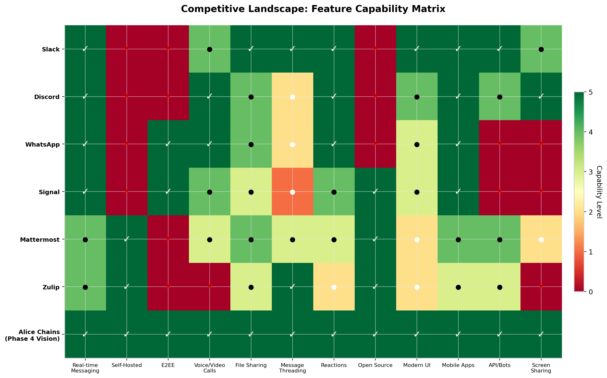
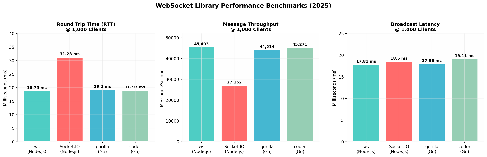
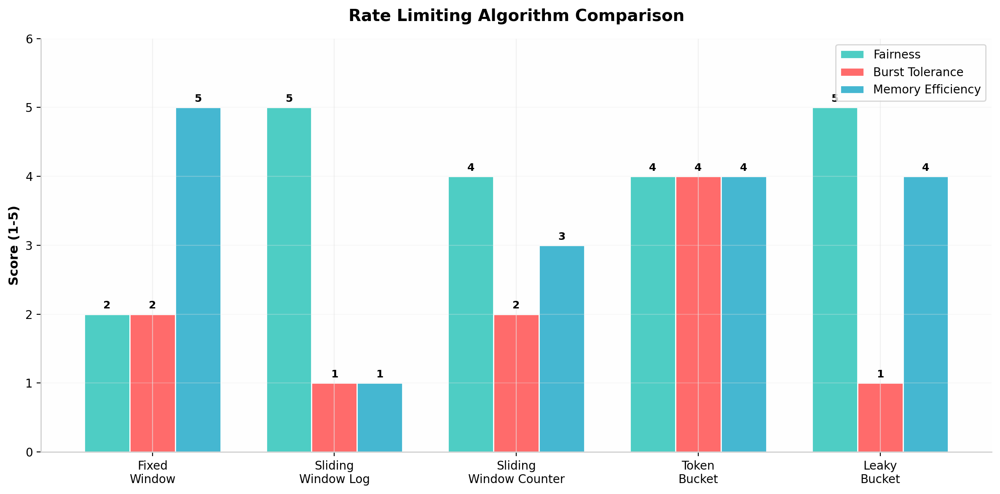
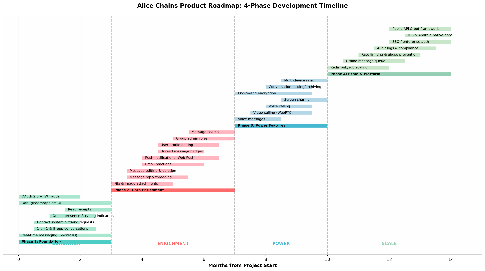

# Alice Chains — Product Requirements & Design Document (v2.0)

> **Provenance:** Authored by the Kimi agent, June 2026, delivered as `Alice_Chains_Mega_Document.docx` (25 pp) in the "Comprehensive Product Requirements Document" package; converted to Markdown for this repo on 2026-08-12 (pandoc, figures extracted to `docs/assets/prd/`). The original .docx/.pdf remain in the delivery archive.
>
> **Editor's notes (2026-08-12):**
> 1. The document's repo link (`github.com/redinc23/alice_chains`) predates the move to **`Mangu-Platforms/alice_chains`**.
> 2. "JWT sessions" in this doc = the HMAC-signed session cookie actually implemented (see `docs/ARCHITECTURE.md` §3; BACKLOG H-5).
> 3. The tRPC table below includes **planned** procedures (`file.getPresignedUrl`, `search.messages`) — implemented surface is in `docs/API.md`.
> 4. Post-delivery hardening (PR #2, July 2026) added authenticated sockets and signed sessions beyond what this document describes.
> 5. Execution status and sequencing now live in `CURRENT_STATUS.md`, `BACKLOG.md`, and `docs/ROADMAP.md`.

**Real-Time Messaging Platform | Dark Theme | WebSocket-First**
React 19 | tRPC v11 | Socket.IO | Drizzle ORM | MySQL | WebRTC
Version 2.0 | June 2026 | Internal Use Only

---

# Executive Summary

Alice Chains is a modern, dark-themed, real-time messaging platform
built with a best-in-class TypeScript stack. It delivers a
Slack/WhatsApp-grade messaging experience with glassmorphism UI
aesthetics, sub-100ms message delivery via Socket.IO, and end-to-end
type safety through tRPC v11. The application is currently in Phase 1 —
meaning the foundational infrastructure is solidly built and functional,
but a long runway of features remains ahead before it reaches product
maturity.

This document maps every inch of that journey: what exists today, what
it looks like, how it works technically, and the full vision of what
Alice Chains must become. It synthesizes deep competitive research,
architectural analysis of industry-leading platforms, and concrete
implementation paths for each planned feature. The document serves as
the single source of truth for engineering decisions, product
prioritization, and stakeholder communication.

The messaging platform market is dominated by incumbents — Slack serves
47.2 million daily active users with a cloud-only model; Discord reaches
26.5 million DAU with a community-first approach; WhatsApp processes
over 100 billion messages per day across 3 billion monthly active users.
Mattermost and Zulip occupy the self-hosted niche but suffer from dated
UIs and complex setups. Alice Chains' opportunity lies at the
intersection of beautiful modern design, true self-hostability, and a
privacy-first trajectory toward end-to-end encryption that none of the
self-hosted incumbents have achieved.

# Product Vision & Value Proposition

## Vision Statement

Alice Chains will become the definitive open-source alternative to Slack
and Discord — a self-hostable, end-to-end encrypted, beautifully crafted
real-time communication platform for teams, communities, and individuals
who demand both elegance and power. The platform embraces a dark-first
design philosophy where every pixel serves a purpose, real-time
communication is not an afterthought but the core architecture, and user
data remains under the owner's complete control.

## Core Value Proposition

Alice Chains enables people to communicate in real time through a
polished, responsive, and visually cohesive interface. Its architecture
prioritizes developer experience and correctness, making it an excellent
foundation for a production-grade messaging product. The value
proposition centers on four pillars:

> • Beautiful Modern UI — Dark-first glassmorphism design that rivals
> Slack's polish, built from the ground up for visual coherence and
> accessibility.
>
> • True Self-Hostability — Full data ownership with deployment options
> ranging from a single Docker container to horizontally scaled
> Kubernetes clusters.
>
> • Developer-Friendly Stack — React 19, TypeScript, tRPC v11, and
> Drizzle ORM create a codebase that developers actually want to
> contribute to.
>
> • Privacy-First Trajectory — A clear roadmap to Signal Protocol-based
> end-to-end encryption, making Alice Chains the most secure self-hosted
> messaging option available.

# Competitive Landscape Analysis

Understanding the competitive terrain is essential for defining Alice
Chains' unique position. The messaging platform market spans from
consumer apps like WhatsApp and Signal to enterprise tools like Slack
and Microsoft Teams, with self-hosted alternatives like Mattermost and
Zulip occupying a smaller but growing niche. Each competitor brings
distinct strengths and weaknesses that inform Alice Chains'
differentiation strategy.

## Feature Capability Matrix

The following matrix compares Alice Chains' Phase 4 vision against the
leading platforms across twelve critical capability dimensions. A green
checkmark indicates full capability, a red X indicates absence, and
intermediate scores reflect partial or limited support.

Figure 1: Competitive Feature Capability Matrix — Alice Chains (Phase 4
Vision) vs. Industry Leaders

## Competitor Deep Dives

### Slack (Salesforce)

Slack dominates the enterprise messaging space with 47.2 million daily
active users and 2,600+ app integrations. Its strengths include
exceptional UX polish, powerful search, threaded conversations, and a
robust app ecosystem. The cloud-only deployment model means
organizations cannot self-host, creating data sovereignty concerns.
Pricing starts at \$7.25/user/month for Pro, with Business+ at \$12.50
and Enterprise Grid at custom pricing. Slack's AI features (Slackbot)
come standard on paid plans. For Alice Chains, Slack represents the UX
benchmark to match and the pricing model to undercut.

### Discord

Discord serves 26.5 million daily active users with 656 million
registered accounts, built primarily for gaming communities but
increasingly adopted by teams and creators. Its voice and video
capabilities are best-in-class, with persistent voice channels and Stage
events. The free tier is generous, but the platform lacks enterprise
features like SSO, audit logs, and compliance certifications. Discord's
gaming-focused brand creates friction for professional adoption. Alice
Chains can compete by offering Discord's real-time richness with
enterprise-grade controls and a professional brand identity.

### Mattermost

Mattermost is the closest direct competitor to Alice Chains' self-hosted
model, with 800,000+ active users. It offers on-premises, private cloud,
and air-gapped deployments with ISO 27001 and HIPAA compliance support.
However, Mattermost suffers from a dated UI, complex setup procedures,
and a less modern tech stack that deters contributor engagement. The
free self-hosted edition has no user limit, while paid plans start at
\$10/user/month. Alice Chains' differentiation is its modern React 19 +
TypeScript stack and glassmorphism UI that makes self-hosted messaging
feel premium rather than utilitarian.

### WhatsApp

WhatsApp's scale is staggering — 3 billion monthly active users and over
100 billion messages per day. Its Signal Protocol-based end-to-end
encryption is the industry gold standard, and the mobile-first
experience is unmatched. However, WhatsApp is Meta-owned, cannot be
self-hosted, offers no desktop-class UX, and provides no API access for
custom integrations. The WhatsApp Business API exists but is heavily
restricted. Alice Chains can never compete on scale, but it can offer
WhatsApp's encryption quality with full data ownership and enterprise
extensibility.

### Signal

Signal represents the privacy pinnacle — best-in-class E2EE, open-source
clients, and a non-profit foundation. The Signal Protocol (X3DH + Double
Ratchet) powers both Signal and WhatsApp. However, Signal lacks
team/community features, workspace management, integrations, and
customization options. It is fundamentally a consumer app, not a
platform. Alice Chains' opportunity is to bring Signal-level encryption
to a team communication context with the full feature set that
organizations require.

## Market Positioning Strategy

Alice Chains occupies a unique position at the intersection of four
vectors: (1) beautiful modern UI that matches Slack's polish, (2) true
self-hostability with full data ownership rivaling Mattermost, (3)
open-source codebase with a clean modern TypeScript stack that
developers want to contribute to, and (4) a privacy-first trajectory
toward E2EE that no self-hosted competitor has achieved. This
positioning targets organizations and individuals who refuse to
compromise on aesthetics, control, or security — a segment that is
growing rapidly in the post-privacy-awareness era.

# System Architecture

Alice Chains follows a monorepo fullstack architecture where both the
frontend (React 19 SPA via Vite) and backend (Hono + tRPC + Socket.IO)
are co-located and share types through the Drizzle schema and tRPC
contract layer. This eliminates entire classes of API bugs and makes
refactoring safe and fearless. The architecture is designed for
horizontal scaling from day one, with clear separation between stateless
API services, stateful real-time services, and data persistence layers.

## Architecture Overview Diagram

Figure 2: Alice Chains System Architecture — 9-Layer Component Overview

## Technology Stack Detail

The technology stack was selected based on performance benchmarks,
developer experience quality, ecosystem maturity, and long-term
maintainability. Each layer choice reflects a deliberate trade-off
analysis:

| **Layer**    | **Technology** | **Version** | **Purpose**                           |
|--------------|----------------|-------------|---------------------------------------|
| Frontend     | React          | 19.x        | Component model, concurrent rendering |
| Language     | TypeScript     | 5.x         | Full-stack type safety                |
| Styling      | Tailwind CSS   | 3.x         | Utility-first dark theme              |
| Components   | shadcn/ui      | Latest      | Radix-based accessible UI             |
| Build Tool   | Vite           | 5.x         | Sub-second HMR, ESM builds            |
| HTTP Server  | Hono           | 4.x         | Edge-ready, ultra-lightweight         |
| API Protocol | tRPC           | v11         | End-to-end typesafe RPC               |
| Real-Time    | Socket.IO      | 4.x         | WebSocket + polling fallback          |
| ORM          | Drizzle ORM    | Latest      | Type-safe SQL, migrations             |
| Database     | MySQL          | 8.x         | Primary relational datastore          |
| Auth         | Kimi OAuth 2.0 | Latest      | Identity + JWT sessions               |
| Search       | Meilisearch    | Latest      | Full-text search \<50ms               |

Table 1: Complete Technology Stack with Versions and Purposes

## Real-Time Architecture — Socket.IO

Socket.IO uses a room-based broadcasting model that is both elegant and
scalable. Each user joins their own personal room (user\_{id}) for
direct notifications, and each conversation has its own room
(conv\_{conversationId}) for message broadcasting. This ensures
efficient fan-out without wasting bandwidth on irrelevant events. The
server maintains an in-memory Map of online users, broadcasting presence
changes to all connected clients.

The event flow is straightforward: when a user connects, they emit a
'join' event with their userId, which registers them in the onlineUsers
Map and joins their personal room. Opening a conversation emits
'joinConversation', which adds the socket to that conversation's room.
Messages sent via 'sendMessage' are persisted to MySQL and then
broadcast to all participants. Read receipts via 'markAsRead' write to
the message_reads table and notify the sender. Disconnect events clean
up presence state.

## Scaling Strategy

The current single-server architecture handles the Phase 1 feature set
admirably, but scaling to thousands of concurrent users requires
horizontal expansion. The key scaling strategies are:

> • Redis Pub/Sub Adapter — The @socket.io/redis-adapter package
> synchronizes room state and broadcasts across all server instances.
> Every event emit goes through Redis, which fans out to all subscribed
> servers.
>
> • Sticky Sessions — Load balancers must route WebSocket connections
> from the same client to the same server instance. This is implemented
> via cookie-based session affinity in NGINX or AWS ALB.
>
> • Connection Limits — Each Node.js instance can handle 50,000-100,000
> concurrent WebSocket connections with proper kernel tuning (ulimit,
> TCP buffer sizes). Beyond this, additional instances are spun up.
>
> • Database Read Replicas — Drizzle ORM's withReplicas() function
> automatically routes read queries to read replicas while writes go to
> the primary. This distributes load for message history fetching and
> search operations.

Figure 3: WebSocket Library Performance Benchmarks at 1,000 Concurrent
Clients

# Database Design

The database is elegantly normalized into core tables that collectively
capture the full complexity of a messaging platform. Every relationship
is explicit and referentially integrity-enforced. Drizzle ORM generates
full TypeScript types from the schema, eliminating the DB/code mismatch
problem entirely. The current schema uses 6 core tables; the Phase 2-4
roadmap expands this to 10+ tables as reactions, audit logs, device
management, and search indexes are added.

## Entity-Relationship Model

The users table serves as the central identity anchor. Users are created
upon OAuth authentication, with the unionId field storing the external
OAuth identifier and the numeric id serving as the internal primary key.
The conversations table represents both direct (1-on-1) and group
conversations, with the type enum determining display behavior. Direct
chats inherit the other participant's name and avatar, while group chats
use their own name and avatar fields.

The conversation_participants join table links users to conversations
with lastReadAt timestamps that power unread counts. The messages table
is the core datastore for all communication, supporting text, image, and
file types with replyToId for threading. The message_reads table powers
the read receipt system — each row represents a single user reading a
single message. The contacts table manages the friendship graph with a
three-state status machine: pending, accepted, and blocked.

## Schema Evolution Roadmap

The database schema must evolve across four phases to support the full
feature set. Phase 1's 6 tables expand to accommodate reactions, push
subscriptions, audit events, device registrations, and encryption key
stores. Each migration follows Drizzle's migrations-as-code pattern with
backward compatibility guarantees.

| **Table**                 | **Phase Introduced** | **Purpose**                          |
|---------------------------|----------------------|--------------------------------------|
| users                     | Phase 1              | Identity, OAuth linkage, roles       |
| conversations             | Phase 1              | Direct and group chat containers     |
| conversation_participants | Phase 1              | Many-to-many join with read tracking |
| messages                  | Phase 1              | Core message content and metadata    |
| message_reads             | Phase 1              | Per-user read receipt tracking       |
| contacts                  | Phase 1              | Friendship graph with status machine |
| message_reactions         | Phase 2              | Emoji reactions per message per user |
| push_subscriptions        | Phase 2              | Web Push API subscription storage    |
| audit_logs                | Phase 4              | Compliance event logging             |
| user_devices              | Phase 3              | Multi-device session management      |
| encryption_keys           | Phase 3              | Signal Protocol key material         |

Table 2: Database Schema Evolution Across Product Phases

# API Specification — tRPC Routers

All CRUD operations flow through tRPC v11 routers mounted on Hono. Each
procedure is either a query (read) or mutation (write), protected by the
authedQuery middleware which validates the JWT and injects the user into
context. Zod schemas enforce input shapes at the network boundary. The
router architecture is organized by domain: conversations, messages,
contacts, files, users, and search.

| **Procedure**              | **Type** | **Input**                          | **Returns**                        |
|----------------------------|----------|------------------------------------|------------------------------------|
| conversation.list          | query    | None                               | Conversation\[\] with participants |
| conversation.getById       | query    | { id: number }                     | Conversation + participants        |
| conversation.createDirect  | mutation | { otherUserId }                    | { id, type }                       |
| conversation.createGroup   | mutation | { name, participantIds\[\] }       | { id, name }                       |
| message.listByConversation | query    | { conversationId, limit? }         | Message\[\] + readBy\[\]           |
| message.send               | mutation | { conversationId, content, type? } | Message                            |
| contact.list               | query    | None                               | Contact\[\] with profile           |
| contact.searchUsers        | query    | { query: string }                  | User\[\]                           |
| contact.add                | mutation | { contactUserId }                  | Contact                            |
| file.getPresignedUrl       | query    | { filename, contentType }          | { url, fields }                    |
| search.messages            | query    | { query, conversationId? }         | Message\[\]                        |

Table 3: tRPC Router API Specification — Core Procedures

# UI/UX Design Specifications

Alice Chains employs a dark-first design language centered on a deep
slate background with violet-to-indigo accent gradients. The
glassmorphism pattern — translucent cards with backdrop blur — creates
depth and visual hierarchy without harsh contrast. Typography uses the
system sans-serif stack via Tailwind, and all interactive elements
follow a consistent 10px border-radius system.

## Design Token System

| **Token**     | **Value (HSL/Hex)** | **Usage**                       |
|---------------|---------------------|---------------------------------|
| --background  | 220 15% 8%          | Main application background     |
| --card        | 220 15% 11%         | Panel and card surfaces         |
| --primary     | 250 85% 65%         | Brand violet — buttons, accents |
| --secondary   | 220 13% 16%         | Input backgrounds, hover states |
| --muted       | 220 13% 20%         | Subtle separators               |
| --border      | 220 13% 18%         | Border color — blends with bg   |
| --emerald-500 | \#10B981            | Online presence indicator       |
| --destructive | 0 62.8% 50%         | Danger/error states             |

Table 4: Design Token Specification — HSL Color Values

## Page Specifications

The Chat page is the heart of Alice Chains — a two-panel layout with a
320px sidebar (collapsible on mobile) containing the conversation list,
and a full-height main pane showing the active conversation. The sidebar
displays conversations sorted by most recently updated, with avatar,
name, preview text, timestamp, and unread count badges. Online status
indicators appear as emerald dots on avatars.

The message pane features a chat header with avatar, name, online
status, and action buttons (call, video, search, more). Message bubbles
use violet backgrounds for sent messages and slate backgrounds for
received messages. Read receipts display as single checkmark (sent) or
double checkmark (read). Typing indicators show three bouncing dots. The
input area is an auto-resize textarea with file attachment and emoji
picker support.

Mobile responsiveness is achieved through Tailwind's md breakpoint at
768px. Below this threshold, the sidebar becomes an absolute-positioned
overlay with z-index 50, a close button appears, and the chat header
gains a hamburger menu. Phone and video buttons are hidden. The layout
uses a custom isMobile hook that listens to window.resize events.

# Phase 2: Core Enrichment Deep Dive

Phase 2 represents the most critical development period for Alice
Chains. The features planned in this phase transform the platform from a
functional prototype into a daily-usable messaging product. Each feature
has been researched against industry implementations and mapped to a
concrete technical implementation path.

## File & Image Attachments

The UI already shows a Paperclip icon in the message composer — this is
a stub. The schema has fileUrl and type=image/file fields ready. The
implementation path follows the presigned URL pattern, which is the
industry gold standard for file uploads in messaging applications.

The workflow is: (1) Client requests a presigned upload URL from the
backend, sending filename and contentType; (2) Backend validates the
user, generates a presigned URL via the AWS SDK (or MinIO client for
self-hosted), and returns the URL + form fields; (3) Client uploads the
file directly to S3/R2/MinIO via HTTP POST; (4) On success, client sends
a message with type=image or type=file and the S3 URL; (5) Backend
persists the message; (6) For images, the message bubble renders a
thumbnail with lazy loading; for files, a download card with filename
and size.

Critical implementation details: CORS must be configured on the S3
bucket to allow browser uploads. File size limits (e.g., 50MB) should be
enforced at both the presigned URL generation and the S3 bucket policy
level. MIME type validation prevents executable uploads. Image
thumbnails can be generated via Sharp (Node.js) or served through an
image CDN like Cloudflare Images that handles resizing on-demand.

## Message Reply Threading

The replyToId foreign key is already in the messages schema — this was
intentionally designed ahead of implementation. Threading transforms
flat message lists into organized conversations-within-conversations, a
pattern that Slack and Flowdock have proven essential for team
communication.

The database design uses a self-referencing pattern: messages.replyToId
references messages.id. A materialized path column (e.g., '1.5.12')
enables efficient tree traversal without recursive CTEs. The recommended
approach caps threading at 3-4 levels — beyond this, UX becomes unwieldy
regardless of technical capability.

The UI implementation requires: a 'Reply' action on message hover;
displaying the quoted message above the reply in the bubble;
scroll-to-quoted behavior when tapping the quote; and a thread view that
shows all replies to a specific message. On the backend, fetching
messages with replies requires a single query with ORDER BY path for
render ordering.

## Push Notifications

When a user receives a message and the browser tab is not focused, they
currently get no notification. The Web Push API (via Service Worker)
combined with VAPID keys enables OS-level push notifications across all
platforms including iOS 16.4+ via PWA installation.

Implementation requires: (1) Generate VAPID key pair using web-push
library; (2) Store public key in environment, private key secured on
server; (3) Client subscribes via PushManager.subscribe() with
userVisibleOnly:true; (4) Store subscription object (endpoint + keys) in
push_subscriptions table; (5) On new message, server encrypts payload
with subscriber's keys and POSTs to the endpoint; (6) Service Worker
receives push event and displays notification; (7) Handle 410/404
responses by cleaning up expired subscriptions.

Platform-specific notes: iOS Safari 16.4+ requires PWA installation (Add
to Home Screen) before push works. Android works directly in Chrome
without installation. Desktop supports all modern browsers. Payload size
is limited to 4KB on most platforms, so notifications should contain
only essential data (sender name, conversation, message preview) with a
deep link to load full content in-app.

## Message Editing & Deletion

The isEdited boolean in the schema is ready for edit tracking. The
implementation path: a hover 'Edit' action puts the message content back
into the input field with an 'editing' mode indicator; a PUT mutation
updates the message content and sets isEdited=true; the UI displays an
'edited' label on modified bubbles. Deletion uses soft-delete: a
deletedAt timestamp is set, and the UI renders '\[deleted\]' for the
content while preserving the message structure for thread continuity.

Real-time synchronization is critical — when a message is edited or
deleted, all participants must see the update immediately. This requires
new Socket.IO events: messageUpdated and messageDeleted, broadcast to
the conversation room. The client-side message cache must update
reactively when these events are received.

## Unread Message Badges

Currently there is no visual unread count on conversation list items.
The lastReadAt field in conversation_participants exists precisely for
this. The gap is the query: count messages in a conversation after
lastReadAt for each user, and surface this as a badge on the sidebar
list item.

The implementation is a SQL query that joins messages with
conversation_participants, filtering for messages.createdAt \>
participants.lastReadAt and messages.senderId != currentUserId. This
count is computed on conversation.list and returned as unreadCount per
conversation. On the UI, a small pill badge shows the count, capped at
'99+' for high volumes. When a user opens a conversation, markAsRead
updates lastReadAt and clears the badge.

## Emoji Reactions

Emoji reactions are a lightweight engagement feature that dramatically
improves conversation dynamics. They require a new message_reactions
table with columns: messageId, userId, emoji (Unicode string), and
createdAt. A UNIQUE(messageId, userId, emoji) constraint ensures a user
can add each emoji at most once per message.

The UI renders a reaction bar below each message bubble, grouping
identical emojis with a count. Tapping an existing reaction you've added
removes it; tapping one you haven't adds it. A '+' button opens an emoji
picker. Real-time propagation uses a new Socket.IO event
(reactionUpdated) broadcast to the conversation room. The tRPC router
adds reaction.add and reaction.remove mutations.

# Phase 3: Power Features Deep Dive

Phase 3 transforms Alice Chains from a chat application into a full
communications platform. Voice and video calling, end-to-end encryption,
and multi-device support are the headline features that position Alice
Chains as a serious alternative to both Slack and WhatsApp.

## WebRTC Voice & Video Calling

The Phone and Video icons are already rendered in the chat header —
stubs with presence and intention. WebRTC peer-to-peer calling requires
three components: a signaling server (implemented over the existing
Socket.IO connection), STUN/TURN servers for NAT traversal, and a
calling UI overlay with mute, camera toggle, and end-call controls.

The signaling flow: Caller emits call:initiate with offer SDP and target
userId; server relays to target's personal room; callee receives the
offer and emits call:accept with answer SDP; ICE candidates are
exchanged via call:ice-candidate events; once connection state reaches
'connected', media flows peer-to-peer. If direct connection fails, TURN
servers relay the media.

Infrastructure requirements: STUN servers are available for free
(Google's stun.l.google.com:19302). TURN servers require dedicated
infrastructure — Coturn is the open-source standard for self-hosted
deployments, or Twilio/Cloudflare offer managed TURN services. For
production, deploy Coturn on a UDP-capable server with authentication
credentials shared between Alice Chains backend and WebRTC clients.

## End-to-End Encryption

True E2EE would make Alice Chains the privacy-first alternative to
WhatsApp and Signal. The Signal Protocol is the gold standard, used by
both WhatsApp (3B users) and Signal. Implementation requires the X3DH
(Extended Triple Diffie-Hellman) key agreement protocol for initial
session setup and the Double Ratchet algorithm for ongoing message
encryption with forward secrecy.

X3DH key exchange: Each user generates a long-term identity keypair
(X25519 + Ed25519), a medium-term signed prekey, and multiple one-time
prekeys. These are uploaded to the server as a 'prekey bundle'. When
Alice wants to message Bob, she fetches Bob's prekey bundle, performs 4
DH operations, and derives a shared secret. Bob derives the same secret
when he receives Alice's initial message.

Double Ratchet: After X3DH establishes the initial shared secret, the
Double Ratchet algorithm maintains forward secrecy by continuously
updating encryption keys. Each message gets a unique key derived from a
chain key, and the chain 'ratchets forward' after each message. If a key
is compromised, only messages from that point forward are at risk — past
messages remain secure. The implementation uses the WebCrypto API for
all cryptographic operations in the browser.

For group conversations, the Signal Protocol uses sender keys — each
participant maintains a sender key chain. When Alice sends a group
message, she encrypts once with her sender key, and all recipients
decrypt with the same key. This is dramatically more efficient than
encrypting per-recipient.

## Screen Sharing

Screen sharing builds on the WebRTC calling infrastructure, using the
getDisplayMedia() API to capture the user's screen, window, or browser
tab. The captured MediaStream is added to the existing peer connection
as a video track. Recipients receive the screen share alongside (or
replacing) the camera feed.

Implementation: During an active WebRTC call, the user clicks the screen
share button. getDisplayMedia({ video: true, audio: false }) prompts the
user to select a source. The resulting stream's video track is added to
the peer connection via pc.addTrack(). The remote side's ontrack handler
detects the new track and displays it in a dedicated screen share
container. When the user stops sharing, the track is removed and the UI
reverts to the camera view.

Quality considerations: Screen sharing should default to 1080p at 15fps
for bandwidth efficiency, with options for 720p/30fps on slower
connections. The getDisplayMedia API supports cursor capture settings
(always, motion, never) and displaySurface selection (monitor, window,
browser). Audio sharing from the screen is supported on Chrome/Firefox
on Windows only; macOS and Linux require microphone audio as fallback.

## Voice Messages

Voice messages are implemented using the MediaRecorder API with
getUserMedia() for microphone access. The recording workflow: user
presses and holds a microphone button (or taps to start/stop), the
MediaRecorder captures audio chunks into a Blob, and the resulting file
is uploaded via the same presigned URL system as file attachments.

Cross-platform compatibility requires a hybrid encoding strategy:
Chrome/Edge prefer WebM/Opus, while iOS/Safari requires MP4/AAC. The
implementation detects the platform and selects the appropriate MIME
type. A shared stream architecture prevents the 'double mic' conflict
where visualizers and recorders fight for microphone access — a single
MediaStream is held by a global manager and passed to consumers as
viewers.

The UI features: a waveform visualization during recording (using Canvas
or WaveSurfer.js), playback with seek/scrub, playback speed control (1x,
1.5x, 2x), and visual progress indication. Voice messages are displayed
in the chat as compact audio player cards with duration and read status.

# Phase 4: Scale & Platform Deep Dive

Phase 4 addresses the infrastructure and platform maturity required for
production deployments at scale. These features are not user-visible in
the same way as Phase 2-3 features, but they are absolutely critical for
reliability, security, and enterprise adoption.

## Redis Pub/Sub Horizontal Scaling

The current architecture stores onlineUsers in an in-process JavaScript
Map. This works for a single server but becomes inconsistent the moment
Alice Chains runs on 2+ instances behind a load balancer. The
@socket.io/redis-adapter package solves this by making all instances
share a single presence store and event bus.

Implementation: Install @socket.io/redis-adapter and ioredis. Create
separate Redis connections for publish and subscribe (a connection in
subscribe mode cannot run other commands). Configure the adapter with
io.adapter(createAdapter(pubClient, subClient)). All room broadcasts,
presence updates, and typing indicators now flow through Redis, ensuring
every connected client receives events regardless of which server
instance they are connected to.

Redis becomes a single point of failure, so production deployments
should use Redis Sentinel for high availability or Redis Cluster for
sharding. Connection pooling via ioredis handles reconnection
automatically. Monitor Redis memory usage — presence data for 100,000
users consumes approximately 50-100MB.

## Rate Limiting & Abuse Prevention

Rate limiting protects the platform from spam, denial-of-service
attacks, and resource exhaustion. The token bucket algorithm is the
strongest general-purpose choice for APIs — it enforces a predictable
long-term rate while allowing controlled bursts that reflect real usage
patterns.

Figure 4: Rate Limiting Algorithm Comparison — Fairness, Burst
Tolerance, Memory Efficiency

Implementation uses Redis as the distributed counter store. Each user
(identified by userId or IP address) has a token bucket stored as a
Redis hash with fields for remaining tokens, last refill timestamp, and
bucket capacity. A middleware function checks the bucket before
processing each request, refilling tokens based on elapsed time. When
the bucket is empty, the middleware returns HTTP 429 Too Many Requests
with a Retry-After header.

Recommended limits: 60 messages per minute per user for chat, 10 contact
requests per minute, 5 file uploads per minute, 100 API calls per minute
overall. These limits should be configurable per-deployment via
environment variables. Rate limit events should be logged for security
monitoring and potential abuse investigation.

## Audit Logging & Compliance

Audit logging is mandatory for enterprise adoption and regulatory
compliance. A centralized audit pipeline captures all security-relevant
events: authentication successes/failures, authorization decisions,
message access, data modifications, admin actions, and system events.
The architecture follows an event-sourcing pattern where audit events
are immutable, timestamped, and tamper-resistant.

The audit event schema includes: event_id (UUIDv7), timestamp (UTC),
service_name, user_id, source_ip, action (enum), resource_affected,
outcome (SUCCESS/FAILURE), and compliance_tags (array). Events are
written to a dedicated audit_logs table in MySQL with append-only access
controls. For long-term retention (7+ years as required by many
regulations), events are periodically archived to immutable object
storage (S3 with Object Lock).

GDPR compliance requires: explicit user consent before processing
personal data, the right to access all stored personal data, the right
to rectification, the right to erasure ("right to be forgotten"), data
portability, and the right to object to processing. Alice Chains must
implement automated workflows for handling data subject access requests
(DSARs) within the 30-day regulatory deadline.

## Native Mobile Applications

A React Native application sharing the same tRPC and Socket.IO client
code would achieve 60-70% code reuse with the web frontend. Native apps
unlock: camera roll media access, background push notifications, haptic
feedback, native navigation patterns, and App Store distribution. This
is the single largest expansion of the total addressable user base.

The mobile architecture mirrors the web app: React Native with
TypeScript, shared tRPC client for API calls, Socket.IO client for
real-time events, and AsyncStorage for local caching. Platform-specific
modules handle push notifications (react-native-firebase for Android,
@react-native-community/push-notification-ios for iOS), camera access
(react-native-image-picker), and biometric authentication
(react-native-keychain).

Key mobile-specific considerations: offline message queue using SQLite
(react-native-sqlite-storage), background message sync, image/video
compression before upload, and adaptive bitrate for voice/video calls.
The app must handle poor network conditions gracefully with automatic
retry, message queuing, and connection state indicators.

# Security Requirements

Security is not a feature to be added later — it must be baked into
every layer of the architecture from day one. The following requirements
establish the security baseline for Alice Chains, covering
authentication, authorization, data protection, and operational
security.

> • SR-1: All HTTP traffic shall be served over HTTPS in production,
> with HSTS headers and TLS 1.3 minimum.
>
> • SR-2: JWTs shall use RS256 with a 2048-bit RSA keypair, including
> exp (expiry) and iat (issued at) claims. Access tokens expire in 15
> minutes; refresh tokens expire in 7 days with rotation on each use.
>
> • SR-3: OAuth 2.0 shall use the Authorization Code flow with PKCE (RFC
> 9700) for all client types. The implicit grant and resource owner
> password credentials flows are explicitly prohibited.
>
> • SR-4: SQL injection is prevented by Drizzle ORM's parameterized
> query generation. No raw SQL shall be constructed from user input.
>
> • SR-5: File uploads shall be validated for MIME type (whitelist
> approach), file size (max 50MB), and content scanning via ClamAV or
> similar before S3 storage.
>
> • SR-6: Rate limiting shall be applied to all public endpoints: 60
> msg/min for chat, 10 contact requests/min, 5 uploads/min, 100 API
> calls/min.
>
> • SR-7: CORS shall be configured to allow only the production frontend
> origin. Wildcard origins are prohibited in production.
>
> • SR-8: All user-generated content shall be sanitized via DOMPurify
> before rendering to prevent XSS attacks.
>
> • SR-9: Socket.IO connections shall verify the userId against the JWT
> before accepting join events. Unauthorized connections are immediately
> terminated.
>
> • SR-10: End-to-end encryption (Phase 3) shall use the Signal Protocol
> with X3DH key agreement and Double Ratchet for forward secrecy. Server
> never sees plaintext message content.

# Performance Targets & Benchmarks

Performance is a feature. The following targets are based on industry
benchmarks for messaging platforms and represent the standards Alice
Chains must meet to compete with incumbents. All targets are measured
under production-like conditions with realistic network latency.

| **Metric**                | **Target**   | **Current State** | **Notes**                  |
|---------------------------|--------------|-------------------|----------------------------|
| Message delivery latency  | \< 100ms P99 | Unmeasured        | Socket.IO room broadcast   |
| API response time         | \< 80ms P95  | Unmeasured        | tRPC + Drizzle + MySQL     |
| Page load (FCP)           | \< 1.2s      | Unmeasured        | Vite + code splitting      |
| Message history load      | \< 50ms      | Estimated fast    | 50-message limit           |
| Search query time         | \< 50ms      | N/A (Phase 2)     | Meilisearch target         |
| Concurrent users (single) | 10,000+      | Single instance   | Needs Redis for multi      |
| Messages per second       | 500+ MPS     | Untested          | Socket.IO rooms scale well |
| DB connections (pooled)   | Max 20/proc  | Drizzle defaults  | Tune for production        |

Table 5: Performance Targets and Current State Assessment

WebSocket library benchmarks from 2025 comparative studies show that raw
ws (Node.js) achieves 45,493 messages/second throughput with 18.75ms RTT
at 1,000 concurrent clients. Socket.IO trades some performance (27,152
msg/s, 31.23ms RTT) for its robust fallback, reconnection, and room
management features. For Alice Chains, Socket.IO's developer experience
advantages outweigh the raw performance difference, especially given
that 27K msg/s is more than sufficient for the target user base.

# GDPR Compliance & Data Governance

The General Data Protection Regulation (GDPR) governs how personal data
of EU residents is processed and stored. For messaging platforms,
compliance involves both technical and administrative safeguards that
protect user data throughout its entire lifecycle. Alice Chains'
self-hosted nature provides significant compliance advantages — data
never leaves the organization's infrastructure unless explicitly
configured to do so.

Core GDPR requirements for messaging platforms include: end-to-end
encryption for messages in transit and at rest; data minimization —
collecting only information necessary for message delivery; configurable
data retention policies with automatic purging; user rights management —
access, rectification, erasure, and portability; Data Processing
Agreements (DPAs) for enterprise customers; and breach notification
procedures with 72-hour reporting timelines.

The audit logging system (Phase 4) provides the traceability required
for compliance verification. Every access to personal data, every
administrative action, and every system event is logged with immutable
timestamps. These logs are retained for 7 years and can be exported for
regulatory review. Role-based access controls ensure that only
authorized personnel can access sensitive audit data.

Data retention policies are configurable per-organization: messages can
be set to auto-delete after 30, 90, or 365 days; file attachments can
have separate retention schedules; and user accounts can be configured
for automatic anonymization after periods of inactivity. The right to
erasure is implemented as a cascading delete that removes all personal
data while preserving anonymized conversation structures for compliance
reporting.

# Development Guide & Getting Started

> **Historical (June 2026).** This section describes the environment as originally planned and is now wrong in several places — Node is pinned to 22, `npm ci` replaces `npm install` (the lockfile is committed), the OAuth variables are `VITE_APP_ID`/`APP_SECRET`/`VITE_KIMI_AUTH_URL` rather than `KIMI_CLIENT_ID`/`KIMI_CLIENT_SECRET`, `npm run db:migrate` replaces `db:push`, Redis is not provisioned, and in development the API listens on `:3001` behind the Vite proxy. **[SETUP.md](SETUP.md) is authoritative.** Kept for provenance.

Prerequisites: Node.js 20+, MySQL 8.x, npm 10+, Redis 7+ (for Phase 4
features). The application uses a single npm workspace — both frontend
and backend are started with one command.

Setup: (1) Clone the repository: git clone
https://github.com/redinc23/alice_chains.git; (2) Install dependencies:
npm install; (3) Configure environment: cp .env.example .env and edit
DATABASE_URL, KIMI_CLIENT_ID, KIMI_CLIENT_SECRET, JWT_SECRET, REDIS_URL;
(4) Push database schema: npm run db:push; (5) Start development server:
npm run dev — Frontend at http://localhost:3000, Backend API at
http://localhost:3000/trpc, Socket.IO at ws://localhost:3000/socket.io.

Available scripts: npm run dev (Vite + Hono with hot reload), npm run
build (production build), npm start (production server), npm run check
(TypeScript type check), npm run db:push (schema push), npm run
db:studio (Drizzle Studio visual browser), npm test (vitest suite), npm
run lint (ESLint).

# Appendices

## Appendix A — Feature Completion Status

| **Feature**                         | **Status**        |
|-------------------------------------|-------------------|
| Real-time messaging (Socket.IO)     | DONE              |
| 1-on-1 and group conversations      | DONE              |
| Contact system with friend requests | DONE              |
| Online presence tracking            | DONE              |
| Typing indicators                   | DONE              |
| Read receipts                       | DONE              |
| Dark glassmorphism UI               | DONE              |
| Mobile-responsive layout            | DONE              |
| OAuth 2.0 + JWT auth                | DONE              |
| File & image attachments            | PLANNED (Phase 2) |
| Message reply threading             | PLANNED (Phase 2) |
| Unread message badges               | PLANNED (Phase 2) |
| Push notifications                  | PLANNED (Phase 2) |
| Message editing & deletion          | PLANNED (Phase 2) |
| Emoji reactions                     | PLANNED (Phase 2) |
| Voice & video calling (WebRTC)      | PLANNED (Phase 3) |
| End-to-end encryption               | PLANNED (Phase 3) |
| Screen sharing                      | PLANNED (Phase 3) |
| Voice messages                      | PLANNED (Phase 3) |
| Redis pub/sub scaling               | PLANNED (Phase 4) |
| Rate limiting & abuse prevention    | PLANNED (Phase 4) |
| Audit logs & compliance             | PLANNED (Phase 4) |
| iOS & Android native apps           | PLANNED (Phase 4) |

## Appendix B — Glossary

tRPC — TypeScript Remote Procedure Call: a framework for building
end-to-end type-safe APIs without code generation.

Socket.IO — A JavaScript library for real-time, bidirectional
event-based communication built on WebSockets with fallback support.

Drizzle ORM — A headless TypeScript ORM that generates queries at
compile time, with SQL-like syntax and zero-abstraction overhead.

Glassmorphism — A design style using frosted-glass-like translucent UI
elements with backdrop blur, subtle borders, and light reflections.

JWT — JSON Web Token: a compact, URL-safe way to represent claims
between two parties, signed with HMAC or RSA.

PKCE — Proof Key for Code Exchange: an OAuth 2.0 extension that prevents
authorization code interception attacks.

Signal Protocol — An end-to-end encryption protocol combining X3DH key
agreement with Double Ratchet for forward secrecy.

X3DH — Extended Triple Diffie-Hellman: a key agreement protocol used in
the Signal Protocol for initial session establishment.

Double Ratchet — An algorithm that combines a symmetric-key ratchet with
a DH ratchet to provide forward secrecy and future secrecy.

WebRTC — Web Real-Time Communication: an open framework for
browser-based real-time communication including voice, video, and data
channels.

VAPID — Voluntary Application Server Identification: keys used to
authenticate Push notification requests from the server to browser push
services.

STUN/TURN — Session Traversal Utilities for NAT / Traversal Using Relays
around NAT: protocols that enable WebRTC connections through firewalls
and NAT.

## Appendix C — Product Roadmap Timeline

Figure 5: Alice Chains 4-Phase Development Roadmap — 14-Month Timeline

**ALICE CHAINS**

The foundation is beautiful. The journey is everything.

github.com/redinc23/alice_chains \| Internal Use Only

Document Version 2.0 \| June 2026
