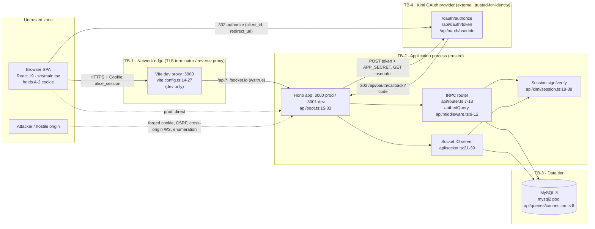

# Alice Chains — Security Specification & Threat Model

**Repo:** `Mangu-Platforms/alice_chains` · **Scope:** current prototype (Hono + tRPC 11 + Socket.IO + Drizzle/MySQL 8 + React 19/Vite) and the hardening required before any non-internal deployment.

Every claim about existing behaviour cites `file.ts:LINE` against the working tree. Anything not confirmed from source is marked `> **UNVERIFIED:**`.

> **UNVERIFIED:** Numeric suffixes on requirement IDs (`FR-AUTH-01`, `NFR-SEC-03`, …) are assigned by this document. Reconcile with the PRD's numbering if it already allocates them. Task-ID meanings pinned by the program brief are `S-2` (dev server port), `S-3` (data integrity), `S-4` (OAuth `state`); the rest are inferred and flagged in §13.

---

## 0. Security posture summary

| Property | Status |
|---|---|
| Session mechanism | HMAC-SHA256 signed cookie `alice_session`, **not a JWT** despite `README.md:13`/`:20` wording — `api/kimi/session.ts:19-26` |
| Signature verification | Constant-time via `timingSafeEqual` — `api/kimi/session.ts:31-34` |
| Session expiry | Absolute 7 days from `iat`, no idle timeout, no revocation — `api/kimi/session.ts:36`, `contracts/constants.ts:7` |
| OAuth | Authorization-code, **no `state`, no PKCE** — `src/pages/Login.tsx:7`, `api/kimi/auth.ts:24-109` |
| Sign-in with sample env | **Broken** — see SEC-C-01 |
| Socket handshake auth | Enforced; `userId` derived server-side — `api/socket.ts:30-39` |
| Socket payload validation | **None at runtime** (TypeScript annotations only) — `api/socket.ts:66,71,78-85,157,190` |
| Rate limiting | **None anywhere** (verified by absence across `api/`) |
| Security headers | **None** (no `secureHeaders`/helmet in `api/boot.ts`) |
| Body limit | 50 MB — `api/boot.ts:17` |
| Message confidentiality at rest | Plaintext `text` column — `db/schema.ts:66`. E2EE/MLS is a later phase (`docs/ALICE_CHAINS_END_TO_END_PRODUCT_BUILDOUT.md:223`) |
| Referential integrity | 0 FKs, 0 non-PK indexes, 0 UNIQUE except `users.unionId` — `db/migrations/0000_lumpy_marten_broadcloak.sql` |

---

## 1. Assets & trust boundaries

### 1.1 Assets

| ID | Asset | Location | Sensitivity |
|---|---|---|---|
| A-1 | Message plaintext | `messages.content` (`db/schema.ts:66`), Socket.IO frames | Critical |
| A-2 | Session token | `alice_session` cookie (`api/kimi/auth.ts:102`) | Critical — bearer credential, no revocation |
| A-3 | `JWT_SECRET` (HMAC signing key) | env (`api/lib/env.ts:8`) | Critical — forges any session |
| A-4 | `APP_SECRET` (OAuth client secret) | env (`api/lib/env.ts:7`), used at `api/kimi/auth.ts:45` | Critical |
| A-5 | Kimi access token | in-memory during callback (`api/kimi/auth.ts:56,63`) | High |
| A-6 | Social graph (contacts, conversation membership) | `contacts`, `conversation_participants` | High |
| A-7 | User directory (name, email, avatar) | `users` (`db/schema.ts:13-27`), exposed by `contact.searchUsers` (`api/contact-router.ts:165-188`) | Medium |
| A-8 | Presence map | in-process `Map` (`api/socket.ts:11`) | Medium |
| A-9 | `DATABASE_URL` | env (`api/lib/env.ts:4`), pooled at import (`api/queries/connection.ts:6`) | Critical |
| A-10 | Build artefacts / dependency tree | `dist/`, `package-lock.json` | High (supply chain) |

### 1.2 Trust boundaries



**Boundary rules.**

| Boundary | Crossing | Rule |
|---|---|---|
| TB-1 | Browser → edge | TLS only in prod; edge must set `X-Forwarded-Proto` (read at `api/kimi/session.ts:41`, `api/lib/cookies.ts:5` — both currently dead code, see §3.3) |
| TB-2 | Edge → app | Every `/api/trpc/*` and `/socket.io` request re-derives identity from the cookie; no header or body field may supply identity (`api/context.ts:4-6`, `api/socket.ts:35-38`) |
| TB-2→TB-3 | App → MySQL | Parameterised Drizzle only (§6); DB user least-privileged; TLS to DB |
| TB-2→TB-4 | App → Kimi | `APP_SECRET` never leaves the server process; server-to-server only (`api/kimi/auth.ts:35-50`) |

---

## 2. STRIDE threat model

Component key: **BR** browser SPA · **EDGE** proxy · **HONO** `api/boot.ts` · **TRPC** routers · **SOCK** `api/socket.ts` · **SESS** `api/kimi/session.ts` · **OAUTH** `api/kimi/auth.ts` · **DB** MySQL.

| # | STRIDE | Threat | Component | Current control (file:line) | Residual | Closed by |
|---|---|---|---|---|---|---|
| T-01 | Spoofing | Forge a session cookie | SESS | HMAC-SHA256 over base64url payload, constant-time compare — `api/kimi/session.ts:19-21,31-34` | **Low** (assumes strong `JWT_SECRET`; `api/lib/env.ts:8` only enforces `min(1)`) | SEC-C-24 |
| T-02 | Spoofing | Replay a stolen cookie after logout | SESS/HONO | None — logout only sends `Max-Age=0` to the client — `api/boot.ts:19-22` | **High** | SEC-C-05 |
| T-03 | Spoofing | Client claims another `userId` over the socket | SOCK | `userId` taken from handshake-authenticated session, never from payload — `api/socket.ts:37,44,87,159,193` | **Low** | — |
| T-04 | Spoofing | Unauthenticated socket connection | SOCK | Handshake middleware rejects when `authenticateRequest` yields no user — `api/socket.ts:30-39` | **Low** | SEC-C-29 (session expiring mid-connection is never re-checked) |
| T-05 | Spoofing | OAuth login CSRF / code injection (attacker's `code` lands in victim session) | OAUTH | **None** — no `state`, no PKCE, no nonce — `api/kimi/auth.ts:26-31`, `src/pages/Login.tsx:7` | **High** | SEC-C-03, SEC-C-04 |
| T-06 | Tampering | Modify session payload | SESS | Signature covers the whole payload; verify precedes `JSON.parse` — `api/kimi/session.ts:31-35` | **Low** | — |
| T-07 | Tampering | Malformed / oversized socket payload (`conversationId: {…}`, 10 MB `content`) reaches Drizzle | SOCK | **None** — types are erased at runtime — `api/socket.ts:66,71,78-85,157,190` | **High** | SEC-C-13, SEC-C-14 |
| T-08 | Tampering | SQL injection via raw `sql` interpolation | TRPC | `sql\`… IN (${messageIds.join(",")})\`` — `api/message-router.ts:68`. Ids are DB-derived ints, and Drizzle binds the joined string as one parameter (see §6) | **Low** for injection / **High** for correctness | SEC-C-15 |
| T-09 | Tampering | LIKE-wildcard injection in user search | TRPC | Value is parameterised, but `%`/`_` in `input.query` are not escaped — `api/contact-router.ts:181-182` | **Medium** (full-table scan, over-broad match) | SEC-C-12 |
| T-10 | Tampering | Write a read receipt for a message in a foreign conversation | TRPC | **None** — `message.markAsRead` checks nothing but authentication — `api/message-router.ts:135-156` | **Medium** | SEC-C-10 |
| T-11 | Tampering | Socket `markAsRead` with ids from another conversation | SOCK | Conversation membership checked (`api/socket.ts:161`) but message→conversation linkage is not | **Medium** | SEC-C-10 |
| T-12 | Repudiation | No audit trail for auth/authorization events | ALL | Only ad-hoc `console.log`/`console.error` — `api/socket.ts:42,148,182,208`, `api/kimi/auth.ts:106`, `api/boot.ts:69,71` | **Medium** | SEC-C-25 |
| T-13 | Info disclosure | Non-participant reads a conversation or its messages | TRPC | Membership checked — `api/conversation-router.ts:113-124`, `api/message-router.ts:26-37` | **Low** | — |
| T-14 | Info disclosure | Any authenticated user enumerates the whole user directory incl. e-mail | TRPC | None — substring LIKE over all users, returns `email` — `api/contact-router.ts:165-188` | **High** | SEC-C-12, SEC-C-19 |
| T-15 | Info disclosure | Global presence leak — every socket learns every online user id | SOCK | `socket.emit("onlineUsers", …)` to each new socket (`api/socket.ts:54`) and `socket.broadcast.emit` for online/offline (`api/socket.ts:52,206`) — not scoped to contacts or shared conversations | **High** | SEC-C-21 |
| T-16 | Info disclosure | Viewer IP/UA leaked to arbitrary hosts via attacker-influenced avatar URL | BR | `users.avatar` is free-form text taken from the IdP (`api/kimi/auth.ts:79`, `db/schema.ts:18`) and rendered as `` | **Medium** | SEC-C-17, SEC-C-22 |
| T-17 | Info disclosure | Cookie sent over plaintext HTTP | OAUTH | `Set-Cookie` string has **no `Secure`** — `api/kimi/auth.ts:102`; clearing cookie likewise — `api/boot.ts:21` | **High** | SEC-C-07 |
| T-18 | Info disclosure | Secret inlined into the public JS bundle by Vite | BR | Only `VITE_KIMI_AUTH_URL` and `VITE_APP_ID` are `VITE_`-prefixed (`src/pages/Login.tsx:4-5`); `APP_SECRET`/`JWT_SECRET` are not, and are absent from `dist/public/assets/*.js` (grep confirmed) | **Low** | SEC-C-24 |
| T-19 | Info disclosure | Internal error text returned to caller | TRPC | `throw new Error("You are not a participant…")` → tRPC `INTERNAL_SERVER_ERROR` — `api/message-router.ts:112`, `api/contact-router.ts:70,86` | **Low** | SEC-C-26 |
| T-20 | DoS | Unbounded request/message rate | ALL | **None** | **High** | SEC-C-19 |
| T-21 | DoS | 50 MB JSON body accepted on every route | HONO | `bodyLimit({ maxSize: 50 * 1024 * 1024 })` — `api/boot.ts:17` | **High** | SEC-C-20 |
| T-22 | DoS | Socket frame flood / oversized frames | SOCK | Socket.IO default `maxHttpBufferSize` (1 MB) only; nothing configured — `api/socket.ts:22-28` | **High** | SEC-C-14, SEC-C-19 |
| T-23 | DoS | Unindexed scans (`conversation_participants`, `messages`, LIKE `%x%`) | DB | No indexes at all — `db/migrations/0000_lumpy_marten_broadcloak.sql` | **High** | SEC-C-16 |
| T-24 | DoS | Presence map grows unbounded / leaks socket ids | SOCK | Entry deleted when the last socket disconnects — `api/socket.ts:201-207`; no sweep for stale ids after a crash-restart of a clustered peer | **Medium** (single-node only) | SEC-C-21 |
| T-25 | Elevation | Add arbitrary users to a group and message them | TRPC | `participantIds` accepted verbatim; no existence, contact, or block check — `api/conversation-router.ts:215-243` | **High** | SEC-C-11 |
| T-26 | Elevation | Open a DM with any user id, including non-existent ones | TRPC | No existence/contact/block check — `api/conversation-router.ts:160-213`; no FK to catch it — `db/migrations/…:12-19` | **Medium** | SEC-C-11, SEC-C-16 |
| T-27 | Elevation | Cross-site request forging a tRPC mutation | HONO | Only `SameSite=Lax` on the cookie — `api/kimi/auth.ts:102`. No origin check, no CSRF token. Dead helper would emit `SameSite=None` when `Origin` is absent — `api/kimi/session.ts:47`, `api/lib/cookies.ts:11` | **Medium** | SEC-C-07, SEC-C-08, SEC-C-18 |
| T-28 | Elevation | Cross-origin WebSocket hijack | SOCK | `origin: false` in production blocks *all* cross-origin (see §7.2); dev allows exactly `http://localhost:3000` — `api/socket.ts:24` | **Low** (at the cost of blocking legitimate split-domain deploys) | SEC-C-18 |
| T-29 | Elevation | Malicious dependency in the build | BUILD | `npm ci` + committed lockfile in the working tree; **`package-lock.json` is still untracked in git** (`git ls-files` has no match) | **High** | SEC-C-27 |
| T-30 | Info disclosure | DB compromise reveals all message plaintext | DB | Accepted for the prototype; MLS/E2EE is Phase 1 Epic 1.3 — `docs/ALICE_CHAINS_END_TO_END_PRODUCT_BUILDOUT.md:223` | **High (accepted)** | Out of scope here |

---

## 3. Authentication & session security

### 3.1 Current scheme (as built)

**Token format** — `api/kimi/session.ts:15-26`

```
alice_session = base64url(JSON payload) "." base64url(HMAC-SHA256(JWT_SECRET, payload))
```

* Algorithm: `createHmac("sha256", env.JWT_SECRET)`, digest `base64url` — `api/kimi/session.ts:20`.
* Payload (`SessionData`, `api/kimi/types.ts:9-15`): `{ userId, unionId, name, email?, iat }` where `iat = Date.now()` (milliseconds) — `api/kimi/session.ts:24`.
* **The payload is signed, not encrypted.** `userId`, `unionId`, `name` and `email` are readable by anyone holding the cookie (i.e. any XSS payload, any log that captures the cookie).
* No `alg`/`kid` header, no key id, no algorithm negotiation — so no "alg: none" class of attack, but also **no key rotation path**.

**Verification** — `api/kimi/session.ts:28-38`

1. Split on `.`; reject if either half missing (`:29-30`).
2. Recompute the signature; reject unless byte lengths match **and** `timingSafeEqual` passes (`:31-34`) — the length pre-check is required because `timingSafeEqual` throws on unequal lengths.
3. `JSON.parse` the payload **after** signature verification (`:35`) — correct ordering; parse errors are swallowed by the caller's `try/catch` at `api/kimi/auth.ts:17-19`.
4. Reject when `!session.unionId` or `Date.now() - session.iat > Session.maxAgeSeconds * 1000` (`:36`), i.e. 7 days (`contracts/constants.ts:7`).
5. `authenticateRequest` then re-loads the user row by `unionId` on every request (`api/kimi/auth.ts:14`), so a deleted user loses access — but a *changed* user id does not invalidate outstanding tokens.

**Cookie flags actually emitted** — `api/kimi/auth.ts:98-104`

```
Set-Cookie: alice_session=<token>; Path=/; HttpOnly; SameSite=Lax; Max-Age=604800
```

| Flag | Value | Note |
|---|---|---|
| `HttpOnly` | set | JS cannot read the cookie |
| `SameSite` | `Lax` | blocks cross-site POST; top-level GET navigation still carries it |
| `Secure` | **absent** | cookie travels over plaintext HTTP — T-17 |
| `Path` | `/` | |
| `Max-Age` | `604800` (7 d) | matches `contracts/constants.ts:7` |
| `Domain` | absent | host-only — good |
| `__Host-` prefix | absent | |

Logout emits `alice_session=; Path=/; HttpOnly; SameSite=Lax; Max-Age=0` — `api/boot.ts:21`. Also no `Secure`, and **purely client-side**: the token remains valid for its full 7 days if it was captured.

**Dead code that must not be revived as-is.** `getSessionCookieOptions` exists *twice* — `api/kimi/session.ts:40-51` and `api/lib/cookies.ts:4-15` — and `parseSessionToken` at `api/lib/cookies.ts:17-23` duplicates `getSessionToken` at `api/kimi/session.ts:7-13`. Grep confirms **no call sites**. Both copies compute `sameSite: origin ? "lax" : "none"` — `SameSite=None` without `Secure` is rejected by modern browsers and, if it ever were accepted, re-opens full cross-site CSRF (T-27).

### 3.2 Required hardening

| ID | Control | Requirement |
|---|---|---|
| SEC-C-03 | OAuth `state` | 32-byte CSPRNG value, stored in a short-lived `__Host-ac_oauth` cookie (`HttpOnly; Secure; SameSite=Lax; Max-Age=600; Path=/`), single-use, compared with `timingSafeEqual`, deleted on use. Missing/mismatched → `400` and no session. | FR-AUTH-02, NFR-SEC-01 |
| SEC-C-04 | PKCE S256 | `code_verifier` = 43–128 char CSPRNG, `code_challenge = base64url(SHA256(verifier))`, `code_challenge_method=S256` on authorize; `code_verifier` sent on token exchange. Verifier stored beside `state` in the same cookie payload (signed), never in `localStorage`. |
| SEC-C-05 | Rotation + invalidation | Issue a fresh token on every successful callback (already true) **and** add server-side revocation: a `sessions` table (`id` PK, `userId`, `createdAt`, `lastSeenAt`, `revokedAt`, `uaHash`) with the row id embedded in the payload as `sid`. `verifySessionToken` → `sid` lookup → reject when `revokedAt` is set. `/api/logout` sets `revokedAt = NOW()` **before** clearing the cookie. |
| SEC-C-06 | Dual expiry | Absolute 7 d from `iat` (keep `api/kimi/session.ts:36`) **plus** idle 24 h from `sessions.lastSeenAt`, refreshed at most once per 5 min to avoid a write per request. Add `v` (payload version) so a format change invalidates old tokens. |
| SEC-C-07 | Cookie flags | Emit via one helper. Prod: `__Host-alice_session=<t>; Path=/; HttpOnly; Secure; SameSite=Lax; Max-Age=604800`. Dev over http: drop `Secure` and the `__Host-` prefix only when `NODE_ENV !== "production"`. Logout must clear with the *same* attributes. |
| SEC-C-08 | Delete duplicates | **Delivered by S-17, with a placement change from the original text.** `api/lib/cookies.ts` is the single cookie module — `serializeSessionCookie`, `clearSessionCookie`, `sessionCookieName`, `parseSessionToken`, plus the OAuth attempt cookies S-4 introduced. The duplicate `getSessionCookieOptions` in `api/kimi/session.ts` and the dead `api/lib/http.ts` are deleted. The original text put the helper in `api/kimi/session.ts` and removed `api/lib/cookies.ts`; that was written before S-4 added the `state`/PKCE cookies, and splitting cookie emission across two modules to satisfy it would recreate the very drift this control exists to prevent. One module, either way. |
| SEC-C-29 | Live session expiry on sockets | Re-verify the session on the socket every 15 min (`socket.data.expiresAt`); on failure emit `sessionExpired` and `socket.disconnect(true)`. |
| SEC-C-30 | Uniform failures | Callback errors return one generic body; no distinction between "unknown code", "expired code", "userinfo failed". |

### 3.3 OAuth endpoint contract (fixes the confirmed URL incoherence)

**The defect.** `.env.example` shipped `VITE_KIMI_AUTH_URL=https://example.com/oauth/authorize` — a full authorize URL used as the *base*. The sample is corrected (`.env.example:13` is now a bare origin), but the code still reads the variable three incompatible ways:

* `src/pages/Login.tsx:7` builds `` `${authUrl}/oauth/authorize?...` `` → `https://example.com/oauth/authorize/oauth/authorize?...`
* `api/kimi/auth.ts:36` posts to `` `${process.env.VITE_KIMI_AUTH_URL}/api/oauth/token` `` → `https://example.com/oauth/authorize/api/oauth/token`
* `api/kimi/auth.ts:60` gets `` `${…}/api/oauth/userinfo` `` → same doubling.

`api/lib/env.ts:5` only validates `z.string().url()`, which a URL-with-path satisfies. **Sign-in is broken out of the box.**

**Second, independent defect (new).** The `redirect_uri` is computed in two places from two different origins:

* client: `${window.location.origin}/api/oauth/callback` — `src/pages/Login.tsx:6` → in dev that is `http://localhost:3000`;
* server: `${url.origin}/api/oauth/callback` — `api/kimi/auth.ts:47`, where `url` is the *inbound* request URL. Vite proxies `/api` to `http://localhost:3001` with `changeOrigin: true` (`vite.config.ts:17-20`), so the server sees `http://localhost:3001`.

The two `redirect_uri` values must be byte-identical or a conformant provider rejects the exchange. Behind any reverse proxy the same mismatch occurs in production.

**Required contract.** One base URL, one derivation site, no string concatenation at call sites.

`contracts/oauth.ts` (new — shared by client and server):

```ts
export const OAuthPaths = {
  authorize: "/oauth/authorize",
  token: "/api/oauth/token",
  userinfo: "/api/oauth/userinfo",
} as const;

/** Throws if the configured base carries a path, query or fragment. */
export function kimiEndpoint(base: string, p: keyof typeof OAuthPaths): string {
  const u = new URL(base);
  if (u.pathname !== "/" || u.search || u.hash) {
    throw new Error(`VITE_KIMI_AUTH_URL must be an origin only, got "${base}"`);
  }
  return new URL(OAuthPaths[p], u).toString();
}
```

`api/lib/env.ts` — the variable **keeps its name**, `VITE_KIMI_AUTH_URL` (`api/lib/env.ts:5`, `.env.example:13`); only its validation tightens from `z.string().url()` to an origin-only refinement:

```ts
VITE_KIMI_AUTH_URL: z.string().url().refine((v) => {
  const u = new URL(v);
  return u.pathname === "/" && !u.search && !u.hash;
}, "VITE_KIMI_AUTH_URL must be a bare origin, e.g. https://kimi.example.com"),
PUBLIC_BASE_URL: z.string().url(),          // canonical externally-visible origin
APP_SECRET: z.string().min(32),
JWT_SECRET: z.string().min(32),
```

`.env.example` — the OAuth block reads:

```
# Bare origin only. Paths are derived in contracts/oauth.ts.
# VITE_-prefixed, therefore inlined into the public client bundle: never a secret.
VITE_KIMI_AUTH_URL=https://kimi.example.com
# Externally visible origin of THIS app; must match the OAuth client's registered redirect URI.
PUBLIC_BASE_URL=http://localhost:3000
```

| Endpoint | Derivation | Used at |
|---|---|---|
| authorize | `kimiEndpoint(VITE_KIMI_AUTH_URL, "authorize")` | `src/pages/Login.tsx` (replaces `:7`) |
| token | `kimiEndpoint(VITE_KIMI_AUTH_URL, "token")` | `api/kimi/auth.ts` (replaces `:36`) |
| userinfo | `kimiEndpoint(VITE_KIMI_AUTH_URL, "userinfo")` | `api/kimi/auth.ts` (replaces `:60`) |
| redirect_uri | `new URL(Paths.oauthCallback, PUBLIC_BASE_URL).toString()` — **one constant, both sides** | `src/pages/Login.tsx:6`, `api/kimi/auth.ts:47` |

~~`api/kimi/platform.ts:8-14` must be rewritten to read from `env` (it currently reads `process.env` directly with `|| ""` fallbacks, bypassing the Zod schema) or deleted — it has no call sites today.~~ **Deleted in P-TOOL-7.** It had no call sites, and its `API_BASE` read was the only reference to a variable nothing else in the codebase consumed — documenting it in `.env.example` would have invited an operator to configure something with no effect.

**Authorize request after SEC-C-03/04:**

```
GET {authorize}
  ?client_id={VITE_APP_ID}
  &redirect_uri={PUBLIC_BASE_URL}/api/oauth/callback
  &response_type=code
  &scope=openid%20profile%20email
  &state={state}
  &code_challenge={S256(verifier)}
  &code_challenge_method=S256
```

**Callback contract** (`GET /api/oauth/callback`, `contracts/constants.ts:2`):

| Condition | Response |
|---|---|
| `error` param present | `302 /login?e=denied`, no cookie |
| missing `code` | `400 {"error":"invalid_request"}` (current behaviour, `api/kimi/auth.ts:29-31`) |
| missing/mismatched `state` | `400 {"error":"invalid_request"}`, state cookie cleared |
| token exchange non-2xx | `502 {"error":"upstream"}` (current: `400 "Failed to exchange code"`, `api/kimi/auth.ts:53`) |
| userinfo non-2xx | `502 {"error":"upstream"}` |
| success | `302 /` + `Set-Cookie` per SEC-C-07, state cookie cleared |

---

## 4. Authorization model

**Primitive:** a row in `conversation_participants` for `(conversationId, userId)` is the sole authorisation fact for anything conversation-scoped. There is no role model inside a conversation; `users.role` (`db/schema.ts:20`) exists but **is never read anywhere** in `api/`.

**Identity source:** `ctx.user` from `createContext` (`api/context.ts:4-6`) for tRPC; `socket.data.userId` set at `api/socket.ts:37` for sockets. Neither ever accepts an id from the caller.

### 4.1 tRPC surface

| Procedure | Auth | Membership / ownership check | Verdict |
|---|---|---|---|
| `ping` | public (`api/router.ts:8`) | n/a | OK |
| `auth.me` | `authedQuery` (`api/auth-router.ts:4`) | n/a | OK |
| `conversation.list` | authed | results derive from the caller's participant rows — `api/conversation-router.ts:18-24,37` | OK |
| `conversation.getById` | authed | explicit check, returns `null` on failure — `api/conversation-router.ts:113-124` | OK |
| `conversation.createDirect` | authed | **none on `otherUserId`** — no existence, contact-status, or block check — `api/conversation-router.ts:160-213` | **GAP** (T-26) |
| `conversation.createGroup` | authed | **none on `participantIds`** — `api/conversation-router.ts:215-243` | **GAP** (T-25) |
| `conversation.markAsRead` | authed | implicit: `WHERE conversationId = ? AND userId = ctx.user.id` — `api/conversation-router.ts:252-256` (no-op for non-members) | OK |
| `message.listByConversation` | authed | explicit check, returns `[]` — `api/message-router.ts:26-37` | OK |
| `message.send` | authed | explicit check — `api/message-router.ts:100-113`; throws bare `Error` not `TRPCError` (`:112`) | OK / fix error type (SEC-C-26) |
| `message.markAsRead` | authed | **none** — writes `message_reads` for any `messageId` — `api/message-router.ts:135-156` | **GAP** (T-10) |
| `contact.list` / `contact.pending` | authed | scoped by `ctx.user.id` — `api/contact-router.ts:26-31,53-58` | OK |
| `contact.add` | authed | self-add rejected (`api/contact-router.ts:69-71`); duplicate rejected (`:85-87`); **no block check**, and the reverse row's `onDuplicateKeyUpdate` (`:103-105`) can never fire because no UNIQUE key exists on `(userId, contactUserId)` | **GAP** |
| `contact.accept` | authed | scoped by `contacts.contactUserId = ctx.user.id` — `api/contact-router.ts:120-124`. Note the input is named `contactId` but is used as a **user id** (`:123`), and the client passes `request.userId` (`src/pages/Contacts.tsx:349`) — consistent, but the name is misleading | OK / rename |
| `contact.remove` | authed | both directions scoped to the caller — `api/contact-router.ts:149-159` | OK |
| `contact.searchUsers` | authed | **none** — substring LIKE over all users, returns `email` — `api/contact-router.ts:165-188` | **GAP** (T-14) |

### 4.2 Socket surface

| Event | Membership check | Verdict |
|---|---|---|
| handshake | `authenticateRequest` → reject — `api/socket.ts:30-39` | OK |
| `joinConversation` | `isParticipant` before `socket.join` — `api/socket.ts:66-68` (helper at `:56-63`) | OK (silent no-op) |
| `leaveConversation` | none — `api/socket.ts:71-73` | Acceptable (leaving a room you are not in is inert) |
| `sendMessage` | participant row required before insert — `api/socket.ts:93-104` | OK |
| `markAsRead` | conversation membership checked — `api/socket.ts:161`; **`messageIds` are not verified to belong to that conversation** — `api/socket.ts:165-174` | **GAP** (T-11) |
| `typing` | `isParticipant` — `api/socket.ts:191` | OK |
| `disconnect` | n/a — `api/socket.ts:201-209` | OK |
| presence emit | **none** — `socket.broadcast.emit("userOnline")` (`api/socket.ts:52`), full online list to each socket (`:54`), `userOffline` (`:206`) | **GAP** (T-15) |

### 4.3 Required controls

| ID | Control |
|---|---|
| SEC-C-09 | One helper `assertParticipant(db, conversationId, userId): Promise<void>` in `api/queries/authz.ts`, throwing `TRPCError({ code: "FORBIDDEN" })` on the tRPC side and returning `false` (silent drop) on the socket side. Replace the five hand-rolled copies at `api/conversation-router.ts:113-124`, `api/message-router.ts:26-37`, `api/message-router.ts:100-113`, `api/socket.ts:56-63`, `api/socket.ts:93-104`. |
| SEC-C-10 | Read receipts: resolve `messageIds → conversationId` in one query and drop any id whose conversation the caller is not a member of, in **both** `api/message-router.ts:135-156` and `api/socket.ts:155-185`. |
| SEC-C-11 | `createDirect` / `createGroup`: every target id must (a) exist in `users`, (b) not have `contacts.status = 'blocked'` in either direction, (c) satisfy the product rule for who may be added. Cap `participantIds` at 256. |
| SEC-C-12 | `searchUsers`: require `query.length >= 3`; escape `%`, `_`, `\`; drop `email` from the projection (match on it, never return it); exclude users who blocked the caller; cap at 20 (already `api/contact-router.ts:185`); rate-limit per SEC-C-19. |
| SEC-C-21 | Presence: replace the global broadcast with a fan-out to `user_<id>` rooms of users who share a conversation or an accepted contact edge; `onlineUsers` on connect returns only that same set. |
| SEC-C-26 | All authorization failures use `TRPCError` with `FORBIDDEN`/`NOT_FOUND` (never bare `Error`, which surfaces as `INTERNAL_SERVER_ERROR` and logs a stack). |

---

## 5. Input validation

### 5.1 Today

**Validated (Zod, server-side, at the tRPC boundary):**

| Input | Schema | Line |
|---|---|---|
| `message.listByConversation` | `conversationId:number`, `limit:1..100 = 50`, `offset:>=0 = 0` | `api/message-router.ts:15-19` |
| `message.send` | `content: string().min(1).max(4000)`, `type: enum(text\|image\|file)`, `fileUrl?: string`, `replyToId?: number` | `api/message-router.ts:87-93` |
| `message.markAsRead` | `messageIds: number[]` (no length cap) | `api/message-router.ts:136` |
| `conversation.getById` / `markAsRead` | `{ id \| conversationId: number }` | `api/conversation-router.ts:107,246` |
| `conversation.createDirect` | `{ otherUserId: number }` | `api/conversation-router.ts:161` |
| `conversation.createGroup` | `name: 1..100`, `participantIds: number[].min(1)` (no max) | `api/conversation-router.ts:217-220` |
| `contact.*` | ids as `z.number()`, `searchUsers.query: string().min(1)` | `api/contact-router.ts:64,111,142,166` |
| Environment | `envSchema.parse(process.env)` at import — `api/lib/env.ts:3-14` | fails fast |

Gaps even inside the validated set: `z.number()` accepts negatives, zero, floats and `Number.MAX_SAFE_INTEGER`; `fileUrl` is an unconstrained string (no `.url()`, no scheme allow-list) — `api/message-router.ts:91`; `messageIds`/`participantIds` are uncapped arrays.

`api/lib/http.ts:3-8` exports a `validateBody` helper — **no call sites**.

**Not validated at all — every Socket.IO payload.** `api/socket.ts:66,71,78-85,157,190` destructure TypeScript-typed objects; those annotations vanish at runtime. A client may emit `sendMessage` with `content` of arbitrary length (up to the 1 MB frame default), `conversationId` as a string or object, `type` as any string (cast at `api/socket.ts:111`), `replyToId` pointing at a foreign message, or `markAsRead` with `messageIds: [1..1e6]` — the handler loops one `INSERT` per id (`api/socket.ts:165-174`).

Note the asymmetry: the socket path is the primary send path in the UI (`src/pages/Chat.tsx:157`), so **the 4000-char limit enforced on `message.send` is not enforced on the path users actually use.**

### 5.2 Required — shared contracts

`contracts/socket-events.ts` (new; imported by `api/socket.ts` and `src/hooks/useSocket.ts` so client and server cannot drift):

```ts
import { z } from "zod";

export const Id = z.number().int().positive().max(Number.MAX_SAFE_INTEGER);

export const JoinConversation  = z.object({ conversationId: Id }).strict();
export const LeaveConversation = JoinConversation;

export const SendMessage = z.object({
  conversationId: Id,
  content: z.string().min(1).max(4000),
  type: z.enum(["text", "image", "file"]).default("text"),
  fileUrl: z.string().url().max(2048).optional(),
  replyToId: Id.optional(),
  tempId: z.string().uuid().optional(),
}).strict();

export const MarkAsRead = z.object({
  conversationId: Id,
  messageIds: z.array(Id).min(1).max(200),
}).strict();

export const Typing = z.object({ conversationId: Id, isTyping: z.boolean() }).strict();

export const ClientEvents = {
  joinConversation: JoinConversation,
  leaveConversation: LeaveConversation,
  sendMessage: SendMessage,
  markAsRead: MarkAsRead,
  typing: Typing,
} as const;
export type ClientEvent = keyof typeof ClientEvents;
```

Server wiring (replaces the raw `socket.on(...)` handlers):

```ts
function on<E extends ClientEvent>(
  socket: Socket, event: E,
  handler: (data: z.infer<(typeof ClientEvents)[E]>) => Promise<void> | void,
) {
  socket.on(event, async (raw: unknown) => {
    const parsed = ClientEvents[event].safeParse(raw);
    if (!parsed.success) {
      socket.emit("validationError", { event, issues: parsed.error.issues.map((i) => i.path.join(".")) });
      return; // never throw out of a socket handler — it kills the process
    }
    await handler(parsed.data);
  });
}
```

Rules:

1. `.strict()` on every schema — unknown keys are a rejection, not a silent pass.
2. Validation runs **before** any DB access and before the membership check.
3. Handlers never throw; they emit `validationError` and return (mirrors the existing swallow-and-emit style at `api/socket.ts:147-150`).
4. `SendMessage` and `message.send` (`api/message-router.ts:87-93`) both import the same schema — one definition of "a valid message".
5. Same `Id` primitive replaces every bare `z.number()` in the tRPC routers.
6. `fileUrl` must additionally pass an allow-list check against the configured attachment origin (§9).

---

## 6. Injection & data access

### 6.1 Finding — `api/message-router.ts:68`

```ts
.where(sql`${messageReads.messageId} IN (${messageIds.join(",")})`)
```

Two facts, both verified against `drizzle-orm@0.40.1` in this tree:

1. **It is not an exploitable SQL injection.** Drizzle wraps a plain interpolated JS value as a bound parameter. Compiling the identical expression with `MySqlDialect().sqlToQuery()` yields:

   ```
   sql:    m.messageId IN (?)
   params: ["7,8,9"]
   ```

   The ids also originate from a prior `SELECT` (`api/message-router.ts:61`), not from the caller.

2. **It is functionally broken.** MySQL compares a `bigint unsigned` column against the string `'7,8,9'`, coerces it to `7`, and the predicate degenerates to `messageId IN (7)`. **Read receipts are returned only for the first message in each page**; every other message renders as unread (`api/message-router.ts:78-82` → `readBy`). Under `STRICT_TRANS_TABLES` this raises a truncation warning, not an error, so it fails silently.

   The empty-array case is currently guarded at `api/message-router.ts:64` (`if (messageIds.length > 0)`), but the guard is the only thing standing between the app and `IN ()`, which is a MySQL syntax error. Removing the guard during a refactor breaks the endpoint.

### 6.2 Fix

```ts
import { inArray } from "drizzle-orm";

reads = messageIds.length
  ? await db.select().from(messageReads).where(inArray(messageReads.messageId, messageIds))
  : [];
```

`inArray` emits `IN (?, ?, ?)` with one bound parameter per element and is already the established pattern in this codebase — `api/conversation-router.ts:37,50,61,174`.

### 6.3 Rule — SEC-C-15

> **Interpolating a value into a `sql\`\`` template is prohibited.** Use Drizzle operators (`eq`, `and`, `or`, `inArray`, `like`, `gt`, …). A `sql\`\`` template may only be used for operators Drizzle does not express, and then only with `sql.placeholder`/bound params — never with `.join()`, `+`, or `${}` on a value that is not a Drizzle column/table reference.

Enforcement:

* ESLint `no-restricted-syntax` on `TaggedTemplateExpression[tag.name="sql"]` with an allow-list comment (`// sql-ok: <reason>`), added to `eslint.config.js:25-30`.
* The two remaining uses at `api/contact-router.ts:181-182` are parameterised correctly but must still gain wildcard escaping (SEC-C-12) and an allow-list comment.
* Code review checklist item; CI grep as a backstop: `rg 'sql`[^`]*\$\{(?!.*\.(id|name|email|messageId))' api/`.

### 6.4 Data-access controls

| ID | Control |
|---|---|
| SEC-C-16 | Add in one migration (task S-3): `UNIQUE (conversationId, userId)` on `conversation_participants`; `UNIQUE (messageId, userId)` on `message_reads`; `UNIQUE (userId, contactUserId)` on `contacts`; FKs with `ON DELETE CASCADE` for `conversation_participants.*`, `messages.conversationId`, `message_reads.messageId`, `contacts.*`, and `ON DELETE SET NULL` for `messages.replyToId`; indexes `messages(conversationId, createdAt)`, `conversation_participants(userId)`, `message_reads(userId)`, `contacts(contactUserId, status)`, `users(email)`. Without the UNIQUEs, the "ignore duplicates" `try/catch` blocks at `api/socket.ts:167-173` and `api/message-router.ts:146-152` and the `onDuplicateKeyUpdate` at `api/contact-router.ts:103-105` are **no-ops that silently accumulate duplicate rows**. |
| SEC-C-28 | Application DB user gets `SELECT, INSERT, UPDATE, DELETE` on the six tables only — no `DROP`, `ALTER`, `FILE`, `GRANT`. Migrations run under a separate DDL user (already a separate step: `docker-compose.yml:22-32`). Enable TLS on the MySQL connection and set a pool cap in `api/queries/connection.ts:6` (`mysql.createPool(url)` currently takes every default). |

---

## 7. Transport & headers

### 7.1 Required response headers

Add a Hono middleware immediately after `api/boot.ts:17`, applied to every route including static (`api/lib/vite.ts:5-8`).

| Header | Value | Rationale |
|---|---|---|
| `Content-Security-Policy` | see below | The production build emits **no inline `<script>`** (`dist/public/index.html` — single external `<script type="module" crossorigin src="/assets/…">`), so `'unsafe-inline'` is not needed for scripts |
| `Strict-Transport-Security` | `max-age=63072000; includeSubDomains; preload` | prod only, behind TLS |
| `X-Content-Type-Options` | `nosniff` | |
| `Referrer-Policy` | `strict-origin-when-cross-origin` | avoids leaking `?c=<conversationId>` (`src/pages/Chat.tsx:39`) to third parties |
| `X-Frame-Options` | `DENY` | legacy backstop for `frame-ancestors` |
| `Cross-Origin-Opener-Policy` | `same-origin` | |
| `Cross-Origin-Resource-Policy` | `same-origin` | |
| `Permissions-Policy` | `camera=(), microphone=(), geolocation=(), payment=()` | the UI shows call icons (`src/pages/Chat.tsx:10-11`) that are not implemented |
| `Cache-Control` | `no-store` on `/api/*` | prevents proxy caching of message payloads |

**Production CSP:**

```
default-src 'self';
script-src 'self';
style-src 'self' 'unsafe-inline';
img-src 'self' data: https://<avatar-cdn>;
font-src 'self' data:;
connect-src 'self' wss://<app-host>;
frame-ancestors 'none';
base-uri 'none';
form-action 'self';
object-src 'none';
upgrade-insecure-requests
```

* `style-src 'unsafe-inline'` is required because Radix/shadcn primitives set inline `style` attributes at runtime (`src/components/ui/*`). Remove it only after migrating to CSP hashes or nonces.
* `img-src` must **not** be `https:` wildcard: `users.avatar` is free-form text supplied by the IdP (`api/kimi/auth.ts:79`) and rendered into ``, so a wildcard turns every avatar into an IP-logging beacon (T-16). Either pin the provider's CDN or proxy avatars through `/api/avatar/:userId` (SEC-C-22).
* `connect-src` must include the `wss://` origin or Socket.IO upgrades are blocked.

**Dev CSP** must be relaxed for Vite HMR (`'unsafe-inline'` for styles, `ws://localhost:3000` in `connect-src`); gate on `env.NODE_ENV` (`api/lib/env.ts:10`). Do not ship the dev policy — assert in a test that the prod policy contains no `'unsafe-eval'` and no `'unsafe-inline'` in `script-src`.

### 7.2 CORS / Socket.IO origin policy

Current — `api/socket.ts:22-28`:

```ts
cors: { origin: process.env.NODE_ENV === "production" ? false : "http://localhost:3000", credentials: true }
```

* **Dev:** exactly `http://localhost:3000`, matching `vite.config.ts:15`. Correct.
* **Prod:** `origin: false` makes Socket.IO **omit `Access-Control-Allow-Origin` entirely**. Same-origin polling and WebSocket upgrades still work because same-origin requests need no CORS header. The implication is decisive: **any split-domain deployment breaks.** If the SPA is served from `app.example.com` and the API/socket from `api.example.com`, the browser blocks the polling handshake, and the WebSocket upgrade — which is not subject to CORS but *is* subject to Socket.IO's own `allowRequest`/origin check — is refused as well. Today this is invisible because production serves client and API from one process on one port (`api/boot.ts:51-58`, `api/lib/vite.ts:5-8`).
* There is **no CORS middleware on the Hono side at all** — `/api/trpc/*` (`api/boot.ts:23-30`) answers cross-origin requests without CORS headers, which the browser then withholds from the calling page. That is safe-by-accident, not by policy: a preflight-free "simple" POST still *reaches* the handler and executes.

Required — SEC-C-18:

```ts
const ALLOWED_ORIGINS = env.ALLOWED_ORIGINS.split(",").map((s) => s.trim()).filter(Boolean);
// Socket.IO
cors: { origin: ALLOWED_ORIGINS, credentials: true }
// Hono, before the tRPC handler
app.use("/api/*", cors({ origin: ALLOWED_ORIGINS, credentials: true, allowMethods: ["GET", "POST"] }));
```

Plus an explicit `Origin`/`Sec-Fetch-Site` check on every state-changing tRPC call (defence in depth alongside `SameSite=Lax`): reject when `Origin` is present and not in `ALLOWED_ORIGINS`. `ALLOWED_ORIGINS` defaults to `PUBLIC_BASE_URL`; never `*` with `credentials: true` (the combination is rejected by browsers and would be catastrophic if it were not).

### 7.3 Cookie transport

`Secure` must be set whenever `NODE_ENV === "production"` — derive from `env.NODE_ENV`, **not** from the request's `x-forwarded-proto` (the current dead helpers do the latter, `api/kimi/session.ts:41`, `api/lib/cookies.ts:5`, which lets a proxy misconfiguration silently downgrade the cookie). Configure the edge to reject plaintext and to strip client-supplied `X-Forwarded-*`.

### 7.4 Body limits

`api/boot.ts:17` allows 50 MB on every route including `/api/trpc/*`. **SEC-C-20:** 256 KB for `/api/trpc/*`, 8 KB for `/api/oauth/*` and `/api/logout`; a separate, larger limit only on the future upload route (§9), and even then the bytes go to object storage, not through the app.

---

## 8. Rate limiting & abuse — SEC-C-19

None exists today. Algorithm: **token bucket** per key, `capacity` = burst, `refill` = sustained rate.

| Surface | Key | Capacity | Refill | On exceed |
|---|---|---|---|---|
| `GET /api/oauth/callback` | IP | 10 | 10 / 10 min | `429`, `Retry-After` |
| Authorize redirect (client-initiated) | IP | 20 | 20 / 10 min | `429` |
| `POST /api/logout` | session | 10 | 10 / min | `429` |
| socket `sendMessage` | `userId` | 20 | 5 / s | drop + `rateLimited` event; disconnect after 5 consecutive violations in 60 s |
| socket `sendMessage` | `userId:conversationId` | 10 | 3 / s | as above |
| tRPC `message.send` | `userId` | 20 | 5 / s | `TOO_MANY_REQUESTS` |
| socket `typing` | `userId:conversationId` | 5 | 1 / 2 s | silent drop (never error — it is cosmetic) |
| socket `markAsRead` | `userId` | 30 | 10 / s | silent drop |
| socket `joinConversation` | `userId` | 30 | 10 / s | silent drop |
| `contact.add` | `userId` | 20 | 20 / day | `TOO_MANY_REQUESTS` |
| `contact.searchUsers` | `userId` | 10 | 1 / s, 300 / day | `TOO_MANY_REQUESTS` |
| `conversation.createGroup` | `userId` | 5 | 20 / day | `TOO_MANY_REQUESTS` |
| `conversation.createDirect` | `userId` | 10 | 50 / day | `TOO_MANY_REQUESTS` |
| File upload init (future) | `userId` | 5 | 50 / day, 500 MB / day | `TOO_MANY_REQUESTS` |
| Socket connections | IP | 20 concurrent | — | reject handshake |
| Socket connections | `userId` | 10 concurrent | — | reject handshake (bounds the `Set` at `api/socket.ts:11`) |

**Storage.** Single node: in-process `Map` with a periodic sweep, keyed as `${surface}:${subject}`. Multi-node (required the moment a second replica exists, since presence is already process-local at `api/socket.ts:11`): Redis with `INCR`+`EXPIRE` or a Lua token-bucket script; the same Redis instance backs the Socket.IO adapter.

**Response behaviour.** HTTP: `429` + `Retry-After` + `RateLimit-Limit`/`RateLimit-Remaining`/`RateLimit-Reset`. tRPC: `TRPCError({ code: "TOO_MANY_REQUESTS" })`. Socket: emit `rateLimited { event, retryAfterMs }` and drop the frame — never throw, never disconnect on a first offence. **Never leak whether a key exists** (e.g. do not rate-limit `searchUsers` differently for hits and misses).

**Abuse controls beyond rate limits:** block list honoured at message send and contact add (SEC-C-11); report/mute endpoints are Phase 5 Epic 5.3 (`docs/ALICE_CHAINS_END_TO_END_PRODUCT_BUILDOUT.md:380`).

---

## 9. File upload security — SEC-C-23 (future attachments, FR-FILE-*)

No upload endpoint exists today. `messages.fileUrl` (`db/schema.ts:68`) and `type: "image"|"file"` (`db/schema.ts:67`) are accepted by `message.send` (`api/message-router.ts:91`) and by the socket handler (`api/socket.ts:112-113`) as **arbitrary unvalidated strings** — a client can already store `javascript:` or `http://attacker/track?u=…` in a message today. That is the immediate fix; the rest is the target design.

| Control | Requirement |
|---|---|
| Allow-list | `image/jpeg`, `image/png`, `image/webp`, `image/gif`, `application/pdf`, `text/plain`, `application/zip`, `video/mp4`. Everything else rejected. |
| Magic bytes | Sniff the first 4 KB server-side; the sniffed type must equal the declared type. Reject on mismatch. Never trust the client `Content-Type` or the extension. |
| No SVG | `image/svg+xml` is **not** on the allow-list (it is an XSS vector). If product requires it, sanitise server-side with a DOM-based sanitiser stripping `<script>`, `<foreignObject>`, `on*`, `href`/`xlink:href` with non-`#` targets — and still serve it with `Content-Disposition: attachment`. |
| Size caps | 10 MB image, 25 MB document, 100 MB video; per-user 500 MB/day (§8). Enforced by the presigned policy, not only by the app. |
| Filename | Never persist the client name as a path. Storage key = `att/<conversationId>/<uuidv4>`; the original name is stored as a DB column, NFKC-normalised, stripped of control chars, `/`, `\`, and leading dots, truncated to 255 bytes, and rendered as text only. |
| Presigned URLs | Upload: PUT-only presign, ≤ 5 min TTL, exact key, `Content-Length` range and `Content-Type` pinned in the policy. Download: GET-only presign, ≤ 5 min TTL, issued **only after** `assertParticipant` (SEC-C-09), never cached in a CDN with a shared key. |
| Separate origin | Serve attachments from `files.<domain>` (or an S3/R2 host), never from the app origin — a stored HTML/PDF then cannot script against the session cookie. Set `Content-Disposition: attachment`, `X-Content-Type-Options: nosniff`, `Content-Security-Policy: default-src 'none'; sandbox` on responses. |
| No cookies | The attachment origin must not be a cookie scope of the app origin (rules out `app.example.com` ↔ `files.example.com` if the cookie ever gains a `Domain` attribute — keep it host-only, §3.1). |
| Metadata | Strip EXIF/GPS from images server-side before storing. |
| AV | Async scan (ClamAV or vendor) before the attachment becomes downloadable; state `pending`→`clean`/`blocked`. |
| Validation | `fileUrl` must parse as a URL whose origin equals the configured attachment origin, enforced by the shared Zod schema (§5.2). |

---

## 10. Secrets management — SEC-C-24

**Inventory** (`api/lib/env.ts:3-14`):

| Var | Class | Notes |
|---|---|---|
| `DATABASE_URL` | secret | includes DB password |
| `APP_SECRET` | secret | OAuth client secret, sent at `api/kimi/auth.ts:45` |
| `JWT_SECRET` | secret | HMAC key for every session (`api/kimi/session.ts:20`) |
| `OWNER_UNION_ID` | config, low sensitivity | optional (`api/lib/env.ts:11`); `getOwnerUnionId()` (`:21-23`) has no call sites |
| `VITE_KIMI_AUTH_URL` | **public** | inlined into the client bundle |
| `VITE_APP_ID` | **public** | OAuth `client_id` — public by RFC 6749 |
| `PORT`, `API_PORT`, `NODE_ENV` | config | |

**`VITE_` rule.** Vite inlines every `VITE_`-prefixed variable into the client bundle at build time — see `Dockerfile:14-18`, which declares them as build args precisely for this reason. Anything `VITE_`-prefixed is **published to every visitor**.

> **Verified, stated plainly: no secret is currently exposed this way.** Only `VITE_KIMI_AUTH_URL` and `VITE_APP_ID` carry the prefix (`src/pages/Login.tsx:4-5`), and both are legitimately public. Grepping the built bundle `dist/public/assets/index-*.js` for `APP_SECRET`, `JWT_SECRET`, `your-app-secret` and `your-jwt-secret` returns **zero matches**. The risk is latent, not realised: `api/lib/env.ts` places `VITE_*` and secrets in the same schema, so a future rename such as `VITE_APP_SECRET` would ship the OAuth client secret to the public without any build error. **Since closed:** `assertNoLeakedSecrets` refuses to boot on such a name, `api/kimi/platform.ts` — which read the two side by side — was deleted in P-TOOL-7, and `test/env-example.test.ts` fails if one appears in `.env.example`.

**Required:**

1. Lint/CI rule: fail the build if any env key matching `/^VITE_/` also matches `/SECRET|TOKEN|KEY|PASSWORD|CREDENTIAL/i`.
2. Split `api/lib/env.ts` into `serverEnv` (secrets, never imported from `src/`) and `publicEnv` (`VITE_*`). Add an import-boundary ESLint rule forbidding `src/**` from importing `api/lib/env`.
3. Minimum lengths: `APP_SECRET`, `JWT_SECRET` ≥ 32 chars (`api/lib/env.ts:7-8` currently allows `min(1)` — `"a"` is a valid signing key today).
4. **Rotation.** The session signing key and `APP_SECRET` rotate every 90 days and immediately on suspected exposure or operator offboarding. Session-key rotation must be zero-downtime: accept **`SESSION_SECRET_PREVIOUS`** for verification for 7 days (one full session lifetime) while signing only with the current key — change `signature()`/`verifySessionToken` (`api/kimi/session.ts:19-38`) to take a key list. **`SESSION_SECRET_PREVIOUS` ships in the same PR as the `JWT_SECRET` → `SESSION_SECRET` rename** (`SRS.md` NFR-OPS-08, `API_CONTRACT.md` G-13, `TECH_SPEC.md §8.3`, ADR-002), so the rotation code is written once against the final name; there is no `JWT_SECRET_PREVIOUS`. `DATABASE_URL` password rotates every 180 days. Record rotations in the audit log (§11).
5. Storage: a managed secret store (or Docker/K8s secrets), never `.env` in an image. `.gitignore:11` already excludes `.env`; keep `.env.example` free of real values.
6. Never log secrets or the session cookie (§11).

---

## 11. Logging, audit & privacy — SEC-C-25

**Today:** seven `console.*` calls — `api/socket.ts:42,148,182,208`, `api/kimi/auth.ts:106`, `api/boot.ts:69,71`. No request log, no structured fields, no correlation id, no retention policy. `api/kimi/auth.ts:106` logs the caught error object; if `fetch` ever attaches the request to the error, that could carry `APP_SECRET`.

**Must log** (structured JSON, one event per line, with `ts`, `level`, `event`, `requestId`, `userId`, `ip`, `ua`):

| Event | Fields |
|---|---|
| `auth.login.success` / `auth.login.failure` | `unionId` (hashed), reason code |
| `auth.state.mismatch`, `auth.pkce.failure` | reason only |
| `auth.logout`, `session.revoked` | `sid` |
| `authz.denied` | `subject`, `object` (`conversationId`), `action` |
| `ratelimit.exceeded` | surface, key class (never the raw key) |
| `socket.connect` / `socket.disconnect` | `userId`, `socketId`, duration |
| `validation.rejected` | event name, failing field **paths only** |
| `message.sent` | `messageId`, `conversationId`, `senderId`, byte length — **never content** |
| `db.migration.applied`, `secret.rotated`, `config.changed` | actor, version |
| 5xx / unhandled rejection | stack, `requestId` |

**Must never be logged:** message content or any substring of it; `alice_session` values or any `Cookie`/`Set-Cookie` header; `APP_SECRET`, `JWT_SECRET`, `DATABASE_URL`; Kimi `access_token`/`refresh_token` (`api/kimi/auth.ts:56,63`); raw `code`/`state`/`code_verifier`; full e-mail addresses (log a salted hash); attachment bytes or filenames; full `Authorization` headers. Implement a redaction serialiser with a deny-list applied at the logger, not at call sites, and a test that asserts a session cookie fed through the logger comes out `[redacted]`.

**Retention.** Application logs 30 days hot / 90 days cold; security & audit events 365 days, append-only, restricted access; presence and typing signals are never persisted (they are process-local today, `api/socket.ts:11`); message content retained per the product's deletion policy — a user deletion must cascade (SEC-C-16 FKs) and purge from backups within 35 days. Log storage must be in the same jurisdiction as the DB.

---

## 12. Dependency & supply chain — SEC-C-27

**State.** `package-lock.json` exists in the working tree and both `Dockerfile:6,29` and `.github/workflows/ci.yml:16` now use `npm ci`; `vitest@^3.0.0` is present in `devDependencies` (`package.json:92`).

> **Finding, not previously listed:** `package-lock.json` is **not tracked by git** — `git ls-files` returns no match, and `git status` shows it as untracked, alongside `index.html`, `Dockerfile`, `docker-compose.yml`, `drizzle.config.ts` and `db/migrations/0000_*.sql`. `npm ci` **fails without a lockfile**, so CI and the Docker build break the moment they run from a clean clone of `origin/main`. Committing these files is a prerequisite for every other supply-chain control.

Requirements:

1. Commit `package-lock.json` (and the other untracked build-critical files); never regenerate it in CI.
2. `npm ci` everywhere — CI (`.github/workflows/ci.yml:16`) and both Docker stages (`Dockerfile:7,30`). Already done; add a CI step that fails if `git diff --exit-code package-lock.json` is dirty after install.
3. `npm audit --audit-level=high` as a non-blocking CI step now, blocking at Gate C; `npm audit signatures` to verify registry provenance.
4. Dependabot: `package-ecosystem: npm` (weekly, grouped patch/minor, separate PRs for major), `github-actions` (weekly), `docker` (weekly). Security updates open immediately.
5. Pin GitHub Actions by commit SHA, not tag (`.github/workflows/ci.yml:11-12` currently uses `@v4`).
6. Node 22 pinned in `engines` (`package.json:95`) and in the workflow (`.github/workflows/ci.yml:14`); `node:22-slim` base images (`Dockerfile:4,10,22`) pinned by digest.
7. Generate a CycloneDX SBOM per release and attach it to the artefact.
8. Run the container as non-root — already done (`Dockerfile:36-38`); keep the healthcheck free of secrets (`Dockerfile:42-43` is clean).
9. New-dependency policy: any addition requires a note on maintenance status, transitive count and licence; no dependency with a single unverified maintainer for crypto or auth paths.

---

## 13. Prioritised remediation

Severity: **S1** blocks any deployment · **S2** blocks public beta · **S3** hardening.

| Control | Threats closed | Requirement | Task | Severity | Effort |
|---|---|---|---|---|---|
| SEC-C-01 Single-source OAuth endpoints (`VITE_KIMI_AUTH_URL`, origin-only) | sign-in broken | FR-AUTH-06 | S-4 | **S1** | S |
| SEC-C-02 Canonical `PUBLIC_BASE_URL` for `redirect_uri` | token exchange fails behind proxy | FR-AUTH-07 | S-4 | **S1** | S |
| SEC-C-27 Commit lockfile + `npm ci` provenance | T-29 | NFR-OPS-01 | S-0 ✅ | **S1** | S |
| SEC-C-15 `inArray` + ban interpolated `sql\`\`` | T-08 | FR-MSG-04, NFR-SEC-02 | S-6 † | **S1** | S |
| SEC-C-13 Zod schemas for all socket events | T-07 | FR-MSG-01, NFR-SEC-03 | S-5 † | **S1** | M |
| SEC-C-07 `Secure` + `__Host-` cookie flags | T-17 | NFR-SEC-04 | S-4 | **S1** | S |
| SEC-C-03 OAuth `state` | T-05 | FR-AUTH-08 | S-4 | **S1** | M |
| SEC-C-16 UNIQUE + FK + indexes | T-23, T-26, dup rows | NFR-REL-01, NFR-PERF-01 | S-3 | **S1** | M |
| SEC-C-04 PKCE S256 | T-05 | FR-AUTH-09 | S-4 | S2 | M |
| SEC-C-05 Server-side session revocation | T-02 | FR-SESS-06 | S-7 † | S2 | M |
| SEC-C-06 Idle + absolute expiry, payload version | T-02 | FR-SESS-07, FR-SESS-08 | S-7 † | S2 | S |
| SEC-C-08 Delete duplicate/dead cookie helpers | T-27 | NFR-SEC-04 | S-7 † | S2 | S |
| SEC-C-09 Central `assertParticipant` | T-13 regression risk | FR-CONV-02 | S-5 † | S2 | S |
| SEC-C-10 Read-receipt ownership check | T-10, T-11 | FR-MSG-05 | S-5 † | S2 | S |
| SEC-C-11 Participant existence/block validation | T-25, T-26 | FR-CONV-08, FR-CONV-09 | F-2 † | S2 | M |
| SEC-C-12 Search hardening (no e-mail, min 3, escape LIKE) | T-09, T-14 | FR-CONT-05, FR-CONT-07, NFR-SEC-05 | F-3 † | S2 | S |
| SEC-C-17 Security headers + CSP | T-16, XSS blast radius | NFR-SEC-06 | S-7 † | S2 | M |
| SEC-C-18 Origin allow-list (CORS + Socket.IO) | T-27, T-28 | NFR-SEC-06 | S-7 † | S2 | S |
| SEC-C-19 Token-bucket rate limiting | T-14, T-20, T-22 | NFR-SEC-07, NFR-SCALE-02 | F-4 † | S2 | L |
| SEC-C-20 Body limit 50 MB → 256 KB | T-21 | NFR-SEC-07 | S-7 † | S2 | S |
| SEC-C-21 Presence scoping + bounded map | T-15, T-24 | FR-PRES-04, FR-PRES-05 | F-5 † | S2 | M |
| SEC-C-24 Secrets: min length, `VITE_` guard, rotation | T-18, T-01 | NFR-SEC-08, NFR-OPS-02 | S-7 † | S2 | M |
| SEC-C-26 `TRPCError` for authz failures | T-19 | NFR-SEC-05 | S-6 † | S2 | S |
| SEC-C-14 Socket frame/flood caps | T-07, T-22 | NFR-SEC-07 | F-4 † | S3 | S |
| SEC-C-22 Avatar proxy / pinned `img-src` | T-16 | NFR-SEC-06 | F-5 † | S3 | M |
| SEC-C-23 Attachment pipeline controls | future FR-FILE | FR-FILE-01…05 | F-4 | S3 | L |
| SEC-C-25 Structured logging + redaction + retention | T-12 | NFR-OPS-03 | F-1 † | S3 | M |
| SEC-C-28 DB least privilege + TLS + pool caps | T-23, blast radius | NFR-SEC-09, NFR-REL-02 | F-1 † | S3 | S |
| SEC-C-29 Socket session re-validation | T-04 | FR-SESS-09 | F-4 † | S3 | S |
| SEC-C-30 Uniform auth failure responses | T-05, T-14 | NFR-SEC-05 | S-7 † | S3 | S |

† Task-ID assignment inferred by this document.

> **Task ids.** [BUILD_PLAN.md](BUILD_PLAN.md) is canonical for task ids and wave order; [BACKLOG.md](../BACKLOG.md) mirrors it one line per task. Rows still carrying a † use this document's pre-BUILD_PLAN mapping and are superseded by BUILD_PLAN wherever the two differ. Confirmed against BUILD_PLAN: `S-0` (toolchain/CI repair + lockfile, done), `S-2` (dev-server port binding, done — `api/boot.ts:48-76`), `S-3` (data integrity), `S-4` (OAuth `state`/PKCE/base URL), `F-4` (attachments).
