# Alice Chains — Technical Specification

**Repo:** `Mangu-Platforms/alice_chains` · **Working tree:** `main` @ `3999bca` with the stabilization changes applied
**Stack of record:** React 19 + Vite 6 + Tailwind + shadcn/ui · Hono 4 + tRPC 11 (superjson) · Drizzle ORM 0.40 on MySQL 8 (mysql2) · Socket.IO 4 · HMAC-SHA256 signed cookie `alice_session` · Kimi OAuth 2.0 authorization code
**Persistence decision of record:** MySQL 8. Supabase/Postgres is a gated future migration — see `SRS.md §8.1` and `ADR.md` ADR-001.

Every claim about existing behaviour cites `file.ts:LINE` against the working tree. Anything not read from source is marked `> **UNVERIFIED:**`.

---

## 1. Scope, audience, and document map

### 1.1 What this document is

The **design** layer. `SRS.md` says *what must be true*; this document says *how the system is shaped so that it can be true*. It is written to be executed by Claude Code as build instructions: every section is meant to be actionable without re-deriving context from source.

It does **not** restate requirements, schemas, procedure signatures, threat models or test cases. Those live in the companion documents and are referenced by ID.

### 1.2 Audience

| Reader | Reads |
|---|---|
| Implementer (human or agent) | §3–§14 in order; §8 before touching any config; §13 before merging anything schema-adjacent |
| Reviewer | §4 (dependency rules), §6 (delivery guarantees), §11 (error contract) |
| Operator | §3 (topology), §8 (env contract), §10 (observability), §13 (rollout) |
| Decision owner | §15 and `ADR.md` |

### 1.3 Document map — who owns which concern

| Concern | Owner document | This document's relationship |
|---|---|---|
| Requirement IDs `FR-*` / `NFR-*`, priority, status, acceptance criteria | `SRS.md` | **Spine.** Every design choice here traces to one or more IDs. Never restated, only cited. |
| Tables, columns, constraints, indexes, migration sequence, query shapes, retention, PII | `DATA_MODEL.md` | Cited for all schema and query work (`DATA_MODEL.md §3`, `§4.4`, `§6`). This document owns *when* migrations ship relative to code (§13), not *what* they contain. |
| tRPC procedure signatures, Socket.IO event payloads, rooms, error envelope, breaking-change policy | `API_CONTRACT.md` | Cited for all wire-format work (`API_CONTRACT.md §2`, `§3`, `§5`, `§6`). This document owns the *lifecycle* and *delivery semantics* around those contracts (§5, §6). |
| Threat model, `SEC-C-*` controls, auth/authz hardening, rate-limit budgets, secrets, logging redaction | `SECURITY.md` | Cited for every control. This document owns the *placement* of controls in the module graph (§4) and the *observability* plumbing they need (§10). |
| Test pyramid, `TC-*` cases, coverage gates, CI job layout, flake policy | `TEST_PLAN.md` | Cited as the verification arm. This document adds no test cases. |
| Decision records with alternatives and consequences | `ADR.md` | Companion. Where this document says "we do X", `ADR.md` says why and what we gave up. |

### 1.4 Rules of engagement for the implementer

1. If this document and `SRS.md` disagree, **`SRS.md` wins** and the discrepancy is a defect in this document.
2. If this document and `SECURITY.md` disagree on a control, **`SECURITY.md` wins** on the control's content; this document wins on where it is wired.
3. Never introduce a requirement ID. New requirements go through `SRS.md`.
4. Every PR cites the `FR-*`/`NFR-*` it closes and the `TC-*` that proves it.

---

## 2. System context and container view

### 2.1 System context (C4 level 1)

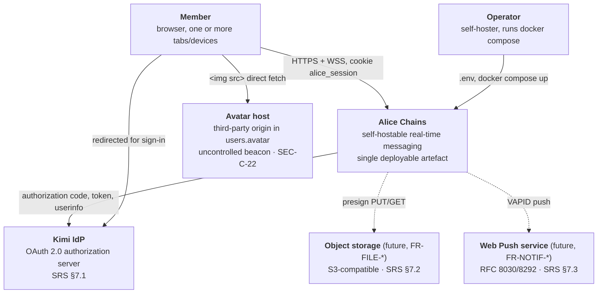

### 2.2 Container view (C4 level 2) — production

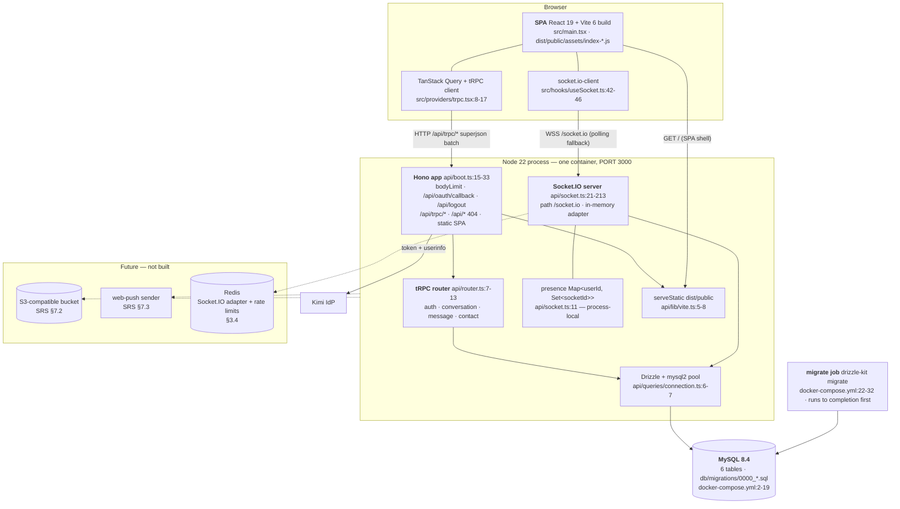

**Container facts, verified:**

| Fact | Evidence |
|---|---|
| One process serves API **and** static client in production | `api/boot.ts:51-54` imports `./lib/vite` only when `isProd`, then `serve()` binds one port at `:64` |
| Socket.IO is attached to the same `http.Server` returned by `@hono/node-server` | `api/boot.ts:64-72` |
| The DB pool is created at **module import time**, not lazily | `api/queries/connection.ts:6` — top-level `mysql.createPool(...)`; `getDb()` (`:9-11`) just returns the singleton |
| The Kimi IdP is a hard dependency for *new* sign-ins only; existing sessions are self-contained for 7 days | `api/kimi/session.ts:36`, `contracts/constants.ts:7` |
| There is no cache, no queue, no Redis, no worker | Absent from `package.json:24-71` |

---

## 3. Runtime topology

### 3.1 Development — two processes

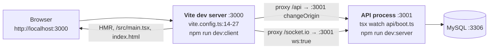

| Property | Value | Evidence |
|---|---|---|
| Client port | 3000 | `vite.config.ts:15`; contract `contracts/constants.ts:17` |
| API port | 3001 | `api/boot.ts:58` reads `process.env.API_PORT`, default `contracts/constants.ts:18` |
| Proxy targets | `http://localhost:3001` for `/api` and `/socket.io` (`ws: true`) | `vite.config.ts:16-26` |
| Both processes launched by | `concurrently` | `package.json:7-9` |
| Bootstrap gate | `env.NODE_ENV !== "test"` — **not** `=== "production"` | `api/boot.ts:48` |

The S-2 defect and its fix are recorded at `SRS.md §1.5` and `NFR-OPS-04`. Two properties of the fix matter downstream:

1. `serve()` from `@hono/node-server` returns a real `http.Server`, which is what Socket.IO's constructor requires (`api/boot.ts:64,72`). The previous hand-rolled `createServer` passed a Node `IncomingMessage` into `app.fetch()`; `IncomingMessage` is not a fetch `Request`, so nothing on the API path could have worked.
2. `changeOrigin: true` on the proxy (`vite.config.ts:19`) rewrites the `Host` header, which is precisely why the server-side `redirect_uri` derivation at `api/kimi/auth.ts:47` computes `http://localhost:3001` while the client computes `http://localhost:3000` (`src/pages/Login.tsx:6`). See §8b — this is FR-AUTH-07.

### 3.2 Production — single process (the reference deployment)

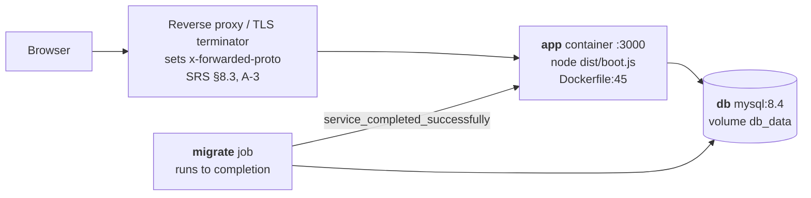

| Property | Value | Evidence |
|---|---|---|
| Port | `PORT` env, default 3000 | `api/boot.ts:57`, `contracts/constants.ts:19`, `docker-compose.yml:44,51-52` |
| Static root | `./dist/public`, SPA fallback to `index.html` | `api/lib/vite.ts:5-8` |
| Boot order | db healthy → migrate exits 0 → app | `docker-compose.yml:28-32,53-57` |
| Container healthcheck | `GET /api/trpc/ping` | `Dockerfile:42-43` — **does not touch the DB**; see FR-ADMIN-11 and §10.2 |
| Non-root runtime | uid 10001 `alice` | `Dockerfile:36-38` |
| Reference size | 4 vCPU / 8 GB, ≤200 members, ≤50 concurrent sockets | `SRS.md §8.3` |

### 3.3 Target scaled topology — N nodes

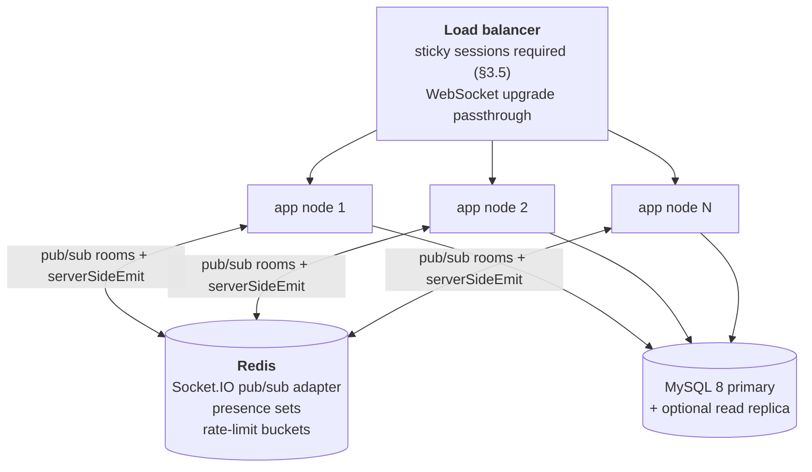

This topology is **not built**. It is the target for `NFR-SCALE-01` (currently **Defective**) and `FR-PRES-08`.

### 3.4 Why the current presence map cannot survive horizontal scaling

The presence store is a plain JavaScript `Map` in module scope:

```ts
// api/socket.ts:11
const onlineUsers = new Map<number, Set<string>>();
```

It is mutated on connect (`api/socket.ts:45-48`) and on disconnect (`:202-207`), and read at `:54` to build the `onlineUsers` snapshot. Four independent failures appear the moment a second process exists:

| # | Failure | Mechanism | Requirement broken |
|---|---|---|---|
| P-1 | **Room fan-out does not cross processes.** A message sent through node A emits to room `conv_42` (`api/socket.ts:127`) using Socket.IO's **default in-memory adapter** (`:22-28` configures no adapter). Sockets in `conv_42` attached to node B are not in node A's adapter and receive nothing. | Adapter is per-process | `NFR-SCALE-01`, `FR-MSG-06` |
| P-2 | **`conversationUpdated` reaches only co-located tabs.** The per-participant loop emits to `user_{id}` (`:141-144`); the same adapter boundary applies. A member with a tab on node A and a tab on node B sees the sidebar update on one tab only. | Adapter is per-process | `FR-MSG-07` |
| P-3 | **The presence snapshot is a per-node roster.** `Array.from(onlineUsers.keys())` (`:54`) enumerates only sockets attached to *this* process. A member on node B is reported offline to everyone on node A. | Map is per-process | `FR-PRES-08`, `FR-PRES-01` |
| P-4 | **Offline transitions fire spuriously.** The `wasOffline` guard (`:46`) and the delete-on-empty rule (`:204-207`) evaluate against a per-node socket set. A member with one socket on each node produces `userOnline` twice and, on closing either tab, one **incorrect** `userOffline` while they are still connected elsewhere. | Map is per-process | `FR-PRES-02` |

P-4 is the subtle one: the deployment does not merely degrade, it emits **actively false** presence. That is why sticky sessions alone are not a fix — stickiness pins a *connection*, not a *user*, and a member's second device can land anywhere.

### 3.5 Redis adapter design (the fix)

**Dependencies:** `@socket.io/redis-adapter`, `redis` (node-redis v4+). New env `REDIS_URL` (§8).

**Wiring** — `api/socket.ts`, replacing the bare constructor at `:22-28`:

```
if (env.REDIS_URL) {
  pub = createClient({ url: env.REDIS_URL });  sub = pub.duplicate();
  await Promise.all([pub.connect(), sub.connect()]);
  io.adapter(createAdapter(pub, sub));         // rooms + broadcasts now cross-process
}
```

Absent `REDIS_URL` the server keeps the in-memory adapter, so the reference single-node deployment (`SRS.md §8.3`) is unchanged. This is the feature flag (§13.2).

**Presence must stop being a `Map`.** The adapter fixes P-1 and P-2 (rooms become cluster-wide) but does **not** fix P-3/P-4, because `onlineUsers` is application state, not adapter state. Two options; take the second.

| Option | Mechanism | Verdict |
|---|---|---|
| Derive presence from rooms | `io.in("user_" + id).fetchSockets()` is adapter-aware and returns cluster-wide sockets (the `user_{id}` room is joined at `api/socket.ts:49`) | Correct but O(round trip) per query, and gives no roster without scanning every user |
| **Redis-backed presence set (chosen)** | `SADD presence:u:{userId} {nodeId}:{socketId}` on connect, `SREM` on disconnect; `EXISTS` → online; roster = `SMEMBERS` of the scoped candidate set | O(1) per transition, roster is a set intersection, and it composes with presence scoping (SEC-C-21) |

**Presence key design:**

| Key | Type | Written | Read | TTL |
|---|---|---|---|---|
| `presence:u:{userId}` | SET of `{nodeId}:{socketId}` | `SADD` at connect, `SREM` at disconnect | `SCARD` / `EXISTS` for "is online" | none; reconciled by sweep |
| `presence:node:{nodeId}` | SET of `{userId}:{socketId}` | mirror of the above | node-crash reconciliation | `EXPIRE 90`, refreshed by heartbeat every 30 s |

**Transition rules (replacing `api/socket.ts:45-54` and `:201-209`):**

1. Connect: `SADD presence:u:{u} member` → returns 1 if newly added. `SCARD` == 1 → this is a 0→1 transition → emit `userOnline` **scoped** per SEC-C-21.
2. Disconnect: `SREM` → `SCARD` == 0 → `DEL` the key and emit `userOffline` scoped.
3. Snapshot on connect: compute the recipient's observable set (accepted contacts ∪ co-participants, per `FR-PRES-04`/`FR-PRES-05`), then a single `SMISMEMBER`-style pipeline or `EXISTS` pipeline over that set. Never `KEYS presence:*`.
4. **Node-crash reconciliation:** a node that dies leaves stale members. On boot each node writes `presence:node:{nodeId}` with a 90 s TTL refreshed every 30 s; a sweeper (one node elected by `SET presence:sweeper NX EX 60`) removes members whose `{nodeId}` prefix has no live `presence:node` key. This closes `FR-PRES-07` in a multi-node world, where the current process-local map is "correct" only because it is not shared.

**Sticky sessions are still required.** `NFR-COMPAT-05` mandates HTTP long-polling fallback, and it is enabled (`src/hooks/useSocket.ts:44`). Polling performs multiple independent HTTP requests per logical connection, which must all reach the node holding the session. Therefore:

- LB must hash on a session affinity cookie or source IP for `/socket.io/*`;
- **or** disable polling and accept `NFR-COMPAT-05` regression (rejected — it is a P1 requirement);
- the Redis adapter is required **in addition to**, never instead of, stickiness.

**Trigger metric for adopting this:** see `ADR.md` ADR-006.

---

## 4. Module and directory architecture

### 4.1 The real tree

```
alice_chains/
├── api/                          server-only; never imported from src/
│   ├── boot.ts                   Hono app + route table + bootstrap  :15-73
│   ├── router.ts                 tRPC root router                    :7-13
│   ├── middleware.ts             initTRPC, publicQuery, authedQuery  :5-12
│   ├── context.ts                per-request ctx { user }            :4-6
│   ├── auth-router.ts            auth.me                             :3-5
│   ├── conversation-router.ts    list/getById/createDirect/createGroup/markAsRead
│   ├── message-router.ts         listByConversation/send/markAsRead
│   ├── contact-router.ts         list/pending/add/accept/remove/searchUsers
│   ├── socket.ts                 Socket.IO server, rooms, presence   :21-213
│   ├── kimi/                     identity: auth.ts, session.ts, types.ts, platform.ts†
│   ├── lib/                      env.ts, cookies.ts†, http.ts†, vite.ts
│   └── queries/                  connection.ts (pool), users.ts
├── db/                           schema.ts, relations.ts, migrations/
├── contracts/                    constants.ts — the ONLY module both sides import
├── src/                          client-only
│   ├── main.tsx  App.tsx  const.ts  index.css
│   ├── pages/    Chat.tsx, Contacts.tsx, Login.tsx, NotFound.tsx, Home.tsx‡
│   ├── hooks/    useAuth.ts, useSocket.ts, use-mobile.ts
│   ├── components/ AuthLayout.tsx, AuthLayoutSkeleton.tsx, ui/ (34 shadcn files)
│   └── providers/ trpc.tsx
├── index.html  vite.config.ts  vitest.config.ts  drizzle.config.ts
├── tsconfig.json  tsconfig.app.json†  tsconfig.node.json  tsconfig.server.json†
└── Dockerfile  docker-compose.yml  .github/workflows/ci.yml

† dead / orphaned — see §4.4    ‡ unreferenced by src/App.tsx:10-17 (SRS §8.4 A-6)
```

### 4.2 Module responsibilities

| Module | Owns | Must not |
|---|---|---|
| `api/boot.ts` | Route table, body limits, static serving, port binding, Socket.IO attachment | Contain business logic; today it inlines the logout handler at `:19-22` — extract to `api/auth-router` or `api/kimi/` when SEC-C-05 lands |
| `api/middleware.ts` | Procedure builders and the auth gate | Know about conversations, messages or contacts. `adminQuery` (FR-ADMIN-02) belongs here |
| `api/*-router.ts` | One tRPC namespace each: input schema → authorization → persistence → projection | Talk to Socket.IO directly today (they do not — see FR-MSG-08); after ADR-007 they emit **through** a single `api/realtime/emit.ts` façade, never `import { getIO }` scattered |
| `api/socket.ts` | Transport: handshake auth, room membership, event dispatch | Own message-write business logic. Today it duplicates the insert at `:107-114`, diverging from `api/message-router.ts:115-122` — this is contract gap G-2 (`API_CONTRACT.md §7.1`) and ADR-007 |
| `api/kimi/**` | OAuth exchange, session token sign/verify, profile mapping | Read `process.env` directly — it does, at `api/kimi/auth.ts:36,44,45,60` and `api/kimi/platform.ts:10-13`, bypassing the validated `env` object (§8.3) |
| `api/queries/**` | Pool ownership and reusable data access | Be the only data-access layer today — routers call `getDb()` and build queries inline. Acceptable while the surface is 16 procedures; revisit if it exceeds ~30 |
| `api/lib/env.ts` | The **single** validated configuration boundary | Be bypassed. It currently is (see above) |
| `db/**` | Drizzle schema, relations, generated migrations | Contain runtime logic. `db/relations.ts` is imported by nothing today — the pool passes `schema` only (`api/queries/connection.ts:3,7`), so the relational query API is unused |
| `contracts/**` | Values that must be identical on both sides of the wire: cookie name, TTL, paths, ports | Import from `api/` or `src/`. Must remain dependency-free so it can be bundled into the client. **This is where shared Zod schemas belong** (SEC-C-13, `API_CONTRACT.md §7.2`) and where `contracts/oauth.ts` goes (`SECURITY.md §3.3`) |
| `src/providers/trpc.tsx` | Query client + tRPC link construction | Hold app state |
| `src/hooks/useSocket.ts` | Socket lifecycle and typed emit/subscribe helpers | Hold conversation state. Today it holds none, which is correct, but it also creates a **new socket per mounting component** (§7.4) |
| `src/pages/**` | Route composition and interaction | Contain transport logic. `Chat.tsx` currently owns socket subscriptions, cache invalidation, presence state and typing state (`:68-152`) — decompose in Phase 2 (§14) |

### 4.3 Dependency rules (enforce with `eslint-plugin-import` / `import/no-restricted-paths`)

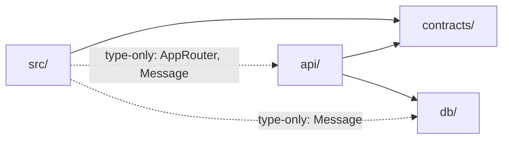

| # | Rule | Rationale | Current violation |
|---|---|---|---|
| D-1 | `contracts/**` imports nothing from `api/`, `db/`, `src/` | It is bundled into the public client | none |
| D-2 | `src/**` MUST NOT import any **value** from `api/**` | Server code and secrets must not reach the bundle (`SRS.md` C-3, FR-AUTH-12) | `src/providers/trpc.tsx:6` imports `type { AppRouter }` — type-only, erased, **allowed**. Enforce with `verbatimModuleSyntax` or an ESLint rule keyed on `import type` |
| D-3 | `src/**` MUST NOT import `api/lib/env` at all | It parses server secrets (`SECURITY.md §10` item 2) | none today; add the lint rule before it happens |
| D-4 | `db/**` imports only `drizzle-orm` | Keeps the schema loadable by `drizzle-kit` outside the app | none |
| D-5 | `api/*-router.ts` MUST NOT import `api/socket.ts` | Prevents a cycle (`socket.ts` → `queries` → …) and forces the façade of ADR-007 | none today (that *is* FR-MSG-08); when fixing it, import `api/realtime/emit.ts`, not `socket.ts` |
| D-6 | Only `api/queries/connection.ts` constructs a pool | Single place to configure limits, TLS, timezone (§11.4, NFR-SCALE-04) | none |
| D-7 | `src/**` MUST import `Message`/`Conversation` types from `@db/schema` only as types | They are `$inferSelect` types, zero runtime cost | `src/hooks/useSocket.ts:3` — `import type { Message }`, correct |

> **UNVERIFIED:** No import-boundary lint rule exists today; `eslint.config.js:6-31` configures only `js.configs.recommended`, `typescript-eslint` recommended and React rules. D-1…D-7 are unenforced conventions until that rule lands.

### 4.4 Path aliases — the drift that already broke CI

The alias map `@` → `src`, `@db` → `db`, `@contracts` → `contracts` must be declared in **four** places that no tool keeps in sync:

| # | Declaration site | Lines | Consumed by | Complete? |
|---|---|---|---|---|
| 1 | `tsconfig.json` `compilerOptions.paths` | `:18-22` | `tsc` (the `build`/`typecheck` gate) **and, implicitly, esbuild** — esbuild reads the nearest `tsconfig.json` for `paths` when bundling `api/boot.ts` | yes |
| 2 | `vite.config.ts` `resolve.alias` | `:8-12` | `vite build`, `vite` dev server | yes |
| 3 | `vitest.config.ts` `resolve.alias` | `:9-13` | `vitest run` | yes — **added during stabilization** |
| 4 | `tsconfig.server.json` `paths` | `:12-16` | **nothing** | orphan |
| 5 | `tsconfig.app.json` `paths` | `:18-20` | **nothing** | **incomplete** — declares `@/*` only, missing `@db/*` and `@contracts/*` |

**The CI failure.** `vitest.config.ts` does not inherit `vite.config.ts`. Before site 3 existed, any test importing a module that transitively imports `@contracts/*` or `@db/*` failed at collect time with an unresolved-import error — `api/kimi/session.test.ts` imports `./session`, which imports `@contracts/constants` (`api/kimi/session.ts:2`). The comment now in the file records this (`vitest.config.ts:6-8`).

**Verified orphans:** neither `tsconfig.app.json` nor `tsconfig.server.json` is referenced by any npm script, by `vite.config.ts`, by `vitest.config.ts`, by `eslint.config.js`, by the Dockerfile or by the CI workflow. `tsconfig.json:25` references only `tsconfig.node.json`. `npx tsc --showConfig` resolves the root config, whose `include` is `["src","api","db","contracts"]` (`tsconfig.json:24`) — one `tsc` invocation typechecks everything.

**Required (task S-ALIAS, Phase 1):**

1. Delete `tsconfig.app.json` and `tsconfig.server.json`, or wire them into scripts. Leaving an incomplete orphan (`tsconfig.app.json:18-20`) is a trap: the first person to run `tsc -p tsconfig.app.json` gets a wall of unresolved `@db/*`.
2. Extract the alias map into `vite.config.ts` and `import { alias } from "./vite.config"` inside `vitest.config.ts`, or define it once in a plain `aliases.mjs` imported by both. One literal, two consumers.
3. Add a regression test asserting the three consumers agree — this is `TC-REG-*` territory; coordinate the ID with `TEST_PLAN.md`.
4. `tsconfig.json` remains the source of truth for `tsc` and esbuild; the JS alias map must mirror it. A CI step that diffs the two representations is cheap insurance.

---

## 5. Request lifecycles

### 5.1 OAuth sign-in, end to end

Two diagrams: what happens today, and the target after `SEC-C-01`…`SEC-C-04`.

**Today (FR-AUTH-06/07 Defective, FR-AUTH-08/09 Missing):**

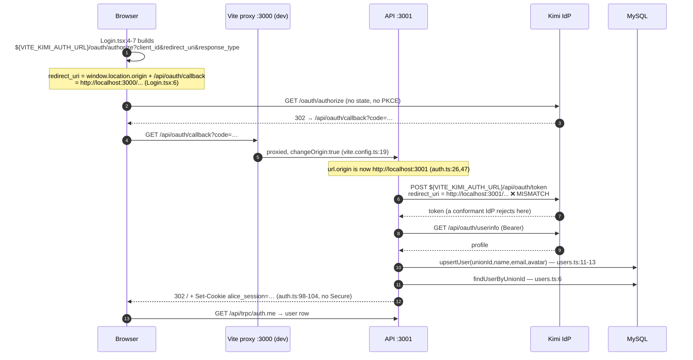

**Target.** The client stops building the authorize URL. A new server route `GET /api/oauth/login` owns state and PKCE, because the `code_verifier` must live in an `HttpOnly` cookie that client JavaScript cannot set — which is what `SECURITY.md §3.3`'s callback contract ("state cookie cleared") already implies. This *refines* `SECURITY.md §3.3`; the env contract and the `contracts/oauth.ts` derivation are unchanged.

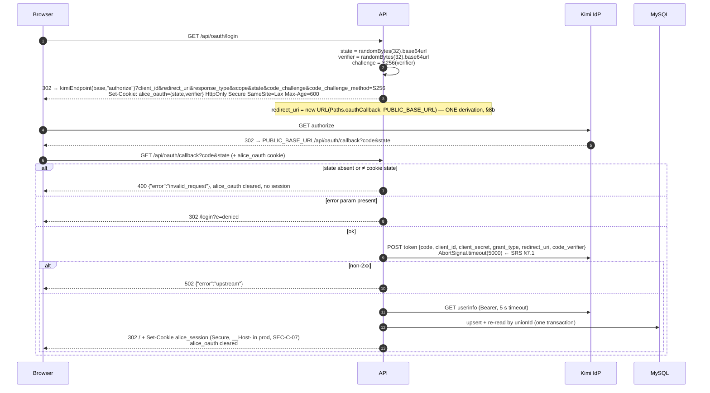

Rate limits on both routes per `SECURITY.md §8` (10 per IP per 10 min on the callback, 20 on the authorize redirect).

### 5.2 An authenticated tRPC query

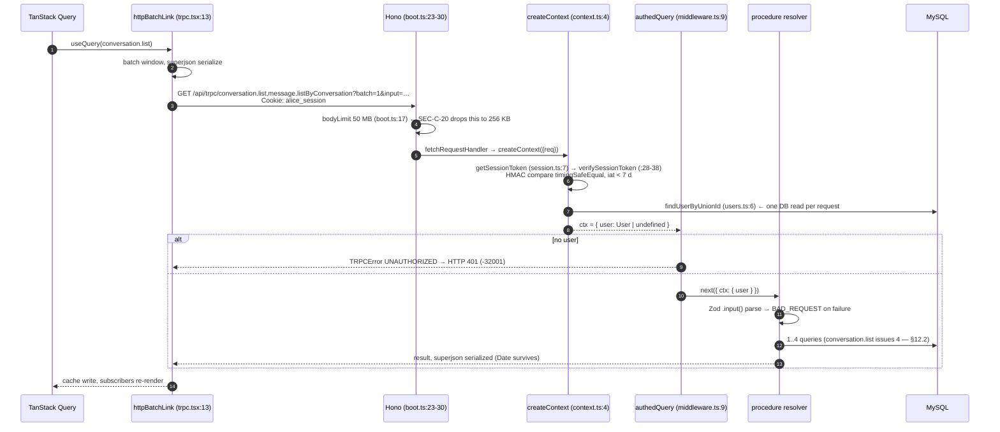

Two properties to preserve: `ctx.user` is the **full DB row** re-read every request (`api/kimi/auth.ts:13-15`), which is what makes `FR-SESS-04` hold and what makes the session payload's `userId`/`name`/`email` fields decorative; and superjson runs on both ends (`api/middleware.ts:5`, `src/providers/trpc.tsx:13`), so `Date` survives — a constraint on any transport change (`SRS.md` C-4).

### 5.3 Socket message send with room fan-out

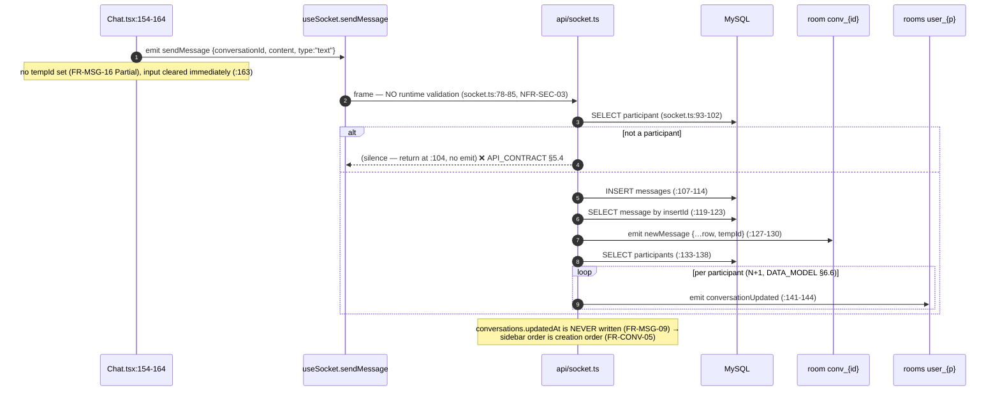

Target changes, in order: Zod-parse the frame in `contracts/` schemas (SEC-C-13); `assertParticipant` helper (SEC-C-09); wrap INSERT + `conversations.updatedAt` bump in one `db.transaction()` (FR-MSG-09, `DATA_MODEL.md §6.7`); return the inserted row from the transaction instead of re-`SELECT`ing; ack the sender with `messageAck {tempId, id, createdAt}` before/with the room emit (§6.3); replace the per-participant loop with a single emit to a `conv_{id}_members` room or `io.to([...rooms])` (`DATA_MODEL.md §6.6`).

### 5.4 Reconnection and missed-message recovery

**Current design: none.** Verified:

- `useSocket` subscribes to no `connect`, `reconnect`, `disconnect` or `connect_error` event (`src/hooks/useSocket.ts:41-53` registers only lifecycle cleanup).
- `Chat.tsx` joins `conv_{id}` in an effect keyed on `[activeConversationId, user, socket]` (`src/pages/Chat.tsx:68-76`). After a transport reconnect, Socket.IO issues a **new socket id** and the server-side room membership is gone; nothing re-emits `joinConversation`, because none of the effect's dependencies changed. **The client silently stops receiving messages until the route re-renders with a different conversation.**
- Nothing tracks the last message the client saw; there is no catch-up query in `api/message-router.ts:12-157`.

**Target design (task F-RECOVER, Phase 2):**

```mermaid
sequenceDiagram
  autonumber
  participant C as Client
  participant IO as Socket.IO
  participant T as tRPC
  participant D as MySQL

  Note over C,IO: transport drops (network, deploy, LB drain)
  IO--xC: disconnect(reason)
  C->>C: set connectionState="reconnecting"; queue outbound sends
  loop backoff 0.5s → 5s, jitter, capped
    C->>IO: reconnect attempt (handshake re-auths cookie, socket.ts:30-39)
  end
  IO-->>C: connect (new socket.id)
  C->>IO: joinConversation for every conversation with an open subscription
  C->>T: message.listSince { conversationId, sinceId: lastSeenId, limit: 200 }
  T->>D: SELECT … WHERE conversationId=? AND id > ? ORDER BY id ASC LIMIT ?
  T-->>C: gap rows (may be empty)
  C->>C: merge by server id, dedupe, re-sort by (createdAt, id)
  alt gap truncated (returned == limit)
    C->>T: conversation.list + message.listByConversation (full resync for that conversation)
  end
  C->>C: flush queued outbound sends with their original clientMsgId (§6.2)
  C->>C: connectionState="online"
```

Design rules:

| # | Rule |
|---|---|
| R-1 | Re-join rooms on **every** `connect`, not only the first. Bind the join to the socket's `connect` event, not to a React effect dependency array. |
| R-2 | `lastSeenId` is the **highest server-assigned `messages.id`** the client has rendered for that conversation. Never a timestamp — `messages.createdAt` has 1-second resolution (`SRS.md` C-8, FR-MSG-11). |
| R-3 | New procedure `message.listSince` — additive, non-breaking per `API_CONTRACT.md §6.1`. Keyset on `id`, which is monotonic per `AUTO_INCREMENT` (`db/migrations/0000_lumpy_marten_broadcloak.sql:41`). It needs IX-1 (`DATA_MODEL.md §3.3`). |
| R-4 | Enable Socket.IO `connectionStateRecovery` (server option) as a **first line** for sub-2-minute blips: it replays missed packets and restores rooms without a DB read. It is best-effort and must never be the only mechanism — R-3 is the authoritative backstop. |
| R-5 | Outbound sends issued while disconnected are queued client-side with their `clientMsgId` and flushed after re-join. Socket.IO's own send buffer is discarded on a *reconnect with a new session*, so the queue must be in application state, not transport state. |
| R-6 | Surface state in the UI: `online` / `reconnecting` / `offline`. Today a dead socket is invisible (`API_CONTRACT.md §5.5`). |
| R-7 | Presence resync is automatic: the server re-sends `onlineUsers` on connect (`api/socket.ts:54`), scoped per SEC-C-21. |

---

## 6. End-to-end delivery guarantee model

### 6.1 Today: at-most-once, with silent loss

| # | Loss window | Evidence |
|---|---|---|
| L-1 | Sender is not a participant → handler returns with **no** emission and no error | `api/socket.ts:104` |
| L-2 | Any throw in the handler → `messageError` is emitted, but **the client never subscribes to it** and the composer was already cleared | `api/socket.ts:147-150`; `src/hooks/useSocket.ts:20` (declared, no helper); `src/pages/Chat.tsx:163` |
| L-3 | Recipient's socket is not in `conv_{id}` (never joined, or reconnected — §5.4) → `newMessage` is not delivered and there is no catch-up | `api/socket.ts:127`; no `listSince` procedure |
| L-4 | Recipient is offline → nothing is persisted as "undelivered"; recovery depends entirely on the next `listByConversation` fetch | `api/message-router.ts:39-58` |
| L-5 | Sender's frame is lost in flight → no ack, no timeout, no retry | no ack in `api/socket.ts:76-152`; no retry in `src/hooks/useSocket.ts:67-79` |
| L-6 | tRPC `message.send` persists but emits nothing → peers never learn of it in real time | FR-MSG-08; `api/message-router.ts:85-133` imports no socket module |

There is exactly one guarantee worth stating today, and it holds: **a message acknowledged by being echoed back was durably persisted first** — both paths INSERT then SELECT before emitting (`api/socket.ts:107-127`, `api/message-router.ts:115-132`). That is `NFR-REL-07`, Implemented.

### 6.2 Target: at-least-once with client-side dedupe

| Layer | Guarantee | Mechanism |
|---|---|---|
| Client → server | **at-least-once** | Client retries an unacked send with the *same* `clientMsgId` until it receives `messageAck` or a terminal error. Backoff 1 s → 8 s, ≤5 attempts, then surface as failed with a manual retry affordance. |
| Server persistence | **exactly-once per `clientMsgId`** | `messages.clientMsgId` CHAR(36), UNIQUE on `(senderId, clientMsgId)`. A retried insert violates the unique key; the handler catches `ER_DUP_ENTRY` (1062), re-`SELECT`s by `(senderId, clientMsgId)`, and returns the **original** row. Same ack, same id, no duplicate row. |
| Server → client | **at-least-once** | Room emit + `listSince` catch-up on reconnect (§5.4 R-3). The same message can legitimately arrive twice: once by socket, once by catch-up. |
| Client rendering | **exactly-once** | Dedupe by server `id`. The cache is a map keyed on `id`; an insert for an existing `id` is an update, never an append. Optimistic rows are keyed on `clientMsgId` until their ack arrives. |

**Schema requirement.** `messages.clientMsgId` does not exist (`db/schema.ts:62-76`). It is a new forward-only migration that must be **appended to the sequence of record in `DATA_MODEL.md §4.4`** as `0006_message_idempotency`; that document currently stops at `0005_attachments`. It depends on `0001_constraints` only for consistency of the FK/UQ policy, not functionally.

```
ALTER TABLE messages ADD COLUMN clientMsgId char(36) NULL;
CREATE UNIQUE INDEX UQ_messages_sender_client ON messages (senderId, clientMsgId);
```

`NULL` is permitted so historical rows and any non-idempotent caller remain valid; MySQL's unique index ignores NULLs, so legacy sends are unaffected.

**Idempotency key format.** UUIDv7 generated client-side (`crypto.randomUUID()` is v4; use a v7 helper for time-sortability, which makes the key useful as a secondary sort during the optimistic window). The key is opaque to the server except as a uniqueness token. It is **not** a security boundary: `senderId` comes from `socket.data.userId` (`api/socket.ts:44`), never from the payload, so one member cannot collide with another's key.

### 6.3 The ack contract

New server → client event, additive per `API_CONTRACT.md §6.1`:

| Event | Payload | Emitted to | When |
|---|---|---|---|
| `messageAck` | `{ clientMsgId, id, conversationId, createdAt, duplicate: boolean }` | originating socket only | after the transaction commits, **before or with** the room fan-out |
| `messageError` | `{ clientMsgId, code, message }` — extend the existing event (`api/socket.ts:149`) with `clientMsgId` and a machine code | originating socket only | validation failure, authorization failure (replaces the silence at `:104`), rate limit, or persistence failure |

Adding fields to an existing socket payload is non-breaking; **removing** `tempId` would be breaking. Keep `tempId` as an alias of `clientMsgId` for one release, then retire it.

### 6.4 Ordering guarantees

| Scope | Guarantee | Basis |
|---|---|---|
| Within one conversation | **Total order by `messages.id`.** `id` is `serial AUTO_INCREMENT` (`db/schema.ts:63`, DDL `:41`), assigned at commit, monotonic per table. | This is the only durable total order available. |
| Within one conversation, by time | `createdAt` is **not** sufficient: MySQL `timestamp` at second resolution (`db/migrations/0000_lumpy_marten_broadcloak.sql:49`) means ties are common at chat rates. | `FR-MSG-11` (Defective). Fix = `ORDER BY createdAt DESC, id DESC` **and** widen to `timestamp(3)`. |
| Across conversations | **None, and none is promised.** The sidebar orders by last activity (`FR-CONV-05`), which is a display concern. | — |
| Socket delivery order | Socket.IO preserves per-connection frame order over a single transport. It does **not** survive a reconnect: frames emitted while disconnected are lost, which is why §5.4 R-3 exists. | — |
| Optimistic vs server order | The client sorts the merged list by `(createdAt, id)` with optimistic rows pinned to the tail using their local send time. On ack, the row takes its server `(createdAt, id)` and may **move**. Accept the move; do not animate it. | — |

### 6.5 Reconciling optimistic sends with server echoes

Today: no optimistic rendering at all. The composer clears (`src/pages/Chat.tsx:163`), then the inbound `newMessage` triggers `refetchMessages()` **and** `refetchConversations()` (`:80-89`) — two full network round trips per message, which is `NFR-PERF-08` (Defective) and gap G-6.

Target state machine per outbound message:

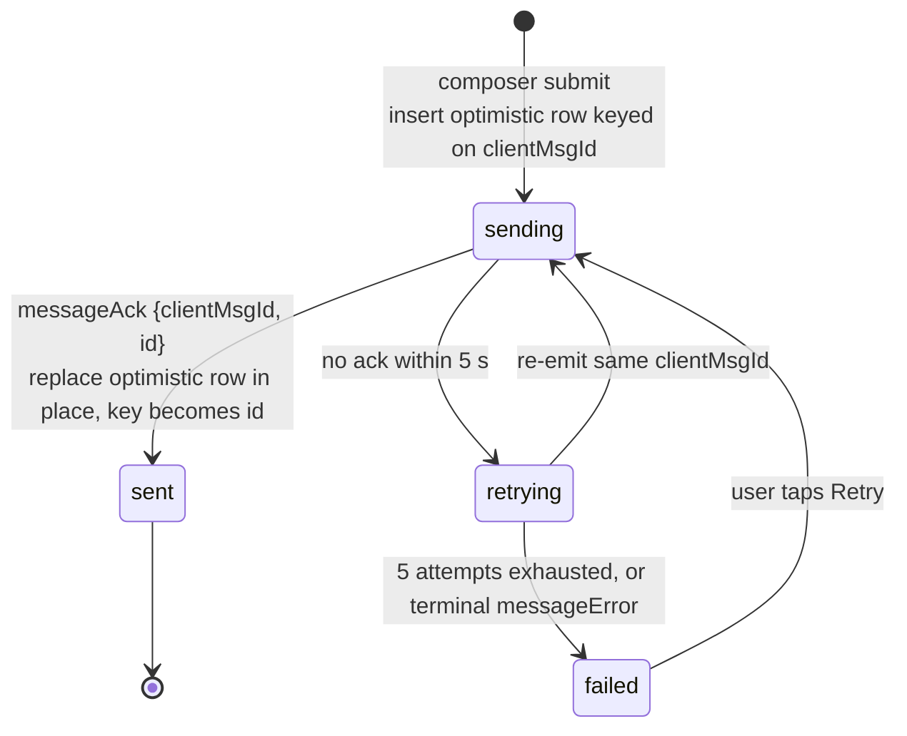

Reconciliation rules:

| # | Rule |
|---|---|
| O-1 | The optimistic row carries `{ clientMsgId, content, senderId: me, createdAt: Date.now(), status: "sending" }` and renders with a muted single-tick. |
| O-2 | On `messageAck`, find by `clientMsgId`, **replace in place** (same array position), set `id` and the server `createdAt`, set `status:"sent"`. Do not remove-then-append; that causes a visible jump. |
| O-3 | On `newMessage`, if `clientMsgId`/`tempId` matches a local optimistic row, treat it as the ack (it carries the full row) and reconcile as O-2. If it matches an existing `id`, it is a duplicate delivery — **drop it**. Otherwise append. |
| O-4 | Never `refetch` on inbound `newMessage`. Append to the cache with `queryClient.setQueryData` (§7.3). This is the fix for `NFR-PERF-08`. |
| O-5 | On terminal failure, keep the text in the composer *and* keep the failed bubble; the member must be able to recover the content. Today the text is destroyed at `src/pages/Chat.tsx:163` before any confirmation. |
| O-6 | The sender receives their own `newMessage` because the emit uses `io.to(...)` which includes the sender (`api/socket.ts:127`). O-3 makes that harmless. Do **not** switch to `socket.to(...)` — other clients of the same member (other tabs) need it. |

---

## 7. Client state management

### 7.1 Layers

| Layer | Holds | Where |
|---|---|---|
| TanStack Query cache | All server-derived state: conversations, messages, contacts, `auth.me` | `src/providers/trpc.tsx:11` — `new QueryClient()` with **no default options** |
| React local state | Composer text, sidebar open, `isMobile`, typing set, online set | `src/pages/Chat.tsx:44-50` |
| URL | Active conversation — `?c=<id>` | `src/pages/Chat.tsx:38-41`, `:187` |
| Socket | Ephemeral transport; owns no state | `src/hooks/useSocket.ts:39` — a `useRef` |

Presence and typing are deliberately **not** in the query cache: they are push-only, have no fetch endpoint, and are per-session. Keep them in React state (or a small store) but move them out of `Chat.tsx` into a `PresenceProvider` in Phase 2 so `/contacts` can use them too.

### 7.2 Required QueryClient defaults (none are set today)

| Option | Value | Why |
|---|---|---|
| `staleTime` | `30_000` for `conversation.list`, `Infinity` for `message.listByConversation` (socket-driven) | `NFR-PERF-07` — conversation switching must render from cache in ≤300 ms; today every switch refetches (`src/pages/Chat.tsx:61-65`, no `staleTime`) |
| `gcTime` | `5 * 60_000` | Keeps recently visited conversations warm |
| `refetchOnWindowFocus` | `false` for messages, `true` for `conversation.list` | Focus refetch of a long history is wasteful; the sidebar benefits |
| `retry` | `false` for `auth.me` (already set at `src/hooks/useAuth.ts:4`), `2` with backoff elsewhere | A 401 must not be retried; a 500 should be |
| `throwOnError` | route-level error boundary for 5xx only | `API_CONTRACT.md §5.5` — a network blip currently renders the sign-in screen (`src/components/AuthLayout.tsx:14`) |

### 7.3 Socket event → cache mapping

This table is the contract. Every entry that says "invalidate" today and "surgical write" in the target is an `NFR-PERF-08` fix.

| Socket event | Today | Target action | Query key | Requirement |
|---|---|---|---|---|
| `newMessage` | `refetchMessages()` + `refetchConversations()` (`Chat.tsx:80-89`) | `setQueryData(message.listByConversation, {conversationId})` → dedupe by `id`, append, re-sort by `(createdAt,id)`. Then `setQueryData(conversation.list)` → move that conversation to the head and replace `latestMessage`. **No network.** | both | `NFR-PERF-08`, `FR-CONV-05` |
| `messageAck` (new) | n/a | Reconcile optimistic row in place (§6.5 O-2) | `message.listByConversation` | `FR-MSG-16` |
| `messageError` | **not subscribed** (G-5) | Mark the optimistic row `failed`; toast a mapped message, never the raw server string | `message.listByConversation` | `API_CONTRACT.md §5.5` |
| `conversationUpdated` | `refetchConversations()` (`Chat.tsx:94-99`) | `setQueryData(conversation.list)` → patch `latestMessage` + reorder. Only invalidate if the conversation id is unknown to the cache (a new conversation), which is the sole legitimate refetch trigger | `conversation.list` | `NFR-PERF-08` |
| `messagesRead` | **not subscribed** (G-4) | `setQueryData(message.listByConversation)` → push `{userId, readAt}` into `readBy` for each id | `message.listByConversation` | `FR-MSG-04` |
| `userTyping` | React state set (`Chat.tsx:102-117`) | unchanged, plus a 5 s client-side TTL per `(userId, conversationId)` | not cached | `FR-PRES-06` |
| `userOnline` / `userOffline` / `onlineUsers` | React state set (`Chat.tsx:120-139`) | unchanged; move to `PresenceProvider` | not cached | `FR-PRES-01`, `FR-PRES-04` |
| `connect` | **not subscribed** | re-join rooms; run `message.listSince` catch-up; flush send queue (§5.4) | both | `NFR-REL-03` |
| `connect_error` | **not subscribed** | if `message === "Unauthorized"`, stop retrying and route to `/login`; otherwise show `reconnecting` | — | `API_CONTRACT.md §5.5` |
| `rateLimited` (new, SEC-C-19) | n/a | disable the composer for `retryAfterMs`, show a non-modal notice | — | `NFR-SEC-07` |

**Invalidation is the exception, not the rule.** Reserve `invalidateQueries` for: a conversation id the client has never seen, a contact mutation's `onSuccess`, and window focus on `conversation.list`.

### 7.4 Optimistic update rules

| Mutation | Optimistic? | Rule |
|---|---|---|
| message send | **Yes** | §6.5. This is the only latency-critical write. |
| `conversation.markAsRead` | Yes, fire-and-forget | Clear the unread badge locally; no rollback on failure — a stale badge is cheaper than a flicker. |
| `message.markAsRead` / socket `markAsRead` | Yes, fire-and-forget | Ticks update locally; the authoritative state arrives via `messagesRead`. |
| `contact.add` / `accept` / `remove` | **No** | Multi-row, non-idempotent, and `accept` is currently Defective (`FR-CONT-14`). Await the mutation, then `invalidateQueries` on `contact.list` and `contact.pending`. |
| `conversation.createDirect` / `createGroup` | **No** | Returns the id the router navigates to; and `createDirect` returns two different shapes (G-12). Await it. |
| typing | n/a | Fire-and-forget, debounced (§12.3). |

Universal rules: every optimistic write captures the previous cache slice and restores it on error; no optimistic write is applied to a query that is currently fetching (use the mutation's `onMutate` → `cancelQueries` handshake); no optimistic write survives a route change without an ack.

---

## 8. Configuration and environment contract

### 8.1 The validated boundary

`api/lib/env.ts:3-14` is the single Zod-validated schema. It is parsed **eagerly at module import** (`:14`), so a missing variable crashes the process at boot rather than at first use — correct behaviour, keep it.

### 8.2 Full variable table

Scope key: **S** = server process only · **C** = inlined into the public client bundle · **B** = build-time only · **I** = infrastructure (compose/CI, never read by app code).

| Name | Req? | Scope | Format | Default | Example | Read at | What breaks without it |
|---|---|---|---|---|---|---|---|
| `DATABASE_URL` | **yes** | S | mysql2 connection URI | — | `mysql://alice:pw@db:3306/alice_chains` | `api/lib/env.ts:4` → `api/queries/connection.ts:6` | Process exits at boot (Zod `min(1)`). Every procedure and every socket handler is dead. |
| `VITE_KIMI_AUTH_URL` | **yes** | **C** + S | `z.string().url()` | — | `https://kimi.example.com` | `api/lib/env.ts:5`; **read directly from `process.env`** at `api/kimi/auth.ts:36,60`, `api/kimi/platform.ts:10`; client at `src/pages/Login.tsx:4` | Boot fails. **Also: it is interpreted three incompatible ways today — FR-AUTH-06. `SEC-C-01` keeps the name and tightens validation to a bare origin; see §8.4.** `VITE_`-prefixed, so it is inlined into the public bundle and must never hold a secret. |
| `VITE_APP_ID` | **yes** | **C** + S | opaque string | — | `alice-chains-prod` | `api/lib/env.ts:6`; `process.env` at `api/kimi/auth.ts:44`, `api/kimi/platform.ts:11`; client at `src/pages/Login.tsx:5` | Boot fails; OAuth `client_id` absent. Public by RFC 6749 — correctly `VITE_`-prefixed. |
| `APP_SECRET` | **yes** | **S** | ≥32 bytes (today `min(1)`) | — | 43-char base64url | `api/lib/env.ts:7`; `process.env` at `api/kimi/auth.ts:45` | Boot fails. Token exchange rejected by the IdP. `min(1)` is `NFR-SEC-08` (Defective). |
| `JWT_SECRET` | **yes** | **S** | ≥32 bytes (today `min(1)`) | — | 43-char base64url | `api/lib/env.ts:8` → `api/kimi/session.ts:20` | Boot fails. **Misnamed — see §8.5.** Changing the value invalidates every live session. |
| `PORT` | no | S | integer string | `"3000"` (schema) / `DEFAULT_PROD_PORT` (boot) | `3000` | `api/lib/env.ts:9`; **`api/boot.ts:57` reads `process.env.PORT` directly, not `env.PORT`** | Prod binds 3000. Note `getPort()` (`api/lib/env.ts:17-19`) is dead code — no call sites. |
| `API_PORT` | no | S | integer string | `API_PORT` = 3001 (`contracts/constants.ts:18`) | `3001` | `api/boot.ts:58` — **`process.env.API_PORT`, absent from the Zod schema** | Dev API binds 3001. **Unvalidated**: `API_PORT=banana` yields `parseInt` → `NaN` → Node binds a random port and the Vite proxy fails with ECONNREFUSED. Add it to the schema. |
| `NODE_ENV` | no | S | `development` \| `production` \| `test` | `development` | `production` | `api/lib/env.ts:10`; gates bootstrap `api/boot.ts:48-49`, static serving `:52`, Socket.IO CORS `api/socket.ts:24` (reads `process.env` directly) | Dev semantics in production: no static files served, API binds 3001, Socket.IO CORS opens to `http://localhost:3000`. |
| `OWNER_UNION_ID` | no | S | Kimi `unionId` | unset | `kimi_01H…` | `api/lib/env.ts:11`, accessor `:21-23` | **Nothing.** `getOwnerUnionId()` has zero call sites (`SRS.md §3.5`). Plumbed by `docker-compose.yml:50` and silently ignored. Becomes live with `FR-ADMIN-01`. |
| `MYSQL_ROOT_PASSWORD`, `MYSQL_DATABASE`, `MYSQL_USER`, `MYSQL_PASSWORD` | compose only | **I** | string | `alice_root` / `alice_chains` / `alice` / `alice_pw` | — | `docker-compose.yml:6-9,27,45` | Compose defaults are used — **development-grade credentials shipped as defaults**; `NFR-SEC-09` requires an app user without root alongside it. |

**Required additions** (each already mandated by a companion document):

| Name | Req? | Scope | Format | Default | Example | Mandated by | What breaks without it |
|---|---|---|---|---|---|---|---|
| `PUBLIC_BASE_URL` | **yes** | S (+ C only if the client keeps building the authorize URL) | absolute origin, no path | — | `https://chat.example.com` | `SEC-C-02`, `SRS.md §7.1`, FR-AUTH-07 | `redirect_uri` mismatch — token exchange rejected. See §8b. |
| `SESSION_SECRET` | **yes** (after rename) | S | ≥32 bytes | falls back to `JWT_SECRET` | 43-char base64url | §8.5 | See §8.5. |
| `SESSION_SECRET_PREVIOUS` | no | S | ≥32 bytes | unset | — | `SECURITY.md §10` item 4 | Zero-downtime secret rotation impossible; rotating logs everyone out. |
| `REDIS_URL` | no | S | redis URI | unset → in-memory adapter | `redis://redis:6379` | §3.5, ADR-006 | Multi-node deployment silently breaks fan-out and presence (`NFR-SCALE-01`). |
| `ALLOWED_ORIGINS` | no | S | comma-separated origins | `PUBLIC_BASE_URL` | `https://chat.example.com` | `SEC-C-18` | Socket.IO CORS stays hard-coded (`api/socket.ts:24`); a split-origin deployment is impossible. |
| `DB_POOL_SIZE` | no | S | integer | `20` | `20` | `NFR-SCALE-04`, `SEC-C-28` | Unbounded pool; a connection storm exhausts MySQL `max_connections`. |
| `DB_SSL` | no | S | `disabled` \| `required` | `disabled` | `required` | `NFR-SEC-09` | DB traffic in cleartext. |
| `LOG_LEVEL` | no | S | `debug`\|`info`\|`warn`\|`error` | `info` | `info` | `NFR-OPS-03` | No level control on structured logs (§10). |
| `S3_ENDPOINT`, `S3_REGION`, `S3_BUCKET`, `S3_ACCESS_KEY_ID`, `S3_SECRET_ACCESS_KEY`, `S3_FORCE_PATH_STYLE` | Phase 2 | S | per `SRS.md §7.2` | — | — | `FR-FILE-*`, ADR-009 | Attachments unavailable; feature flag off. |
| `VAPID_PUBLIC_KEY` (C), `VAPID_PRIVATE_KEY` (S), `VAPID_SUBJECT` (S) | Phase 2 | mixed | per `SRS.md §7.3` | — | `mailto:ops@example.com` | `FR-NOTIF-*` | Web Push unavailable; feature flag off. |

### 8.3 Discipline: stop reading `process.env` directly

`api/lib/env.ts` exists to be the only reader. It is bypassed in five places:

| Site | Variable | Consequence |
|---|---|---|
| `api/kimi/auth.ts:36,60` | `VITE_KIMI_AUTH_URL` | Undefined yields the literal string `"undefined/api/oauth/token"` at runtime instead of a boot failure |
| `api/kimi/auth.ts:44,45` | `VITE_APP_ID`, `APP_SECRET` | Same class |
| `api/kimi/platform.ts:10-13` | all four, with `\|\| ""` fallbacks | Silently substitutes empty strings; the module has **no call sites** and should be deleted or rewritten (`SECURITY.md §3.3`) |
| `api/socket.ts:24` | `NODE_ENV` | Duplicates `env.NODE_ENV`; drifts if the schema's default ever changes |
| `api/boot.ts:57,58` | `PORT`, `API_PORT` | `PORT` bypasses its own validated default; `API_PORT` is unvalidated entirely |

**Rule E-1:** every configuration read goes through `import { env } from "./lib/env"`. Add an ESLint `no-restricted-properties` rule banning `process.env` outside `api/lib/env.ts`.

### 8.4 `VITE_*` is public. This is not a warning, it is a definition.

Vite performs **static text replacement** of `import.meta.env.VITE_*` at build time. The value is baked into `dist/public/assets/index-*.js` and served to every visitor. `Dockerfile:14-18` declares `VITE_KIMI_AUTH_URL` and `VITE_APP_ID` as build `ARG`s precisely because of this.

**Verified today: no secret is exposed.** Only `VITE_KIMI_AUTH_URL` and `VITE_APP_ID` carry the prefix and both are legitimately public (`SECURITY.md §10`).

**The latent risk is structural, not incidental.** `api/lib/env.ts:3-12` places secrets and `VITE_*` variables in one schema, and `api/kimi/platform.ts:10-13` reads them side by side. Renaming `APP_SECRET` to `VITE_APP_SECRET` would publish the OAuth client secret with **zero build errors and zero test failures**.

Required (`FR-AUTH-12`, `SEC-C-24`):

1. Split `api/lib/env.ts` into `serverEnv` and `publicEnv`; `src/**` may import only the latter (rule D-3).
2. CI gate: fail if any key matching `/^VITE_/` also matches `/SECRET|TOKEN|KEY|PASSWORD|CREDENTIAL/i`.
3. CI gate: grep the built `dist/public/assets/*.js` for the literal values of `APP_SECRET`, `JWT_SECRET`/`SESSION_SECRET` and `DATABASE_URL`; any match fails the build. This catches accidental inlining regardless of prefix.
4. Never place `VAPID_PRIVATE_KEY` or `S3_SECRET_ACCESS_KEY` behind a `VITE_` prefix. `VAPID_PUBLIC_KEY` is the only push variable that may carry it.

### 8.5 `JWT_SECRET` is misnamed — rename path with backwards compatibility

**The claim, verified.** The session token is `base64url(JSON) + "." + base64url(HMAC-SHA256(payload, JWT_SECRET))` (`api/kimi/session.ts:19-26`). There is no JOSE header, no `alg` field, no three-segment structure, no `jose`/`jsonwebtoken` dependency (`package.json:24-71`). It is a signed envelope, not a JWT. `README.md:13,20` compounds the error by advertising "JWT sessions" (`NFR-OPS-08`, gap G-13).

**Why it matters beyond pedantry.** A reader who believes these are JWTs will reach for a JWT library to verify them (it will fail), will assume `exp`/`nbf`/`aud` semantics (there are none — only `iat` at `api/kimi/session.ts:36`), and will assume `alg` negotiation risks that do not apply. The name actively misdirects security review.

**Target name:** `SESSION_SECRET`.

**Migration path — zero downtime, no session invalidation.** The secret *value* does not change, only the variable name, so every live cookie keeps verifying.

| Phase | Change | Operator action |
|---|---|---|
| **R0 (Phase 1, ships with the rename)** | Schema accepts both: `SESSION_SECRET: z.string().min(32).optional()`, `JWT_SECRET: z.string().min(32).optional()`, plus a `superRefine` requiring at least one. Export `sessionSecret = env.SESSION_SECRET ?? env.JWT_SECRET`. `api/kimi/session.ts:20` reads `sessionSecret`. If only `JWT_SECRET` is present, emit one structured `config.deprecated` log line at boot naming the variable and the removal release. | none — existing deployments keep working unchanged |
| **R1 (next release)** | `.env.example`, `docker-compose.yml:49`, `Dockerfile`, CI (`TEST_PLAN.md §8`) and all docs use `SESSION_SECRET`. Deprecation log escalates to `warn` on every boot. | set `SESSION_SECRET` to the same value; `JWT_SECRET` may stay |
| **R2 (release after)** | `JWT_SECRET` removed from the schema. Boot fails with an explicit message: *"JWT_SECRET was renamed to SESSION_SECRET; set SESSION_SECRET to the same value."* | unset `JWT_SECRET` |

Do the rename **in the same PR as** the `SESSION_SECRET_PREVIOUS` rotation support (`SECURITY.md §10` item 4), so the rotation code is written once against the final name.

Rename the *concept* everywhere in the same change: `README.md:13,20` and `info.md:12` must stop saying JWT (`NFR-OPS-08`).

### 8b. `PUBLIC_BASE_URL` — the canonical externally-visible origin

**Definition.** `PUBLIC_BASE_URL` is the origin at which members reach this deployment, as registered with the Kimi OAuth client. Bare origin — scheme, host, optional port. No path, no query, no fragment, no trailing slash. Validated by the same refinement `SECURITY.md §3.3` applies to `VITE_KIMI_AUTH_URL`.

**The defect it fixes (FR-AUTH-07).** `redirect_uri` is computed twice, from two different sources, and OAuth 2.0 requires the two legs to match byte-for-byte:

| Leg | Expression | Dev value | Prod value behind a proxy |
|---|---|---|---|
| Authorization request | `${window.location.origin}/api/oauth/callback` (`src/pages/Login.tsx:6`) | `http://localhost:3000/api/oauth/callback` | the public origin — correct by accident |
| Token exchange | `${new URL(c.req.raw.url).origin}/api/oauth/callback` (`api/kimi/auth.ts:47`) | `http://localhost:3001/api/oauth/callback` — the Vite proxy rewrote `Host` (`vite.config.ts:19`, `changeOrigin: true`) | the *internal* origin, e.g. `http://app:3000`, whenever the proxy does not forward `Host` verbatim |

A conformant IdP rejects the exchange. In dev it always mismatches; in production it mismatches under any reverse proxy that rewrites `Host` — and `SRS.md §8.3` assumes a reverse proxy.

**The fix.** One constant, one derivation function, two call sites:

```ts
// contracts/oauth.ts  (per SECURITY.md §3.3)
import { Paths } from "./constants";
export const redirectUri = (publicBaseUrl: string) =>
  new URL(Paths.oauthCallback, publicBaseUrl).toString();
```

- `api/kimi/auth.ts:47` → `redirectUri(env.PUBLIC_BASE_URL)`. It **never** reads the inbound request URL again.
- The authorization request is built by `GET /api/oauth/login` (§5.1), server-side, from the same expression. The client never constructs a `redirect_uri` — this is why the recommended design removes the need for a `VITE_PUBLIC_BASE_URL` entirely.
- `Paths.oauthCallback` is already `"/api/oauth/callback"` in `contracts/constants.ts:2` and is already used to register the route (`api/boot.ts:18`). Route registration and `redirect_uri` derivation therefore share one literal, which makes them impossible to drift.

**Why deriving from the request cannot work.** `X-Forwarded-Host`/`X-Forwarded-Proto` are attacker-controllable unless the edge strips and re-sets them (`SECURITY.md §7.3`). Trusting them to build a `redirect_uri` turns a proxy misconfiguration into an open-redirect primitive in the OAuth flow. Configuration is the only safe source.

**Operator failure modes:**

| Symptom | Cause |
|---|---|
| IdP returns `invalid_grant` / `redirect_uri_mismatch` | `PUBLIC_BASE_URL` differs from the URI registered with the Kimi client — including `http` vs `https`, a trailing slash, or a port |
| Sign-in loops back to `/login` | `PUBLIC_BASE_URL` points at a different host than the one the member is actually on, so the session cookie is set on the wrong origin |
| Works in dev, fails in prod | `PUBLIC_BASE_URL` left at `http://localhost:3000` |

`PUBLIC_BASE_URL` also becomes the single source for: the S3 CORS allowlist (`SRS.md §7.2`), the CSP `form-action`/`frame-ancestors` origin (`SEC-C-17`), the default `ALLOWED_ORIGINS` (`SEC-C-18`), and push notification click-through URLs (`FR-NOTIF-09`).

---

## 9. Build and bundling

### 9.1 What each stage produces

`npm run build` = `tsc && vite build && esbuild api/boot.ts …` (`package.json:10`).

| Stage | Command | Emits | Verified |
|---|---|---|---|
| 1. `tsc` | bare `tsc` against `tsconfig.json` | **nothing.** `tsconfig.json:11` sets `"noEmit": true`. This step is a **typecheck gate only** — it is `npm run typecheck` under another name (`package.json:20`). Its `include` is `["src","api","db","contracts"]` (`:24`), so one pass covers client and server. | `npx tsc --showConfig` |
| 2. `vite build` | `vite build`, `outDir: dist/public` (`vite.config.ts:29`) | `dist/public/index.html` (591 B), `dist/public/assets/index-*.css` (40,982 B → **7,441 B gzip**), `dist/public/assets/index-*.js` (**596,584 B → 181,756 B gzip**) — one JS chunk, no code splitting | `ls -l dist/public/assets`, `gzip -c \| wc -c` |
| 3. `esbuild` | `--platform=node --bundle --format=esm --outdir=dist` with a `createRequire` banner | `dist/boot.js` — **2,594,758 B** (2.5 MB), unminified, no sourcemap | `ls -l dist/boot.js` |

`dist/` layout:

```
dist/
├── boot.js                       2,594,758 B   server, single file, ESM
└── public/
    ├── index.html                      591 B
    └── assets/
        ├── index-CuaWawaA.css       40,982 B   (7,441 gzip)
        └── index-UJM86xCc.js       596,584 B   (181,756 gzip)
```

`npm start` = `node dist/boot.js` (`package.json:11`). In production the same process serves `dist/public` via `serveStatic` (`api/lib/vite.ts:5-8`).

The `createRequire` banner exists because bundled CommonJS dependencies call `require()` at runtime while the output format is ESM. Consequence, recorded as constraint C-2 in `SRS.md §8.2`: **no dynamic `require` of a computed path is permissible** anywhere in `api/`.

### 9.2 Why the server bundle is 2.5 MB

esbuild inlines the entire transitive dependency graph. Module counts by package, read from the emitted `// node_modules/...` banners in `dist/boot.js`:

| Package | Modules bundled | Note |
|---|---|---|
| `mysql2/lib` | 89 | the driver, plus its protocol/packet layer |
| `drizzle-orm/mysql-core` | 42 | every column builder, including types this schema never uses (`binary`, `year`, `decimal`, `varbinary`, `mediumint`, …) |
| `hono/dist` | 22 | |
| `iconv-lite/encodings` | 18 | **transitive from mysql2** — full legacy charset tables for a `utf8mb4`-only deployment |
| `engine.io/build` | 15 | Socket.IO transport layer |
| `ws/lib` | 13 | |
| `superjson/dist` | 11 | |
| `socket.io/dist` | 9 | |
| `zod/v3` | 8 | |
| **`drizzle-orm/pg-core`** | **7** | **PostgreSQL core pulled into a MySQL-only server** — dead weight from a barrel import in drizzle's shared modules |
| `socket.io-adapter`, `socket.io-parser`, `engine.io-parser`, `negotiator`, `debug`, `is-what` | 4/3/4/4/4/3 | |

Three of these are avoidable: `iconv-lite`'s encoding tables, `drizzle-orm/pg-core`, and the unused mysql-core column builders.

**Recommended change — stop bundling dependencies at all.** The runtime image already installs production dependencies:

```
# Dockerfile:29-30
COPY package.json package-lock.json ./
RUN npm ci --omit=dev …
```

So `node_modules` is present at runtime, and inlining the same packages into `dist/boot.js` is pure duplication. Switch to:

```
esbuild api/boot.ts --platform=node --bundle --format=esm --packages=external \
  --outdir=dist --sourcemap=external
```

| Effect | Result |
|---|---|
| `dist/boot.js` size | ~2.5 MB → tens of KB (first-party code only) |
| Banner | `createRequire` no longer needed; drop it and constraint C-2 relaxes |
| Cold start | improves — no 2.5 MB parse |
| Debuggability | stack traces point at real package files; external sourcemap for first-party code |
| Cost | the runtime image must keep `node_modules` (it already does) and native/optional deps resolve normally |

If a fully self-contained artefact is required later (e.g. a distroless image with no `node_modules`), keep bundling but add `--minify` and `--external:mysql2` at minimum, since mysql2 is the largest contributor and loads charset tables lazily.

**Do not** rely on esbuild for typechecking — it strips types without checking them. Stage 1 (`tsc`) is the only type gate, which is why `validate` runs `typecheck` first (`package.json:22`).

### 9.3 Client bundle: the 596 KB chunk

**State the numbers precisely, because two different budgets are in play.**

| Measure | Value | Budget | Verdict |
|---|---|---|---|
| Initial JS, gzipped | **181,756 B ≈ 177.5 KiB** | `NFR-PERF-06`: ≤250 KB gzipped | **currently passing**, with ~28 % headroom |
| Initial JS, raw | **596,584 B ≈ 582.6 KiB** | Vite's `chunkSizeWarningLimit`, default 500 kB, measured **after minification, before compression** | **exceeded** → the build prints the "chunks are larger than 500 kB" warning |
| CSS, gzipped | 7,441 B | — | fine |

So the build warning is real, but it is not a `NFR-PERF-06` failure today. The failure mode is **regression**: one chunk, no splitting, so every added dependency lands on the critical path with nothing to absorb it, and nothing in CI notices until the gzip budget is crossed.

**Correction to a stated cause.** `SRS.md` NFR-PERF-06 justifies the budget by noting that "33 Radix/shadcn components are vendored, several unused by the two live routes". Verified against the built artefact: **the unused ones are not in the bundle.** Only 7 of the 34 files in `src/components/ui/` are imported by any live route (`avatar`, `button`, `dialog`, `dropdown-menu`, `input`, `scroll-area`, `tabs`), and greps of `dist/public/assets/index-UJM86xCc.js` for `Accordion`, `Menubar`, `NavigationMenu`, `Slider`, `Progress` and `sidebar_state` return **zero matches** — a module that nothing imports never enters the graph. The 27 unused files cost `node_modules` weight, typecheck time and review surface, not bytes on the wire. The budget stands; the causal story does not.

**Code-splitting plan (task S-BUNDLE, Phase 1 — cheap and it makes the budget defensible):**

| # | Action | Expected effect |
|---|---|---|
| B-1 | `React.lazy` the routes: `/login`, `/contacts`, `NotFound` remain lazy; `/` (Chat) stays eager since it is the landing route for an authenticated member. Wrap in `<Suspense fallback={<AuthLayoutSkeleton/>}>` — the skeleton already exists (`src/components/AuthLayoutSkeleton.tsx`). | Moves `Contacts.tsx` and its `dialog`/`tabs` Radix deps off the first paint |
| B-2 | Lazy-import `socket.io-client` **inside** the chat route, not at module scope. `useSocket` currently imports it eagerly (`src/hooks/useSocket.ts:2`), so the transport ships to `/login`, where there is no session and no socket. | Removes engine.io + parser from the login path |
| B-3 | Delete `date-fns` and use `Intl.DateTimeFormat`. It is used for exactly two calls (`src/pages/Chat.tsx:280,467`), both `format(..., "HH:mm")` — which is also the `NFR-I18N-02` defect (a hard-coded 24-hour pattern for every locale). **One change closes a perf item and an i18n defect.** | One dependency removed |
| B-4 | `build.rollupOptions.output.manualChunks`: `react-vendor` (react, react-dom, react-router), `data-vendor` (@tanstack/react-query, @trpc/client, @trpc/react-query, superjson). | Long-lived cacheable chunks; a first-party change no longer invalidates the framework chunk |
| B-5 | Delete the 27 unimported files in `src/components/ui/` and their `@radix-ui/*` dependencies from `package.json:26-46`. **Bundle-neutral** (B-1…B-4 do the byte work); this is repo hygiene, faster `npm ci`, faster `tsc`, smaller audit surface. | ~20 dependencies removed |
| B-6 | **CI gate**: assert gzipped initial JS ≤ 250 KB and fail above it (`NFR-PERF-06` requires the gate, not just the number). Report the delta on every PR. | Converts a passing measurement into an enforced budget |
| B-7 | Keep `chunkSizeWarningLimit` at its 500 kB default. After B-1…B-4 the largest chunk should fall below it; if a deliberate exception is needed, raise it in the same PR that documents why. | Warning becomes signal again |

---

## 10. Observability

Current state, verified: **seven** `console.*` calls and nothing else — `api/socket.ts:42,148,182,208`, `api/kimi/auth.ts:106`, `api/boot.ts:69,71`. The `api/kimi/auth.ts:106` site wraps the whole OAuth callback, so an error carrying the exchange request can print `APP_SECRET`; redact there first. No request log, no correlation id, no metrics, no tracing (`NFR-OPS-03`, Defective; gap G-24).

### 10.1 Structured logging

**Transport:** one JSON object per line on stdout; the container runtime ships it. No file handling in-process.

**Library:** `pino` (fast, has a redaction API applied at the serialiser). The redaction deny-list must live in the logger config, never at call sites — `SECURITY.md §11` is explicit about this and it is the only design that survives a careless `logger.error(err)`.

**Mandatory fields on every line:**

| Field | Type | Source |
|---|---|---|
| `ts` | ISO 8601 UTC | logger |
| `level` | `debug`\|`info`\|`warn`\|`error` | `LOG_LEVEL` |
| `event` | dotted name from the `SECURITY.md §11` catalogue (`auth.login.success`, `authz.denied`, `message.sent`, …) | call site |
| `requestId` | ULID, generated in a Hono middleware, propagated via `AsyncLocalStorage` so nested calls inherit it | middleware |
| `userId` | number or absent — **never** `unionId` in the clear | `ctx.user.id` / `socket.data.userId` |
| `socketId` | on socket events only | `socket.id` |
| `durationMs` | on request/handler completion | timer |
| `outcome` | `ok` \| `denied` \| `error` | call site |

**Redaction rules** (deny-list at the serialiser; `SECURITY.md §11` owns the full list):

| Never logged | Why |
|---|---|
| `messages.content` or any substring | It is the product's most sensitive asset (`SECURITY.md` A-1) |
| `Cookie` / `Set-Cookie` headers, any `alice_session` value | Bearer credential |
| `APP_SECRET`, `SESSION_SECRET`/`JWT_SECRET`, `DATABASE_URL` | Secrets |
| Kimi `access_token` / `refresh_token` | `api/kimi/auth.ts:56,63` |
| raw `code`, `state`, `code_verifier` | Replayable |
| full email addresses | Log a salted hash |
| validation failure **values** | Log failing field **paths** only |

Two existing call sites are latent leaks and must be replaced first: `api/kimi/auth.ts:106` logs the caught error object from a `fetch` that carried `APP_SECRET` in its body, and `api/socket.ts:148` logs driver errors that can embed row values including message text.

**Test requirement:** a session cookie and a message body fed through the logger must come out `[redacted]` — this is an assertion, not a convention. Coordinate the `TC-REG-*` id with `TEST_PLAN.md`.

### 10.2 Health and readiness

Today there is one endpoint and it is the wrong shape: `ping` returns `{ok:true, ts}` without touching the database (`api/router.ts:8`), and `Dockerfile:42-43` uses it as the container healthcheck. **The container reports healthy with a dead connection pool** — `FR-ADMIN-11`, Partial.

| Endpoint | Auth | Checks | Success | Failure | Consumer |
|---|---|---|---|---|---|
| `GET /api/health` | none | process is up; **no dependencies** | `200 {"status":"ok","version":"<git sha>"}` | never fails while the process lives | Container `HEALTHCHECK`, LB liveness. Must not fail on a DB blip, or the orchestrator restarts a process that would have recovered. |
| `GET /api/ready` | none | `SELECT 1` with a 1 s timeout; migration journal head matches the bundled expectation; Redis `PING` when `REDIS_URL` is set | `200 {"status":"ready","checks":{…}}` | `503 {"status":"degraded","checks":{…}}` | LB readiness, deploy gates. Removes the node from rotation without killing it. |
| `ping` (tRPC) | none | unchanged | unchanged | unchanged | Keep for backwards compatibility; `API_CONTRACT.md §6.1` makes removing it breaking. External uptime probing (`NFR-REL-05`) can keep using it. |

Both new endpoints are plain Hono routes registered before the tRPC handler in `api/boot.ts`, so they cost nothing and work when tRPC does not. Update `Dockerfile:42-43` to `/api/health` in the same change.

### 10.3 RED metrics

Prometheus text format on `GET /metrics`, bound to the same port, **not** publicly routable (block at the edge; the reference deployment has a reverse proxy — `SRS.md §8.3`).

| Surface | Metric | Type | Labels | Serves |
|---|---|---|---|---|
| tRPC | `trpc_requests_total` | counter | `procedure`, `type` (query/mutation), `code` | Rate, Errors |
| tRPC | `trpc_request_duration_seconds` | histogram | `procedure` | Duration → `NFR-PERF-01` |
| Socket | `socket_events_total` | counter | `event`, `outcome` (ok/denied/invalid/ratelimited) | Rate, Errors |
| Socket | `socket_event_duration_seconds` | histogram | `event` | `NFR-PERF-03` server-side component |
| Socket | `socket_connections_active` | gauge | `node` | `NFR-SCALE-02`; also the ADR-006 trigger metric |
| Socket | `socket_handshake_duration_seconds` | histogram | — | `NFR-PERF-04` |
| Delivery | `message_delivery_latency_seconds` | histogram | — | `NFR-PERF-03`: emit-time minus DB `createdAt`, sampled |
| DB | `db_pool_connections{state}` | gauge | `active`\|`idle`\|`queued` | `NFR-SCALE-04`, pool exhaustion |
| DB | `db_query_duration_seconds` | histogram | `op` | N+1 detection (§12.2) |
| HTTP | `http_requests_total`, `http_request_duration_seconds` | counter, histogram | `route`, `status` | `NFR-REL-05` |
| Auth | `auth_login_total` | counter | `outcome` (`ok`/`state_mismatch`/`upstream`/`denied`) | `NFR-SEC-01` |
| Abuse | `ratelimit_exceeded_total` | counter | `surface` | `NFR-SEC-07` |
| Process | `nodejs_*` default collectors | — | — | `NFR-SCALE-02` RSS ceiling |

### 10.4 Minimum dashboard and alert set

**One dashboard, five rows:** Traffic (tRPC RPS by procedure, socket events/s, active sockets) · Latency (p50/p95/p99 for the four hot paths of §12.1) · Errors (tRPC by code, socket by outcome, 5xx rate) · Saturation (pool gauge, RSS, event-loop lag) · Business (messages/min, sign-ins/hour, concurrent members).

| Alert | Condition | Severity | Rationale |
|---|---|---|---|
| App down | `/api/health` fails 3 consecutive 30 s probes | page | `NFR-REL-05` (99.5 %, 3 h 39 m/month budget) |
| Not ready | `/api/ready` 503 for >2 min | page | DB unreachable — `NFR-REL-02` |
| Delivery latency | `message_delivery_latency_seconds` p95 > 250 ms for 10 min | page | `NFR-PERF-03` |
| tRPC latency | `trpc_request_duration_seconds{procedure="conversation.list"}` p95 > 200 ms for 10 min | ticket | `NFR-PERF-01` |
| Error rate | tRPC 5xx > 1 % of requests for 5 min | page | — |
| Pool saturation | `db_pool_connections{state="queued"}` > 0 for 1 min | page | `NFR-SCALE-04` |
| Socket ceiling | `socket_connections_active` > 6 000 on any node for 15 min | ticket | 60 % of the `NFR-SCALE-02` 10 000 figure — the ADR-006 trigger |
| Presence leak | `socket_connections_active` monotonically rising for 6 h with flat traffic | ticket | `FR-PRES-07`, `NFR-REL-04` soak |
| Auth failure spike | `auth_login_total{outcome!="ok"}` > 20 % for 15 min | ticket | IdP outage or a broken `redirect_uri` (§8b) |
| Rate-limit surge | `ratelimit_exceeded_total` > 100/min from one subject | ticket | Abuse or a client retry loop |

> **UNVERIFIED:** No metrics library, `/metrics` route, tracing SDK or log shipper exists in the repository today. Every item in §10 is new construction.

---

## 11. Error handling and resilience

### 11.1 tRPC error mapping

No `errorFormatter` is configured (`api/middleware.ts:5`), so tRPC's default shape applies and — critically — a bare `throw new Error("You are not a participant in this conversation")` (`api/message-router.ts:112`) is wrapped as `INTERNAL_SERVER_ERROR` **with the original message intact**, plus a stack trace outside production. See `API_CONTRACT.md §5.1-5.2`.

Target mapping. Changing an error code for an existing condition **is breaking** (`API_CONTRACT.md §6.1`) and must ship in one coordinated release.

| Condition | Today | Target | Requirement |
|---|---|---|---|
| No session | `UNAUTHORIZED` 401 (`api/middleware.ts:10`) | unchanged | `FR-AUTH-04` |
| Not a conversation participant, read path | `null` (`api/conversation-router.ts:124`) / `[]` (`api/message-router.ts:37`) | `NOT_FOUND` — indistinguishable from "does not exist" | `FR-CONV-15`, `NFR-SEC-05`, `SEC-C-26` |
| Not a conversation participant, write path | `INTERNAL_SERVER_ERROR` with a prose message (`api/message-router.ts:112`) | `FORBIDDEN` | same |
| Zod input failure | `BAD_REQUEST` | unchanged, but the formatter must return `zodError.fieldErrors` **paths only**, never values | `SECURITY.md §11` |
| Duplicate contact request | `INTERNAL_SERVER_ERROR` (`api/contact-router.ts:86`) | `CONFLICT` | `FR-CONT-02` |
| Self-add | `INTERNAL_SERVER_ERROR` (`api/contact-router.ts:70`) | `BAD_REQUEST` | `FR-CONT-02` |
| Rate limited | n/a | `TOO_MANY_REQUESTS` + `Retry-After` | `NFR-SEC-07` |
| Unknown throw / driver error | message leaks to the client | `INTERNAL_SERVER_ERROR` with a **generic** message and a `requestId`; the real error goes to the log only | `NFR-SEC-05` |

Add an `errorFormatter` in `api/middleware.ts` that strips `stack` unconditionally (not just in production), replaces any non-`TRPCError` message with `"Internal error"`, and attaches `requestId` so a member can quote it to an operator.

### 11.2 Socket error channel

Today: `connect_error` on handshake failure (`api/socket.ts:36`), `messageError` on a `sendMessage` throw (`:149`), and **silence** for everything else — `markAsRead` failures are only `console.error`'d (`:182`); `joinConversation`, `leaveConversation` and `typing` have no error path; a non-participant `sendMessage` returns with no emission (`:104`).

Target channel (all additive, therefore non-breaking):

| Event | Payload | When |
|---|---|---|
| `validationError` | `{ event, issues: string[] }` — field **paths** only | Zod parse failure on any inbound frame (SEC-C-13) |
| `authzError` | `{ event, code: "FORBIDDEN" \| "NOT_FOUND" }` | membership check fails — replaces the silence at `:104` |
| `rateLimited` | `{ event, retryAfterMs }` | token bucket empty (`SECURITY.md §8`); drop the frame, never disconnect on a first offence |
| `messageError` | `{ clientMsgId, code, message }` | persistence failure; extend the existing payload (§6.3) |
| `messageAck` | `{ clientMsgId, id, conversationId, createdAt, duplicate }` | success (§6.3) |

Rules: every handler is wrapped in a `try/catch` that logs structured and emits a typed error; **no handler may return silently** on a failure the client can act on; `typing` failures stay silent because the indicator is cosmetic (`SECURITY.md §8`). Today `joinConversation` (`:66-68`) and `typing` (`:188-198`) have no `try/catch` at all, so a rejected DB query there is an unhandled promise rejection that can terminate the process under Node 22's default — `NFR-REL-03`.

### 11.3 Client-side error handling

Per `API_CONTRACT.md §5.5` (**S-CLIENT-ERR**): subscribe to `messageError`, `validationError`, `authzError`, `rateLimited` and `connect_error`; keep unsent text on failure (§6.5 O-5); distinguish 401 from 5xx before rendering the sign-in screen (`src/components/AuthLayout.tsx:14` currently conflates them); never surface a raw server message (`src/pages/Contacts.tsx:55` does).

### 11.4 Database connection pool

```ts
// api/queries/connection.ts:6-7  — everything is defaulted
const pool = mysql.createPool(env.DATABASE_URL);
const db = drizzle(pool, { schema, mode: "default" });
```

Target configuration:

| Option | Value | Requirement |
|---|---|---|
| `connectionLimit` | `env.DB_POOL_SIZE` default **20** | `NFR-SCALE-04` (Missing) |
| `queueLimit` | `0` (unbounded queue) with an alert on `queued > 0` | Fail slow, not hard; §10.3 |
| `connectTimeout` | 10 000 ms | `NFR-REL-02` |
| `enableKeepAlive` | `true`, `keepAliveInitialDelay: 10_000` | Survives idle NAT teardown |
| `timezone` | `"Z"` | `NFR-I18N-03` (Partial) — pins app-written `new Date()` values (e.g. `api/conversation-router.ts:251`) to UTC |
| `charset` | `utf8mb4_0900_ai_ci` | `FR-MSG-17` (Partial); pair with the column charset fix in the migration |
| `ssl` | `{ rejectUnauthorized: true }` when `DB_SSL=required` | `NFR-SEC-09` |
| `namedPlaceholders` | `false` | Keep positional binding; interpolated SQL is banned (`NFR-SEC-02`) |

**Pool error handling.** No `pool.on("error")` handler exists; an emitted pool error with no listener terminates the process (`NFR-REL-02`). Required: attach a handler that logs structured and marks readiness degraded; let mysql2 reconnect; expose the state through `/api/ready`.

**Retry/backoff policy:**

| Failure | Policy |
|---|---|
| Transient connection error (`ECONNRESET`, `PROTOCOL_CONNECTION_LOST`, `ETIMEDOUT`) on a **read** | Retry twice, 100 ms → 400 ms with jitter, then fail |
| Same on a **write** | **Do not blind-retry.** Retry only where an idempotency key makes it safe — message send has one (§6.2), so retry once; everything else fails to the client |
| Deadlock (`ER_LOCK_DEADLOCK` 1213) | Retry the whole transaction up to 3 times with jitter |
| Duplicate key (1062) | **Not** an error on the idempotent send path — re-`SELECT` and return the original (§6.2) |
| Pool exhaustion | No retry. Fail fast with `TOO_MANY_REQUESTS` so backpressure reaches the client |
| Boot-time unreachable DB | Retry the readiness probe with backoff for up to 60 s before exiting non-zero, so `docker compose up` tolerates a slow MySQL start (`NFR-OPS-07`, 120 s budget) |

### 11.5 Graceful shutdown

None exists: no `SIGTERM` handler anywhere in `api/`. On `docker compose down` or a rolling deploy, sockets are severed mid-frame and in-flight requests are lost.

Required sequence, wired in `api/boot.ts` after `serve()`:

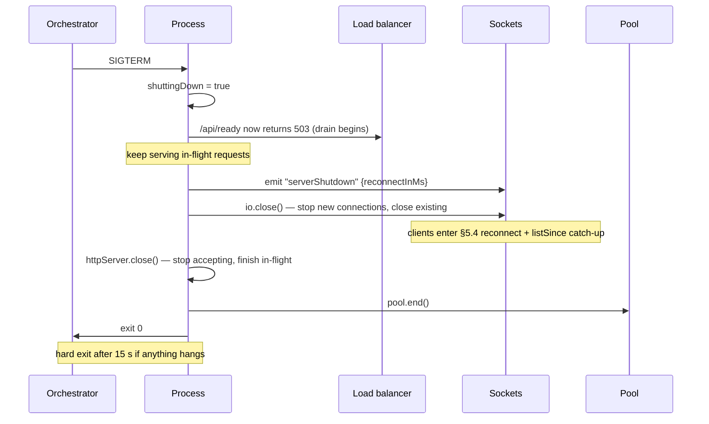

| Step | Detail |
|---|---|
| Drain window | Readiness flips to 503 immediately; wait ≥5 s (one LB probe interval) before closing sockets so the LB stops routing first |
| Socket notice | Emitting `serverShutdown` with a suggested reconnect delay spreads the thundering herd across nodes; without it every client reconnects simultaneously and the handshake DB read (`api/kimi/auth.ts:14`) becomes a self-inflicted spike (`NFR-PERF-04`) |
| Hard timeout | `setTimeout(() => process.exit(1), 15_000).unref()` — never hang a deploy |
| In-flight writes | The message-send transaction is short; a 15 s budget is ample. No queue drain is needed because there is no queue |

---

## 12. Performance design

### 12.1 Hot paths

| # | Path | Frequency | Current cost | Budget |
|---|---|---|---|---|
| H-1 | socket `sendMessage` | per message | membership `SELECT` + INSERT + re-`SELECT` + room emit + participants `SELECT` + N emits (`api/socket.ts:93-145`) | `NFR-PERF-03` p95 ≤250 ms |
| H-2 | socket `typing` | **per keystroke** (`src/pages/Chat.tsx:176-184`, no debounce) | one membership `SELECT` on an unindexed table (`api/socket.ts:191` → `:56-63`) — a full scan per character typed | not budgeted; must become ~free |
| H-3 | `conversation.list` | per sidebar render + every inbound message today | 4 sequential queries, one of which loads **every message of every conversation** (`api/conversation-router.ts:53-62`) | `NFR-PERF-01` p95 ≤200 ms @ 50 conversations |
| H-4 | `message.listByConversation` | per conversation open + per inbound message today | 2 queries; the second is the broken `IN` (`api/message-router.ts:68`) | `NFR-PERF-01` p95 ≤150 ms @ 50 messages |
| H-5 | Socket handshake | per connect and per reconnect | `verifySessionToken` + one DB read (`api/kimi/auth.ts:14`) | `NFR-PERF-04` p95 ≤200 ms |
| H-6 | tRPC context creation | **every request** | same DB read as H-5 (`api/context.ts:5`) | inside `NFR-PERF-01` |

### 12.2 N+1 and full-scan inventory, and how each is eliminated

Authoritative list: `DATA_MODEL.md §6.6`. Fixes and their ordering:

| # | Site | Fix | Prerequisite |
|---|---|---|---|
| N-1 | `api/conversation-router.ts:53-62` loads all messages to compute the latest per conversation | Window function / lateral per `DATA_MODEL.md §6.1`; also returns `unreadCount` (`FR-CONV-07`) in the same statement | IX-1 |
| N-2 | `api/message-router.ts:144-153` and `api/socket.ts:165-174` — one INSERT per message id | Single multi-row `insert().values(rows).onDuplicateKeyUpdate(...)` | **UQ-2 must exist first**, otherwise the upsert cannot dedupe (§13.3) |
| N-3 | `api/socket.ts:140-145` — one emit per participant | Single emit to a conversation-members room, or `io.to([...userRooms])` | none |
| N-4 | `api/socket.ts:56-63` invoked per `typing` event | IX-2 **plus** cache membership in `socket.data.conversations` at `joinConversation` and invalidate on membership change | IX-2 |
| N-5 | `api/conversation-router.ts:167-197` — membership pre-scan for `createDirect` | Single `EXISTS` join filtered on `conversations.type='direct'`; also fixes `FR-CONV-01` | none |
| N-6 | `api/message-router.ts:68` — `IN (?)` bound to a joined string | `inArray(messageReads.messageId, messageIds)` | `SEC-C-15`; correctness fix (`FR-MSG-04`) that also makes the query indexable |
| N-7 | H-6: one DB read per tRPC request for `ctx.user` | 30 s in-process LRU keyed on `unionId`, invalidated on any write to that user's row. **Only after** `FR-SESS-06` revocation exists — caching identity without a revocation signal extends the blast radius of a stolen cookie | `SEC-C-05` |

Indexes IX-1…IX-6 are specified in `DATA_MODEL.md §3.3` and land in `0001_constraints`.

### 12.3 Caching strategy

| Layer | What | TTL / invalidation | Notes |
|---|---|---|---|
| Client query cache | conversations, messages, contacts | `staleTime` per §7.2; socket events write through, they do not invalidate | The single largest win: kills `NFR-PERF-08` |
| Client route chunks | code-split bundles | content hash | §9.3 |
| HTTP | `Cache-Control: public, max-age=31536000, immutable` for `/assets/*` (hashed); `no-cache` for `index.html` | — | `serveStatic` (`api/lib/vite.ts:5-8`) sets no cache headers today — every asset is re-fetched or revalidated on each load, which is an `NFR-PERF-05` (FCP/LCP) tax |
| Server, per-socket | conversation membership in `socket.data` | invalidate on join/leave/removal | Fixes N-4 |
| Server, per-process | `ctx.user` LRU | 30 s, gated on N-7's prerequisite | — |
| Server, shared | none | — | No Redis today; when it arrives (§3.5) it holds presence and rate-limit buckets, **not** message data |
| Database | InnoDB buffer pool | — | The working set is small at reference scale; indexes matter far more than tuning |

Explicitly **not** cached: message content beyond the client cache, presence (push-only), and anything keyed on identity without an invalidation path.

### 12.4 How each NFR-PERF target is met

| ID | Target | Mechanism | Verified by |
|---|---|---|---|
| `NFR-PERF-01` | `conversation.list` p95 ≤200 ms @ 50 conv; `message.listByConversation` p95 ≤150 ms @ 50 msgs | N-1 rewrite + IX-1/IX-2 + N-6; drops both from O(total messages) to O(page) | TC-DATA-08/09 + k6 |
| `NFR-PERF-02` | No per-row query fan-out | N-2, N-3, N-5; query-count assertions in integration tests | TC-CONV-09, TC-CONT-15 |
| `NFR-PERF-03` | send → peer p95 ≤250 ms, p99 ≤800 ms | Single transaction replacing INSERT + re-SELECT; ack emitted before the participants query; N-3 removes the per-participant loop from the critical path | Two instrumented clients, 1 000 messages |
| `NFR-PERF-04` | OAuth callback p95 ≤300 ms (excl. IdP); handshake p95 ≤200 ms | 5 s IdP timeouts bound the tail (`SRS.md §7.1`); handshake stays one indexed lookup on `users.unionId` (already UNIQUE, `db/migrations/0000_lumpy_marten_broadcloak.sql:66`); `serverShutdown` staggering avoids reconnect storms (§11.5) | Server spans |
| `NFR-PERF-05` | FCP ≤1.2 s, LCP ≤2.5 s (Fast 3G, 4× CPU) | §9.3 B-1…B-4 + immutable asset caching + the existing `AuthLayoutSkeleton` covering the `auth.me` round trip | Lighthouse CI, median of 5 |
| `NFR-PERF-06` | Initial JS ≤250 KB gzip, CI-enforced | Currently **177.5 KiB** — passing. B-6 converts it into a gate; B-1…B-4 create headroom | CI size assertion |
| `NFR-PERF-07` | Conversation switch renders ≤300 ms from cache | `staleTime: Infinity` on message queries + socket write-through, so a revisit is a pure cache read | React Profiler in E2E |
| `NFR-PERF-08` | Inbound message must not trigger a full refetch | §7.3 mapping table — `setQueryData` everywhere `refetch` appears today | Network assertion in TC-E2E-03 |

Plus, though budgeted elsewhere: H-2 must be fixed by a client-side debounce (emit `isTyping:true` at most once per 2 s, `false` after 3 s idle) **and** the server-side TTL of `FR-PRES-06`. Per-keystroke full table scans (`api/socket.ts:191`) are the single worst cost-per-value ratio in the system.

---

## 13. Migration and rollout strategy

### 13.1 Constraint: existing deployments must not break

> **UNVERIFIED:** No production deployment of Alice Chains is known to exist. `NFR-OPS-02` records that `index.html`, `package-lock.json`, `drizzle.config.ts`, `Dockerfile`, `docker-compose.yml` and the baseline migration are **untracked in git** — a clean clone of `origin/main` cannot build, so any existing deployment was built from a dirty tree. §13 is written as if deployments exist, because that is the safe assumption and the cost of the discipline is low.

### 13.2 Shipping order

| Wave | Contents | Compatible with an unupgraded client? | Notes |
|---|---|---|---|
| **W0** | Commit the untracked build inputs (`SEC-C-27`, `NFR-OPS-02`); no code change | yes | Prerequisite for every other wave. Nothing can be reviewed or reproduced until the tree builds from `origin/main` |
| **W1** | Server-only, behaviour-preserving: env split, `SESSION_SECRET` alias (§8.5 R0), structured logging, `/api/health` + `/api/ready`, pool config, `pool.on("error")`, graceful shutdown, `errorFormatter` (message stripping only, codes unchanged) | yes | Zero wire changes |
| **W2** | Additive wire changes: `messageAck`, `validationError`, `authzError`, `rateLimited`, `message.listSince`, `contracts/` Zod schemas, socket validation (SEC-C-13) | yes — old clients ignore unknown events (`API_CONTRACT.md §6.2`) | Socket validation **is** enforcement: log-only for one release, then reject (§13.5) |
| **W3** | Schema: `0001_constraints` (`DATA_MODEL.md §3.5`, §4.3) | yes | See §13.3 for the ordering trap |
| **W4** | Behaviour fixes that depend on W3: multi-row read-receipt upsert, `conversations.updatedAt` in the send transaction, `inArray` receipt fix, `FR-CONV-08` participant validation | yes | `FR-MSG-04` starts returning *more* receipts than before — the client already renders them |
| **W5** | **Breaking, coordinated**: error-code changes (`null`/`[]` → `NOT_FOUND`, 500 → `FORBIDDEN`), OAuth `state`+PKCE with the server-initiated `/api/oauth/login`, cookie `Secure` + `__Host-` prefix | **no** | Ship server and client together in one artefact — which is already how it deploys (`Dockerfile`), so this is a single release, not a rollout dance |
| **W6** | Redis adapter + presence relocation, gated on `REDIS_URL` | yes | Unset `REDIS_URL` keeps today's behaviour exactly |
| **W7** | Phase 2 features behind flags (§14.2) | yes | |

The `__Host-` cookie rename in W5 logs everyone out once: the browser holds `alice_session` while the server reads `__Host-alice_session`. Mitigate by reading **both** names for one release (`getSessionToken`, `api/kimi/session.ts:7-13`) and writing only the new one.

### 13.3 The schema migration ordering constraint

`0001_constraints` adds foreign keys, unique keys and indexes to tables that today have **zero FKs and one unique key** (`db/migrations/0000_lumpy_marten_broadcloak.sql:66`). Two constraints bind the code/migration ordering in **opposite directions**, which is why this needs stating explicitly:

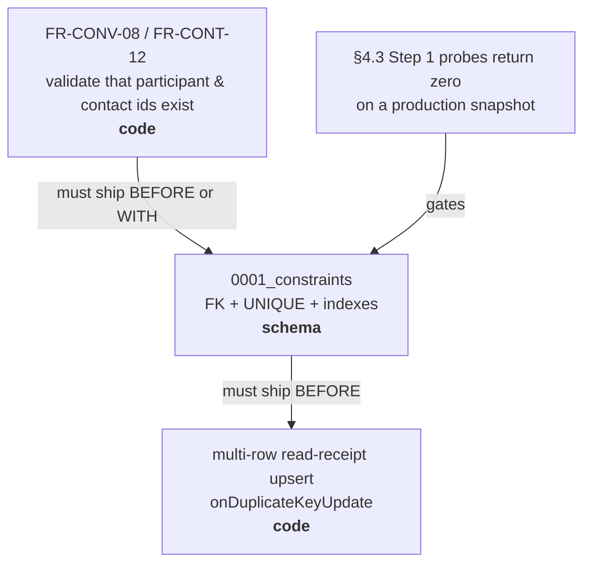

| Direction | Rule | Why |
|---|---|---|
| **Before/with the migration** | `FR-CONV-08` and `FR-CONT-12` id-existence validation must already be live | The instant FKs exist, `createGroup` with a bogus id raises `ER_NO_REFERENCED_ROW_2` (1452), which surfaces as a 500. Validating first turns it into a clean `BAD_REQUEST` and, more importantly, stops new orphans being written *while* the dedupe runs |
| **After the migration** | The multi-row `onDuplicateKeyUpdate` receipt write (N-2) must not ship before UQ-2 exists | Without the unique key there is no key to conflict on; the upsert silently becomes a plain multi-row insert and duplicates keep accumulating. The existing `try/catch` at `api/message-router.ts:150-152` is dead code for exactly this reason |
| **Gate** | `DATA_MODEL.md §4.3` Step 1 probes must return zero rows against a production snapshot before merge | Adding UNIQUE over duplicates aborts with 1062; adding an FK over orphans aborts with 1452. The migration is one file containing probe → dedupe → orphan cleanup → DDL, in that order |
| **Escalation** | Messages orphaned by `senderId`, and conversations orphaned by `createdBy`, cannot be auto-deleted | `DATA_MODEL.md §4.3` Step 3 requires a human decision (anonymise vs purge) before merge |
| **Forward-only** | No down migrations. A mistake is a new numbered migration | `DATA_MODEL.md §4.2` |
| **Locking** | Adding FKs and indexes on MySQL 8 is largely online (`ALGORITHM=INPLACE`), but at reference scale (`SRS.md §8.3`: ≤200 members) the tables are small enough that a brief lock is acceptable. Announce a maintenance window anyway | — |

The sequence of record is `DATA_MODEL.md §4.4`. This document adds one entry to it: `0006_message_idempotency` (§6.2).

### 13.4 Feature flags

Prefer **configuration presence** over boolean flags, so an unset variable is the off switch and there is no dead flag to clean up.

| Capability | Flag | Off behaviour |
|---|---|---|
| Redis adapter + shared presence | `REDIS_URL` unset | In-memory adapter, process-local presence — today's behaviour |
| Attachments (`FR-FILE-*`) | `S3_BUCKET` unset | `file.*` procedures return `PRECONDITION_FAILED`; the paperclip is hidden rather than inert (`SRS.md §9` item 8) |
| Web Push (`FR-NOTIF-*`) | `VAPID_PUBLIC_KEY` unset | No service-worker registration; the client feature-detects and hides the UI (`SRS.md §7.4`) |
| Admin surface (`FR-ADMIN-*`) | `OWNER_UNION_ID` unset | No administrator exists; every admin procedure returns `FORBIDDEN` — already the specified behaviour (`FR-ADMIN-03`) |
| Rate limiting | `RATELIMIT_MODE` = `off` \| `log` \| `enforce`, default `enforce` | `log` exists for the one-release soak in §13.5 |
| Socket payload validation | `SOCKET_VALIDATION` = `log` \| `enforce`, default `enforce` | Same |

Boolean flags for incomplete features are banned: an unfinished feature stays on a branch. Flags exist to decouple *deployment topology* and *enforcement timing*, not to hide half-built code.

### 13.5 Enforcement ramps

Two changes tighten behaviour that was previously permissive. `API_CONTRACT.md §6.1` allows tightening authorization where the old behaviour was a bug, "but log before enforcing". Concretely:

| Change | Release N | Release N+1 |
|---|---|---|
| Socket payload validation (SEC-C-13) | `SOCKET_VALIDATION=log`: parse, log `validation.rejected` with field **paths**, process anyway | `enforce`: reject with `validationError` |
| Rate limiting (SEC-C-19) | `RATELIMIT_MODE=log`: count and log `ratelimit.exceeded`, allow | `enforce`: 429 / `rateLimited` |
| Search minimum length (`FR-CONT-06`) | log short queries | reject with `BAD_REQUEST` |

If a log-mode release shows a legitimate client pattern tripping a limit, the limit is wrong — adjust the budget in `SECURITY.md §8` before enforcing, not after.

### 13.6 Rollback

| Layer | Rollback |
|---|---|
| Code | Redeploy the previous image tag. The artefact is one container (`Dockerfile`), so client and server roll back together |
| Schema | **No down migrations.** `0001_constraints` is additive (constraints and indexes only, no column drops, no data loss beyond the deliberate dedupe), so the previous image runs against the new schema unchanged — the old code simply does not exploit the new keys |
| The one-way door | The `0001_constraints` dedupe **deletes duplicate rows**. Take a `mysqldump` immediately before, retained for 30 days. This is also the forcing function for `NFR-REL-06` (backup/restore), which is currently Missing |
| Config | `SESSION_SECRET`/`JWT_SECRET` dual-read (§8.5) means a config rollback never invalidates sessions |

---

## 14. Phased implementation architecture

Phase boundaries follow `SRS.md §9`: Phase 1 makes the release criteria *achievable*; Phase 2 delivers the remaining P1/P2 surface.

### 14.1 Phase 1 — Stabilize

**Definition of done:** every P0 requirement Implemented (`SRS.md §9` item 6); the 42-item release-blocking set of `SRS.md §10.4` empty; every `SEC-C-*` rated **S1** in `SECURITY.md §13` implemented with a test.

| Workstream | Modules touched | Closes | Notes |
|---|---|---|---|
| **P1-A Repo integrity** | git index, `.github/workflows/ci.yml` | `NFR-OPS-01/02`, `NFR-SEC-12`, `SEC-C-27` | W0. Commit the six untracked files. Nothing else can be reviewed until this lands |
| **P1-B Config boundary** | `api/lib/env.ts`, `contracts/oauth.ts` (new), `api/kimi/platform.ts` (delete), `.env.example`, `Dockerfile`, `docker-compose.yml` | `FR-AUTH-06/07/12`, `NFR-SEC-08`, `SEC-C-01/02/24` | §8. Includes `PUBLIC_BASE_URL`, the origin-only refinement on `VITE_KIMI_AUTH_URL`, secret minimum lengths, the `SESSION_SECRET` alias |
| **P1-C OAuth hardening** | `api/kimi/auth.ts`, new `GET /api/oauth/login`, `src/pages/Login.tsx` | `FR-AUTH-08/09`, `NFR-SEC-01`, `SEC-C-03/04` | §5.1 target diagram. Wave W5 (breaking) |
| **P1-D Session & cookie** | `api/kimi/session.ts`, `api/lib/cookies.ts` (delete), `contracts/constants.ts` | `FR-SESS-02/03/10`, `NFR-SEC-04`, `SEC-C-07/08` | Three cookie implementations collapse to one; dual-name read for the `__Host-` transition (§13.2) |
| **P1-E Shared validation** | `contracts/schemas.ts` (new), `api/socket.ts`, `api/*-router.ts` | `FR-MSG-01`, `NFR-SEC-03`, `SEC-C-13` | One Zod schema per event, imported by both transports — closes gap G-2 permanently |
| **P1-F Authorization consolidation** | `api/lib/authz.ts` (new `assertParticipant`), all routers, `api/socket.ts` | `FR-CONV-02/15`, `FR-MSG-05`, `NFR-SEC-05`, `SEC-C-09/10/26` | Five failure shapes collapse to two codes (§11.1) |
| **P1-G Data integrity** | `db/schema.ts`, `db/migrations/0001_constraints.sql` | `NFR-REL-01`, `SEC-C-16` | `DATA_MODEL.md §3.5`, `§4.3`. Ordering per §13.3 |
| **P1-H Query correctness** | `api/message-router.ts:68`, `api/conversation-router.ts` | `FR-MSG-04/09`, `FR-CONV-01/05/08/09/10`, `NFR-SEC-02`, `SEC-C-11/15` | Depends on P1-G for the upsert |
| **P1-I Directory & presence scoping** | `api/contact-router.ts`, `api/socket.ts` | `FR-CONT-05/06/07/08`, `FR-PRES-04/05`, `SEC-C-12/21` | |
| **P1-J Edge hardening** | `api/boot.ts`, `api/socket.ts` | `NFR-SEC-06/07/11`, `SEC-C-17/18/19/20` | Security headers, origin allowlist, body limit 50 MB → 256 KB, rate limiting (ramped per §13.5) |
| **P1-K Realtime parity** | `api/realtime/emit.ts` (new), all routers | `FR-MSG-08` | ADR-007. `message.send` must emit what socket `sendMessage` emits |
| **P1-L Ops floor** | `api/lib/log.ts` (new), `api/boot.ts`, `api/queries/connection.ts` | `NFR-OPS-03`, `NFR-REL-02/03`, `FR-ADMIN-11`, `SEC-C-25/28` | §10, §11.4, §11.5 |
| **P1-M Build hygiene** | `package.json`, `vite.config.ts`, `vitest.config.ts`, tsconfigs | `NFR-PERF-06` gate, `NFR-OPS-01` | §4.4 alias consolidation, §9.3 splitting, `--packages=external` |
| **P1-N Honest docs** | `README.md`, `info.md` | `NFR-OPS-08` | Stop claiming JWT; stop recommending `db:push` (ADR-005); no E2EE/calling/federation/mobile claims (`SRS.md §2.3`) |

**Module boundaries introduced in Phase 1** (each is a new seam, and each is the thing that makes Phase 2 cheap):

```
contracts/schemas.ts    one Zod definition per wire message, both transports
contracts/oauth.ts      one endpoint derivation, both sides
api/lib/authz.ts        assertParticipant + (later) assertAdmin
api/lib/log.ts          structured logger with serialiser-level redaction
api/realtime/emit.ts    the ONLY module that may import getIO()
api/lib/env.ts          split into serverEnv / publicEnv
```

### 14.2 Phase 2 — Features

Phase 2 opens only when Phase 1's exit criteria are met. Every item is flag-gated (§13.4).

| Workstream | Modules | Requirements | Depends on |
|---|---|---|---|
| **P2-A Unread & ordering** | `api/conversation-router.ts`, `src/pages/Chat.tsx` | `FR-CONV-07`, `FR-NOTIF-07/08` | P1-G (IX-1), P1-H (`updatedAt`) |
| **P2-B Delivery guarantees** | `contracts/schemas.ts`, `api/socket.ts`, `db/migrations/0006_message_idempotency`, `src/hooks/useSocket.ts`, new `src/state/messages.ts` | `FR-MSG-16`, `NFR-PERF-08`, `NFR-REL-03` | P1-E, P1-K. §6 in full |
| **P2-C Reconnect recovery** | `api/message-router.ts` (`listSince`), `src/hooks/useSocket.ts` | `NFR-REL-03`, `FR-MSG-06` | P2-B. §5.4 |
| **P2-D Client decomposition** | `src/state/` (presence, typing, connection), `src/features/chat/*` | `NFR-PERF-07`, `NFR-A11Y-02/04/05` | P2-B. `Chat.tsx` is 563 lines holding transport, cache, presence, typing and layout |
| **P2-E Blocking & contacts** | `api/contact-router.ts`, `api/lib/authz.ts` | `FR-CONT-04/09/10/11/13/14`, `FR-CONV-09`, `FR-MSG-19` | P1-F, P1-G |
| **P2-F Group administration** | `api/conversation-router.ts` | `FR-CONV-11/12/13/14` | P1-F. First real use of `conversations.createdBy` |
| **P2-G Attachments** | new `api/file-router.ts`, `api/lib/storage.ts`, `0005_attachments` | `FR-FILE-01…10`, `SEC-C-23` | ADR-009, `SRS.md §7.2`, `SECURITY.md §9` |
| **P2-H Notifications** | new `api/push/*`, `public/sw.js`, `0004_push_subscriptions` | `FR-NOTIF-01…09` | P2-A, `SRS.md §7.3` |
| **P2-I Message lifecycle** | `api/message-router.ts`, `0002_soft_delete`, `0003_message_reactions` | `FR-MSG-10/11/12/13/14/15` | P1-G |
| **P2-J Session lifecycle** | `api/kimi/session.ts`, a session store | `FR-SESS-06/07/08/09`, `SEC-C-05/06/29` | Unblocks `FR-ADMIN-05/09`. Needs Redis or a DB table |
| **P2-K Admin & data rights** | `api/middleware.ts` (`adminQuery`), new `api/admin-router.ts` | `FR-ADMIN-01…11` | P2-J for revocation |
| **P2-L Horizontal scale** | `api/socket.ts`, `api/lib/presence.ts` | `NFR-SCALE-01`, `FR-PRES-08` | ADR-006 trigger. §3.5 |
| **P2-M A11y & i18n** | `src/**` | `NFR-A11Y-01…06`, `NFR-I18N-01…04` | P2-D |

### 14.3 What must not change across phases

| Invariant | Why |
|---|---|
| MySQL 8 + Drizzle | ADR-001; `SRS.md §8.1` |
| One deployable artefact serving client + API on one origin | `Dockerfile`, `api/boot.ts:51-54`; ADR-013. Same-origin is what makes the `HttpOnly`/`SameSite=Lax` cookie work without CORS |
| superjson on both tRPC ends | `SRS.md` C-4 |
| Socket.IO path `/socket.io`, rooms `user_{id}` / `conv_{id}` | `API_CONTRACT.md §6.1` — renaming rooms is breaking |
| `contracts/` stays dependency-free | It ships to the public bundle |
| Port contract 3000 / 3001 / 3000 | `contracts/constants.ts:17-19`, `NFR-OPS-04` |

---

## 15. Open technical questions requiring a human decision

| # | Question | Options | Recommendation |
|---|---|---|---|
| **Q-1** | **What is the Kimi IdP's actual endpoint layout?** Three code sites disagree (`src/pages/Login.tsx:7`, `api/kimi/auth.ts:36,60`) and `.env.example:5` disagrees with all of them. `SRS.md §7.1` marks the inferred paths UNVERIFIED. Does Kimi support `state` and PKCE S256 (`SRS.md` A-2)? | (a) Obtain the published spec. (b) Probe a live tenant's discovery document. (c) Implement against the inference and iterate. | **(a), blocking.** `FR-AUTH-06…09` are four P0 requirements resting on an unverified assumption. If PKCE is unsupported, `FR-AUTH-09` must be withdrawn in `SRS.md`, not silently skipped. |
| **Q-2** | ~~The IdP base-URL variable had three names across the specs.~~ **RESOLVED.** The variable in the code and in `.env.example:13` is **`VITE_KIMI_AUTH_URL`**; the invented names `KIMI_BASE_URL` and `VITE_KIMI_BASE_URL` have been removed from every document. `SEC-C-01` keeps the name and constrains the value to a bare origin. | — | Remaining open sub-question: **if** §5.1's server-initiated `GET /api/oauth/login` is adopted, the client no longer needs the IdP origin at all and the `VITE_` prefix can be dropped (server-only `KIMI_AUTH_URL`), removing a public surface. Decide that with S-4, not before. |
| **Q-3** | **Who initiates the authorization request — client or server?** `SECURITY.md §3.3` builds the URL in `src/pages/Login.tsx`; §5.1 here proposes `GET /api/oauth/login`. | (a) Client builds it; the server sets the `state`/`verifier` cookie via a prior fetch. (b) Server 302s. | **(b).** The `code_verifier` must be in an `HttpOnly` cookie, which client JS cannot set; (a) requires an extra round trip to obtain the cookie and still leaves the URL assembled in two places. (b) also makes `redirect_uri` derivable from `PUBLIC_BASE_URL` alone (§8b). |
| **Q-4** | **Session revocation store (`FR-SESS-06`, blocks `FR-ADMIN-05/09`).** | (a) Redis (a `REDIS_URL` dependency for a single-node deployment). (b) MySQL `sessions` table + short-TTL in-process cache. (c) A `users.sessionEpoch` counter — bump to invalidate all of a member's sessions; no per-session granularity. | **(c) first, (b) later.** (c) is one column, one migration, and one comparison in `verifySessionToken`; it delivers global logout and admin deactivation immediately. Per-device revocation (b) can follow when there is a device list to hang it off. (a) forces Redis on the reference deployment for no other gain. |
| **Q-5** | **Where does presence live after Redis (`FR-PRES-08`)?** | (a) Redis sets (§3.5). (b) Derive from adapter room membership via `fetchSockets()`. (c) A MySQL `presence` table. | **(a).** (b) has no efficient roster query; (c) writes to durable storage on every tab open and close, which is the worst possible write pattern for the hottest ephemeral signal. |
| **Q-6** | **Does the release keep two message write paths?** Socket `sendMessage` and tRPC `message.send` diverge in validation (G-2), and only the socket path is used by the UI (`src/pages/Chat.tsx:157`). | (a) tRPC owns writes; the socket becomes read-only transport. (b) Socket owns writes; tRPC `message.send` is deleted. (c) Both, sharing one service function. | **(c) now, (a) later** — see ADR-007. Extracting `sendMessage()` into a service both transports call removes the divergence in one refactor without a breaking change; migrating the client to tRPC writes is a separate, larger decision. |
| **Q-7** | **What is the `conversation.list` ordering source of truth?** `DATA_MODEL.md §6.5` offers two fixes: bump `conversations.updatedAt` in the send transaction, or order by the last message's timestamp. | (a) Bump `updatedAt` — one extra UPDATE per message; hot-row contention on busy groups. (b) Order by `MAX(messages.createdAt)` — no write amplification; needs IX-1 and a window function. | **(a).** `FR-MSG-09` is a P0 requirement worded as "MUST update `conversations.updatedAt` … in the same transaction", so (b) alone does not satisfy the SRS as written. At reference scale the extra UPDATE is negligible. If (b) is preferred on performance grounds, amend `FR-MSG-09` first. |
| **Q-8** | **Rate-limit storage on a single node.** `SECURITY.md §8` specifies an in-process `Map` for single node, Redis for multi. | (a) In-process now, Redis later. (b) Redis from the start. | **(a).** It matches the reference deployment (`SRS.md §8.3`, no Redis) and the abstraction (a `RateLimiter` interface) makes the swap mechanical. Document plainly that single-node buckets reset on restart. |
| **Q-9** | **Do we keep the 27 unused shadcn components?** They cost zero bundle bytes (verified, §9.3) but ~20 `@radix-ui` dependencies, audit surface and typecheck time. | (a) Delete now. (b) Keep — Phase 2 UI will want some. | **(a).** They are a `git revert` away, and `NFR-SEC-12`/`SEC-C-27` want the dependency tree minimal. Re-add on demand via the shadcn CLI. |
| **Q-10** | **Server bundling strategy.** `--packages=external` shrinks `dist/boot.js` from 2.5 MB to tens of KB but requires `node_modules` at runtime (already present, `Dockerfile:29-30`). | (a) External packages. (b) Keep bundling, add `--minify`. | **(a).** The current build duplicates every dependency and gains nothing; the runtime stage already installs them. Revisit only if a distroless image without `node_modules` becomes a requirement. |
| **Q-11** | **`OWNER_UNION_ID` semantics.** It is parsed, exposed and plumbed but read nowhere (`SRS.md §3.5`). Does changing it demote the previous owner? | (a) Assign `admin` on provisioning only; changing the variable affects future sign-ins only. (b) Reconcile on every sign-in: promote the match, demote everyone else. | **(b).** (a) leaves a stale administrator after an operator handover with no way to remove them (no admin UI exists — `FR-ADMIN-04` is P2). (b) makes the env variable the single source of truth, which is what a self-hoster will expect. |
| **Q-12** | **MySQL `timestamp` precision (`FR-MSG-11`, `SRS.md` C-8).** Widening to `timestamp(3)` changes six columns across five tables. | (a) Widen all timestamps in `0001_constraints`. (b) Widen `messages.createdAt` only. (c) Leave it; rely on `id` as the tiebreaker. | **(b) + `id` tiebreaker.** Only message ordering is user-visible; widening `contacts.updatedAt` buys nothing and enlarges an already-gated migration. The `ORDER BY createdAt DESC, id DESC` change is required regardless. |
| **Q-13** | **Avatar rendering (`SEC-C-22`, `SRS.md §6` data residency).** `users.avatar` is a third-party URL rendered directly, so every avatar load beacons a foreign origin with the member's IP. | (a) Proxy through the app with caching. (b) Fetch once at provisioning, store in object storage. (c) Pin `img-src` in CSP and accept the beacon. | **(c) now, (b) with P2-G.** (a) makes the app an open image proxy unless carefully constrained. (b) is correct but needs the object-storage work of ADR-009. |

---

## Appendix A — Verified build and artefact facts

| Fact | Value | How verified |
|---|---|---|
| `dist/boot.js` | 2,594,758 B | `ls -l` |
| `dist/public/assets/index-*.js` | 596,584 B raw / 181,756 B gzip | `ls -l`, `gzip -c \| wc -c` |
| `dist/public/assets/index-*.css` | 40,982 B raw / 7,441 B gzip | same |
| `dist/public/index.html` | 591 B | `ls -l` |
| Server bundle top contributors | mysql2 89 modules, drizzle mysql-core 42, hono 22, iconv-lite 18, engine.io 15, ws 13, superjson 11, socket.io 9, zod 8, **drizzle pg-core 7** | `grep -o '// node_modules/…' dist/boot.js` |
| Unused shadcn components are absent from the client bundle | `Accordion`, `Menubar`, `NavigationMenu`, `Slider`, `Progress`, `sidebar_state` → 0 matches | `grep -c` on the built asset |
| shadcn files imported by live routes | 7 of 33 (`avatar`, `button`, `dialog`, `dropdown-menu`, `input`, `scroll-area`, `tabs`) | `grep -rhoE 'from "@/components/ui/…"' src/pages src/components/*.tsx` |
| `tsc` in `build` emits nothing | `"noEmit": true` | `tsconfig.json:11`, `npx tsc --showConfig` |
| `tsconfig.app.json` / `tsconfig.server.json` are referenced by nothing | no match in scripts, vite/vitest/eslint configs, Dockerfile, CI | `grep -rn tsconfig` |
| Pinned versions in the lockfile | `@trpc/server` 11.18.0 · `vitest` 3.2.7 · `socket.io` 4.8.3 · `socket.io-client` 4.8.3 · `drizzle-orm` 0.40.1 · `hono` 4.13.1 · `mysql2` 3.23.3 · `vite` 6.4.3 · `react` 19.2.8 | `package-lock.json` |
| `console.*` call sites in `api/` | 7 — `socket.ts:42,148,182,208`, `kimi/auth.ts:106`, `boot.ts:69,71` | `grep -rn 'console\.' api/` |
| Untracked build-critical files | `Dockerfile`, `docker-compose.yml`, `drizzle.config.ts`, `index.html`, `package-lock.json`, `db/migrations/0000_*.sql`, `db/migrations/meta/` | `git status --porcelain` |
